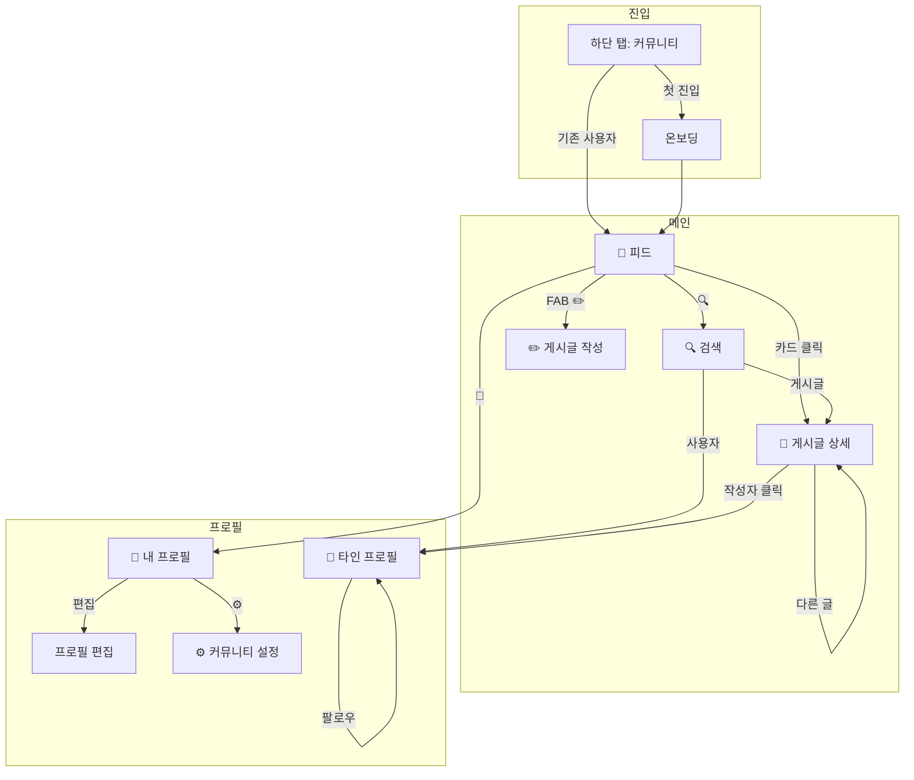

# 커뮤니티 구조 개선안 (Draft)

> **상태**: 논의 중  
> **작성일**: 2026-01-15  
> **참고**: 토스증권 커뮤니티 UX

---

## 📍 화면 구조 및 네비게이션

### 페이지 구조

```
커뮤니티/
├── 🚪 온보딩 (첫 진입 시)          → 피드로 이동
│
├── 📰 피드 (메인)                   ← 하단 탭 "커뮤니티"
│   ├── [추천 / 팔로잉 / TBD]       ← 콘텐츠 탭
│   ├── 🔍 검색                      → 검색 화면
│   ├── 👤 내 프로필                 → 내 프로필 화면
│   ├── ✏️ FAB 글쓰기               → 게시글 작성 화면
│   └── 📄 게시글 카드               → 게시글 상세
│
├── 🔍 검색
│   ├── 종목 결과                   → 해당 종목 포함 포트폴리오
│   ├── 게시글 결과                 → 게시글 상세
│   └── 사용자 결과                 → 타인 프로필
│
├── 📄 게시글 상세
│   ├── 작성자 프로필               → 타인 프로필
│   ├── 이 사람의 다른 글           → 게시글 상세
│   ├── 더보기 메뉴                 → 북마크/차단/신고
│   └── 댓글 영역
│
├── 👤 내 프로필
│   ├── ⚙️ 설정                     → 커뮤니티 설정
│   ├── 프로필 편집                 → 프로필 편집 화면
│   └── [최근활동 / 투자 / TBD]
│
├── 👥 타인 프로필
│   ├── 🚫 차단                     → 차단 모달
│   ├── 팔로우 버튼                 → 팔로우 바텀시트
│   └── [공개된 탭만 표시]
│
└── ⚙️ 커뮤니티 설정
    ├── 알림 설정
    ├── 정보 공개 범위
    ├── 북마크
    ├── 차단 계정 관리
    ├── 신고·삭제된 글
    └── 커뮤니티 이용규칙
```

### 화면 플로우



---

## 1. 핵심 변경 포인트

### 현재 구조 (문제점)

```
users 테이블 하나에 모든 정보:
├── 앱 기본 정보 (email, google_id, role, membership)
├── 앱 프로필 (nickname, profile_picture)
└── 커뮤니티 정보 (bio, profile_character, is_verified)
```

**문제**: 커뮤니티 비사용자도 커뮤니티 관련 컬럼 보유, 프로필 분리 불가

### 제안 구조

```
users 테이블 (앱 계정)
├── 기본 정보 (email, google_id)
├── 앱 프로필 (name, profile_picture - Google 연동)
└── 앱 설정 (role, membership, is_active)

community_profiles 테이블 (커뮤니티 전용) [신규]
├── 커뮤니티 닉네임 (닉네임 변경 쿨타임 90일)
├── 커뮤니티 프로필 사진 (별도 업로드)
├── 자기소개 (bio)
├── 공개 설정
└── 가입 상태 (약관 동의 여부)
```

---

## 2. 신규 테이블 (Draft)

### community_profiles

```sql
CREATE TABLE community_profiles (
  user_id VARCHAR(36) PRIMARY KEY,        -- users.id FK
  nickname VARCHAR(20) NOT NULL UNIQUE,   -- 커뮤니티 닉네임
  nickname_changed_at TIMESTAMP,          -- 닉변 쿨타임용
  profile_picture VARCHAR(500),           -- 커뮤니티 프사 (별도)
  bio VARCHAR(200),                       -- 자기소개
  
  -- 공개 설정
  show_recent_activity BOOLEAN DEFAULT TRUE,  -- 최근활동 공개
  show_portfolio BOOLEAN DEFAULT FALSE,       -- 투자현황 공개
  
  -- 상태
  is_terms_agreed BOOLEAN DEFAULT FALSE,  -- 약관 동의
  terms_agreed_at TIMESTAMP,
  is_active BOOLEAN DEFAULT TRUE,
  
  -- 카운트 캐시
  post_count INT DEFAULT 0,
  follower_count INT DEFAULT 0,
  following_count INT DEFAULT 0,
  
  created_at TIMESTAMP DEFAULT CURRENT_TIMESTAMP,
  updated_at TIMESTAMP DEFAULT CURRENT_TIMESTAMP ON UPDATE CURRENT_TIMESTAMP,
  
  FOREIGN KEY (user_id) REFERENCES users(id) ON DELETE CASCADE
);
```

### community_blocks (차단 계정)

```sql
CREATE TABLE community_blocks (
  id INT AUTO_INCREMENT PRIMARY KEY,
  blocker_id VARCHAR(36) NOT NULL,        -- 차단한 사람
  blocked_id VARCHAR(36) NOT NULL,        -- 차단당한 사람
  created_at TIMESTAMP DEFAULT CURRENT_TIMESTAMP,
  
  UNIQUE INDEX (blocker_id, blocked_id)
);
```

### community_reports (신고)

```sql
CREATE TABLE community_reports (
  id INT AUTO_INCREMENT PRIMARY KEY,
  reporter_id VARCHAR(36) NOT NULL,
  target_type ENUM('POST', 'COMMENT', 'USER'),
  target_id VARCHAR(36) NOT NULL,
  reason ENUM('SPAM', 'ABUSE', 'INAPPROPRIATE', 'OTHER'),
  description VARCHAR(500),
  status ENUM('PENDING', 'REVIEWED', 'REJECTED') DEFAULT 'PENDING',
  created_at TIMESTAMP DEFAULT CURRENT_TIMESTAMP
);
```

---

## 3. 신규 화면 (Draft)

### 3.1 커뮤니티 온보딩 (첫 진입 시)

```
┌─────────────────────────────────────┐
│              ← 닫기                 │
├─────────────────────────────────────┤
│                                     │
│         🎉 커뮤니티 시작하기         │
│                                     │
│  다른 투자자들과 의견을 나누고       │
│  포트폴리오를 공유해보세요           │
│                                     │
├─────────────────────────────────────┤
│  ☑️ 커뮤니티 이용약관 동의 (필수)    │
│  ☑️ 개인정보 처리방침 동의 (필수)    │
├─────────────────────────────────────┤
│                                     │
│  닉네임 입력                        │
│  ┌─────────────────────────────────┐│
│  │ 투자왕김철수                     ││
│  └─────────────────────────────────┘│
│  ⚠️ 닉네임은 90일마다 변경 가능합니다│
│                                     │
│         [시작하기]                  │
│                                     │
└─────────────────────────────────────┘
```

### 3.2 피드 화면 (메인)

**고정 영역**: 헤더 (스크롤에 영향 안받음)

```
┌─────────────────────────────────────┐
│  피드               [🔍]   [👤]    │  ← 헤더 (고정)
├─────────────────────────────────────┤
│  [추천]  [팔로잉]  [TBD]            │  ← 콘텐츠 탭 (고정)
├─────────────────────────────────────┤
│                                     │  ← 스크롤 영역 시작
│ ┌─────────────────────────────────┐ │
│ │ [프사] 투자왕김철수              │ │
│ │       3분 전                    │ │
│ │                                 │ │
│ │ 삼성전자, 지금 사도 될까요?      │ │  ← 제목
│ │ 안녕하세요. 최근 삼성전자...     │ │  ← 본문 (잘림)
│ │ 더보기                          │ │
│ │                                 │ │
│ │ 🖼️ [이미지 썸네일]              │ │  ← 이미지 (있으면)
│ │                                 │ │
│ │ ❤️ 42  💬 12  🔄 5  📤    ⋯   │ │  ← 액션 바
│ └─────────────────────────────────┘ │
│ ─────────────────────────────────── │
│ ┌─────────────────────────────────┐ │
│ │ [프사] 배당러버                 │ │
│ │       1시간 전                  │ │
│ │ ...                             │ │
│ └─────────────────────────────────┘ │
│                                     │
│  (더 많은 게시글...)               │
│                                     │  ← 스크롤 영역 끝
│                                     │
│                           [✏️]     │  ← FAB (게시글 작성)
└─────────────────────────────────────┘
```

#### 헤더 영역

| 요소 | 설명 |
|------|------|
| 피드 | 타이틀 |
| 🔍 (검색) | 검색 화면 이동 |
| 👤 (프로필) | 내 커뮤니티 프로필 이동 |

#### 콘텐츠 탭

| 탭 | 설명 |
|------|------|
| 추천 | 최근 이슈 / 좋아요 많은 글 / 인기 급상승 등 |
| 팔로잉 | 내가 팔로우하는 사람들의 글 |
| TBD | 추후 결정 |

#### 게시글 카드

| 요소 | 설명 |
|------|------|
| 프사 | 작성자 프로필 (클릭 → 프로필 상세) |
| 닉네임 | 작성자 닉네임 |
| 시간 | n분 전 / n시간 전 / n일 전 / m월 d일 |
| 제목 | 게시글 제목 |
| 본문 | 미리보기 (잘림) + 더보기 |
| 이미지 | 첨부 이미지 썸네일 (있으면) |

#### 액션 바

| 아이콘 | 설명 |
|------|------|
| ❤️ | 좋아요 수 + 토글 |
| 💬 | 댓글 수 (클릭 → 상세) |
| 🔄 | 리포스트 수 (P3) |
| 📤 | 공유하기 |
| ⋯ | 더보기 메뉴 (드롭다운) |

#### 더보기 메뉴 (⋯)

```
┌─────────────────┐
│ 🔖 북마크       │
│ 🚫 작성자 차단   │
│ ⚠️ 신고        │
└─────────────────┘
```

#### FAB (게시글 작성)

| 요소 | 설명 |
|------|------|
| 위치 | 우하단 고정 |
| 아이콘 | ✏️ (연필) |
| 동작 | 게시글 작성 화면 이동 |

### 3.3 게시글 액션 UI 패턴

#### 북마크 성공 (토스트/스낵바)

```
┌─────────────────────────────────────┐
│ ✅ | {닉네임}님의 글을 북마크했어요 | [보기] │
└─────────────────────────────────────┘
```

- 자동 사라짐 (3초)
- [보기] 클릭 → 북마크 목록으로 이동

#### 북마크 취소 (토스트/스낵바)

```
┌─────────────────────────────────────┐
│ ✅ | 북마크를 취소했어요              │
└─────────────────────────────────────┘
```

- 자동 사라짐 (3초)

#### 차단 확인 (모달 - 화면 중앙)

```
┌─────────────────────────────────────┐
│                                     │
│    {닉네임}님을 차단할까요?          │
│                                     │
│  차단하면 이 사람의 글을 볼 수 없고,  │
│  이 사람도 내 글을 볼 수 없어요.     │
│                                     │
├─────────────────────────────────────┤
│      [닫기]       [차단하기]        │
└─────────────────────────────────────┘
```

#### 신고 (바텀시트)

```
┌─────────────────────────────────────┐
│                                     │
│         신고하는 이유               │
│                                     │
│  스팸, 광고                     ○  │
│  비속어, 욕설                   ○  │
│  허위 정보                      ○  │
│  혐오 발언                      ○  │
│  개인정보 노출                  ○  │
│  기타                          ○  │
│                                     │
├─────────────────────────────────────┤
│              [확인]                 │
└─────────────────────────────────────┘
```

- 기본값: 모두 비활성화 (선택 필수)
- 하나 이상 선택 시 [확인] 활성화

#### 신고 완료 (토스트/스낵바)

```
┌─────────────────────────────────────┐
│ ✅ | 신고가 접수됐어요                │
└─────────────────────────────────────┘
```

- 자동 사라짐 (3초)

### 3.4 내 커뮤니티 프로필 (프로필 아이콘 클릭)

```
┌─────────────────────────────────────┐
│  ←                    ⚙️ ︎︎(설정)    │
├─────────────────────────────────────┤
│                                     │
│  투자왕김철수              [프사]   │
│  @investking                        │
│                                     │
│  게시글 12  │ 팔로워 156  │ 팔로잉 23│
│                                     │
│  [프로필 편집]                      │
│                                     │
├─────────────────────────────────────┤
│  [최근활동]  [투자]  [TBD]          │
├─────────────────────────────────────┤
│  (해당 탭 콘텐츠)                   │
│                                     │
└─────────────────────────────────────┘
```

### 3.5 커뮤니티 설정 메뉴

```
┌─────────────────────────────────────┐
│  ← 커뮤니티 설정                    │
├─────────────────────────────────────┤
│                                     │
│  > 알림 설정                        │
│  > 정보 공개 범위                   │
│  > 북마크                           │
│  > 차단 계정 관리                   │
│  > 신고·삭제된 글                   │
│  > 커뮤니티 이용규칙                │
│                                     │
└─────────────────────────────────────┘
```

### 3.6 타인 프로필 상세

```
┌─────────────────────────────────────┐
│  ←                          [🚫]   │  ← 차단
├─────────────────────────────────────┤
│                                     │
│  배당러버                   [프사]  │
│  @dividend_lover                    │
│                                     │
│  게시글 48  │ 팔로워 1.2K │ 팔로잉 89│
│                                     │
│  [팔로우]                           │
│                                     │
├─────────────────────────────────────┤
│  (공개 설정된 탭만 표시)            │
│                                     │
└─────────────────────────────────────┘
```

### 3.7 게시글 상세 화면

**고정 영역**: 헤더, 프로필, 댓글작성란 (스크롤에 영향 안받음)

```
┌─────────────────────────────────────┐
│  ←          전체/국내/해외          │  ← 헤더 (고정)
├─────────────────────────────────────┤
│ [프사] 투자왕김철수                 │  ← 프로필 영역 (고정)
│       1월 15일 (수정됨) · 팔로워 3K │
│                          [팔로우]   │
├─────────────────────────────────────┤
│                                     │  ← 스크롤 영역 시작
│  삼성전자, 지금 사도 될까요?        │  ← 제목
│                                     │
│  안녕하세요. 최근 삼성전자 주가가   │  ← 본문
│  많이 올랐는데요.                   │
│  ...                                │
│  (본문 전체)                        │
│                                     │
├─────────────────────────────────────┤
│ ❤️ 42  💬 12  🔄 5            [공유]│  ← 하단 통계/액션
├─────────────────────────────────────┤
│                                     │
│ 이 사람의 다른 글            더보기>│
│ ┌───────────┐ ┌───────────┐        │  ← 좌우 슬라이드
│ │ 3일 전·국내│ │ 1월 10일·해외│       │
│ │ 제목...   │ │ 제목...    │       │
│ │ 본문...   │ │ 본문...    │       │
│ └───────────┘ └───────────┘        │
│                                     │
├─────────────────────────────────────┤
│                                     │
│  [최신순 ▼]                         │  ← 댓글 정렬 드롭다운
│                                     │
│  [프사] 배당러버 · 5분 전           │  ← 댓글
│        좋은 분석이네요! 저도        │
│        비슷하게 생각했어요.         │
│        ❤️ 3              ↩️         │  ← 좋아요, 대댓글
│                                     │
│  [프사] 주식초보 · 1월 14일         │
│        질문 있어요! 매수 타이밍은   │
│        어떻게 잡으시나요?           │
│        ❤️ 1              ↩️         │
│                                     │
│  (더 많은 댓글...)                  │
│                                     │  ← 스크롤 영역 끝
├─────────────────────────────────────┤
│  [댓글을 입력하세요...]       [⬆️]  │  ← 댓글작성란 (고정)
└─────────────────────────────────────┘
```

#### 헤더 영역

| 요소 | 설명 |
|------|------|
| 뒤로가기 (←) | 이전 화면 |
| 중앙 주제 | 전체/국내/해외 (게시글 카테고리) |

#### 프로필 영역

| 요소 | 설명 |
|------|------|
| 프사 | 작성자 프로필 사진 (클릭 → 프로필 상세) |
| 닉네임 | 작성자 닉네임 |
| 날짜 | n분 전 / n시간 전 / n일 전 / m월 d일 (7일 이후) |
| (수정됨) | 수정된 글이면 표시 |
| 팔로워 수 | 팔로워 N / N.NK / N.NM |
| 팔로우 버튼 | 팔로우/팔로잉 토글 |

#### 본문 영역

| 요소 | 설명 |
|------|------|
| 제목 | 게시글 제목 |
| 본문 | 게시글 내용 전체 |
| 이미지 | 첨부 이미지 (있으면) |

#### 하단 통계/액션

| 요소 | 설명 |
|------|------|
| ❤️ 좋아요 수 | 클릭 시 좋아요 토글 |
| 💬 댓글 수 | 클릭 시 댓글 영역으로 스크롤 |
| 🔄 리포스트 수 | 리포스트 기능 (P3) |
| 공유 아이콘 | 공유하기 액션시트 |

#### 이 사람의 다른 글 (캐러셀)

| 요소 | 설명 |
|------|------|
| 좌우 스와이프 | 슬라이드로 탐색 |
| 카드 구성 | 시간 · 주제 / 제목 / 본문 (잘림) |
| 시간 표기 | n일 전 (7일 이내) / m월 d일 (7일 초과) |
| 더보기 | 작성자 프로필로 이동 |

#### 댓글 영역

| 요소 | 설명 |
|------|------|
| 정렬 드롭다운 | 최신순(기본) / 인기순 / 날짜순(과거순) |
| 댓글 구성 | 프사 / 닉네임 · 시간 / 댓글 내용 |
| ❤️ | 댓글 좋아요 |
| ↩️ (대댓글) | 대댓글 작성 트리거 |

#### 댓글작성란 (고정)

| 요소 | 설명 |
|------|------|
| 텍스트박스 | 플레이스홀더 "댓글을 입력하세요..." |
| ⬆️ (전송) | 댓글 작성 |

---

## 4. 확정 사항

### ✅ 닉네임 규칙

- **허용 문자**: 한글, 영어 대소문자만
- **금칙어**: 일반적인 금칙사항 적용 (욕설, 비속어 등)
- **중복**: 불가
- **변경 쿨타임**: 90일

### ✅ 프로필 사진

- 커뮤니티 시작 시 **기본 프사**(기본 아바타)로 설정
- 이후 사용자가 직접 변경 가능

### ✅ 공개 범위 기본값

| 항목 | 기본값 |
|------|--------|
| 게시글/최근활동 | 🔓 전체 공개 |
| 투자현황 | 🔒 비공개 |

### ✅ 카테고리 필터

- 드롭다운 ❌ → **토글 버튼** ✅
- 구성: `[전체]` `[국내]` `[해외]`

```
│  [추천]  [팔로잉]  [TBD]             │  ← 콘텐츠 탭
├─────────────────────────────────────┤
│  [전체] [국내] [해외]               │  ← 토글 버튼 필터
```

### ⏳ 미정 사항

- **TBD 탭**: 추후 결정
- **커뮤니티 탈퇴**: 앱 탈퇴와 분리 여부 검토 중

---

## 5. 팔로우 UI 패턴

### 5.1 팔로우 성공 바텀시트

```
┌─────────────────────────────────────┐
│                                     │
│            ✅ (큰 체크)             │
│                                     │
│        팔로우 완료!                 │
│                                     │
│   새 글·거래알림을 보내드릴게요.     │
│                                     │
│  ┌─────────────────────────────────┐│
│  │ ⚠️ 거래 알림은 참고용이며, 선행 ││
│  │ 거래를 위한 것이 아닙니다.       ││
│  │ {닉네임}님의 투자 성향은 회원님과││
│  │ 다를 수 있습니다.               ││
│  └─────────────────────────────────┘│
│                                     │
├─────────────────────────────────────┤
│  다음부터 보지 않기           ○    │
├─────────────────────────────────────┤
│              [확인]                 │
└─────────────────────────────────────┘
```

**동작**:

- "다음부터 보지 않기" 체크 시 → 이후 팔로우 즉시 완료 (바텀시트 생략)
- 설정은 로컬 저장 또는 서버 저장 (user preferences)

### 5.2 팔로우 취소 확인 바텀시트

```
┌─────────────────────────────────────┐
│                                     │
│      팔로우를 취소할까요?           │
│                                     │
│  팔로우 취소하면 {닉네임}님이 글을   │
│  올리거나 거래할 때 알림을 받을 수   │
│  없어요.                            │
│                                     │
├─────────────────────────────────────┤
│     [닫기]      [팔로우 취소]       │
└─────────────────────────────────────┘
```

**동작**:

- 닫기: 바텀시트 닫고 팔로우 유지
- 팔로우 취소: 언팔로우 처리 후 바텀시트 닫기

---

## 6. 📋 미기획 / TODO 사항

### 🔴 미기획 화면

| 화면 | 설명 | 우선순위 |
|------|------|:--------:|
| **게시글 작성** | 제목/본문/카테고리/이미지 첨부 | 🔥 높음 |
| **게시글 수정** | 기존 글 수정 화면 | 🔥 높음 |
| **프로필 편집** | 닉네임/프사/자기소개 변경 | 🔥 높음 |
| **북마크 목록** | 설정 > 북마크에서 진입 | 중간 |
| **차단 계정 목록** | 설정 > 차단 계정 관리 | 중간 |
| **신고·삭제된 글** | 내 신고 내역 / 삭제된 글 확인 | 중간 |
| **대댓글 UI** | 댓글에 대한 답글 구조 | 중간 |
| **알림 설정** | 커뮤니티 알림 on/off 세부 설정 | 중간 |
| **정보 공개 범위** | 최근활동/투자 공개 설정 화면 | 중간 |
| **팔로워/팔로잉 목록** | 프로필에서 탭 클릭 시 | 중간 |
| **포트폴리오 공유** | 내 포트폴리오를 커뮤니티에 공유 | 낮음 |
| **리포스트 기능** | 다른 사람 글 리포스트 | 낮음 (P3) |

### 🟡 미결정 사항

| 항목 | 옵션 | 현재 상태 |
|------|------|----------|
| **TBD 탭** | 추천/팔로잉 외 세 번째 탭 내용 | ❓ 미정 |
| **프로필 TBD 탭** | 최근활동/투자 외 세 번째 탭 | ❓ 미정 |
| **커뮤니티 탈퇴** | 앱 탈퇴와 분리 여부 | ❓ 논의 필요 |
| **리포스트** | P3에서 구현 여부 | ❓ 미정 |
| **포트폴리오 복사** | 다른 사람 포폴 복사 기능 | ❓ 미정 |

### 🟢 추가 고려사항

#### UI/UX

- [ ] 빈 상태 UI (팔로잉 0명일 때, 북마크 0개일 때 등)
- [ ] 본인 게시글에서 더보기 메뉴 (수정/삭제 vs 북마크/차단/신고)
- [ ] 본인 댓글에서 수정/삭제 UI
- [ ] 이미지 뷰어 (게시글 이미지 전체화면)
- [ ] 이미지 여러 장일 때 캐러셀/그리드 표시
- [ ] 긴 본문 더보기/접기
- [ ] 스켈레톤 UI (로딩 상태)
- [ ] Pull to Refresh 인디케이터
- [ ] 무한 스크롤 로딩 인디케이터

#### 기능

- [ ] 검색 기록 저장/삭제 정책
- [ ] 게시글 임시저장
- [ ] 본문 내 링크 처리 (URL 자동 인식)
- [x] ~~멘션(@) 기능~~ → **제거** (미사용)
- [x] ~~해시태그(#)~~ → **종목 태그**로 대체 (아래 상세)
- [ ] 게시글 공유 시 딥링크/공유 카드
- [ ] 푸시 알림 내용 및 클릭 시 이동
- [ ] 차단 해제 플로우
- [ ] 신고 후 해당 글 숨김 처리

##### 📌 종목 태그 기능 (확정)

**위치**: 게시글 작성 시 키보드 위 패널

```
┌─────────────────────────────────────┐
│  [📷 사진]  [GIF]  [📈 종목태그]    │  ← 키보드 상단 패널
├─────────────────────────────────────┤
│                                     │
│  본문 입력...                       │
│  #삼성|                             │  ← 커서 위치
│                                     │
├─────────────────────────────────────┤
│ [삼성전자] [삼성SDI] [삼성바이오]... │  ← 종목 자동완성 (좌우 스와이프)
├─────────────────────────────────────┤
│          ⌨️ 키보드                  │
└─────────────────────────────────────┘
```

**동작**:

1. [📈 종목태그] 버튼 탭 → 본문에 `#` 자동 입력
2. `#` 뒤에 종목명 입력 시작 (예: `#삼성`)
3. 패널에 검색어와 매칭되는 종목 리스트 표시 (좌우 스와이프)
4. 종목 선택 → 본문에 `#삼성전자` 형태로 태그 완성
5. 완성된 태그는 하이라이트 처리 (파란색 등)

**표시**:

- 게시글에서 종목 태그 클릭 → 해당 종목 포함 포트폴리오 목록으로 이동
- 피드/검색에서 종목 태그로 필터링 가능

#### 정책/규칙

- [ ] 닉네임 글자 수 제한 (현재 20자?)
- [ ] 자기소개 글자 수 제한 (현재 200자?)
- [ ] 게시글 제목/본문 글자 수 제한
- [ ] 이미지 첨부 제한 (장수, 용량)
- [ ] 댓글 글자 수 제한
- [ ] 신고 누적 시 자동 조치 기준
- [ ] 금칙어 목록 관리 방법

#### 데이터/API

- [ ] 피드 추천 알고리즘 (최신순만? 인기순 가중치?)
- [ ] 인기 검색어 집계 방식
- [ ] 캐싱 정책 (피드, 프로필 등)
- [ ] 페이지네이션 방식 (커서 vs 오프셋)

---

## 7. 다음 단계

### Phase 1: 핵심 화면 기획

1. [x] 화면 구조 정의
2. [x] 피드 레이아웃
3. [x] 게시글 상세 레이아웃
4. [x] 프로필 레이아웃
5. [x] 액션 UI 패턴 (팔로우/북마크/차단/신고)
6. [ ] 게시글 작성 화면
7. [ ] 프로필 편집 화면
8. [ ] 검색 화면 상세

### Phase 2: 설정 및 부가 화면

1. [ ] 북마크 목록
2. [ ] 차단 계정 관리
3. [ ] 알림 설정
4. [ ] 정보 공개 범위

### Phase 3: PRD 반영

1. [ ] DB 스펙 추가 (community_profiles, community_blocks 등)
2. [ ] API 스펙 추가
3. [ ] UI 스펙 추가
4. [ ] pages/ 상세 기획서 작성

---

> 📅 최종 수정: 2026-01-15
