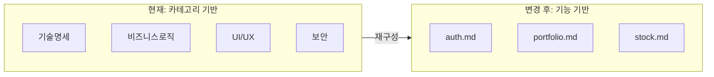

# PRD 문서 구조 변경 안내

> 이 문서는 PRD 작성 방식을 카테고리 기반에서 **기능 기반**으로 변경하는 것에 대한 안내입니다.

---

## 1. 왜 변경하는가?

### 1.1 현재 문제점

AI 에이전트가 PRD를 읽고 개발 작업을 수행할 때:

| 문제 | 설명 |
|------|------|
| **토큰 낭비** | "포트폴리오 기능" 구현 시 6개 파일 전체를 읽어야 함 |
| **정보 분산** | 하나의 기능 정보가 여러 파일에 흩어져 있음 |
| **Phase 혼재** | P1/P2/P3 정보가 섞여 있어 현재 작업에 불필요한 정보도 읽음 |

### 1.2 변경 목표



- **필요한 파일만** 읽어서 토큰 절약
- **기능별로** 정보가 모여 있어 맥락 파악 용이
- **Phase 마커**로 현재/미래 구분 명확

---

## 2. 새로운 디렉토리 구조

```
📁 prd/
│
├── 📄 README.md                 # 진입점 (에이전트 첫 번째로 읽음)
│
├── 📁 core/                     # 핵심 문서 (항상 읽어야 함)
│   ├── overview.md              # Phase별 목표, 마일스톤
│   └── tech-stack.md            # 기술 스택, 아키텍처
│
├── 📁 features/                 # 기능별 상세 (해당 기능 작업 시만)
│   ├── auth.md                  # 인증 (OAuth, JWT, 보안)
│   ├── portfolio.md             # 포트폴리오 관리
│   ├── stock.md                 # 종목 관리, 시세
│   ├── rebalancing.md           # 리밸런싱 알고리즘
│   ├── notification.md          # 알림 기능
│   └── ui-design.md             # 디자인 시스템
│
└── 📁 reference/                # 참조용 (필요시만)
    ├── db-schema.md             # DB 테이블 구조
    ├── api-spec.md              # API 명세
    ├── infra.md                 # 서버/인프라 구성
    ├── security.md              # 보안 체크리스트
    ├── testing.md               # 테스트 전략
    └── deployment.md            # 배포, CI/CD
```

### 폴더별 역할

| 폴더 | 언제 읽나 | 예상 토큰 |
|------|----------|----------|
| `core/` | **항상** (모든 작업 시작 전) | 500-800 |
| `features/해당파일` | 해당 기능 작업 시 | 500-1000/파일 |
| `reference/` | 구체적인 스펙 필요 시 | 필요시만 |

---

## 3. 문서 작성 규칙

### 3.1 기본 템플릿

모든 `features/` 파일은 다음 구조를 따릅니다:

```markdown
# [기능명]

## 요약 ⚡
> 에이전트가 빠르게 파악할 핵심 (3-5줄)
- 핵심 기능 설명
- 현재 Phase 범위
- 주요 제약사항

---

## Phase 1 (현재)

### 기능 목록
- [ ] 기능 A
- [ ] 기능 B

### 규칙
| 항목 | 값 |
|------|-----|
| 항목1 | 값1 |

---

## Phase 2+ (확장 고려사항)

> ⚠️ 현재 구현 시 아래를 **고려**해서 설계할 것

- [P2] 기능 A → 현재 코드에서 모듈화 권장
- [P3] 기능 B → 현재 구현과 무관, 참고만

---

## 관련 문서
- DB: `reference/db-schema.md#테이블명`
- API: `reference/api-spec.md#엔드포인트`
```

### 3.2 Phase 마커 규칙

| 마커 | 의미 | 예시 |
|------|------|------|
| `[P1]` | Phase 1에서 구현 | `[P1] 기본 리밸런싱` |
| `[P2]` | Phase 2에서 구현 예정 | `[P2] 공유 기능` |
| `[P3]` | Phase 3에서 구현 예정 | `[P3] AI 추천` |
| `[P2-고려]` | P2 예정이지만 P1에서 설계 시 고려 필요 | `[P2-고려] is_public 컬럼 미리 추가` |

### 3.3 요약 섹션 작성 원칙

**에이전트가 전체 파일을 읽지 않아도** 핵심을 파악할 수 있도록:

```markdown
## 요약 ⚡

- 사용자당 최대 5개 포트폴리오
- 삭제 시 최소 1개 유지 (자동 생성)
- [P2] 공유 기능 예정 → DB에 `is_public` 컬럼 예약
```

---

## 4. 기존 문서 매핑

현재 6개 파일이 어떻게 재배치되는지:

| 기존 파일 | 섹션 | 새 위치 |
|-----------|------|---------|
| 1 기술명세 | 한투API | `core/tech-stack.md` |
| | OAuth, JWT | `features/auth.md` |
| | 기술스택 | `core/tech-stack.md` |
| 2 비즈니스로직 | 포트폴리오 | `features/portfolio.md` |
| | 종목 | `features/stock.md` |
| | 리밸런싱 | `features/rebalancing.md` |
| | 알림 | `features/notification.md` |
| 3 UI/UX | 전체 | `features/ui-design.md` |
| 4 데이터/보안 | DB 스키마 | `reference/db-schema.md` |
| | 보안 | `features/auth.md` + `reference/security.md` |
| 5 성능 | 인프라 | `reference/infra.md` |
| | 목표 응답시간 | `reference/api-spec.md` |
| 6 테스트/배포 | 테스트 | `reference/testing.md` |
| | 배포 | `reference/deployment.md` |

---

## 5. 에이전트 사용 시나리오

### 예시 1: 포트폴리오 기능 구현

```
에이전트 읽는 순서:
1. README.md (진입점)
2. core/overview.md (Phase 목표)
3. core/tech-stack.md (기술 스택)
4. features/portfolio.md (상세 스펙)
5. (필요시) reference/db-schema.md
```

**예상 토큰: ~1200** (기존 ~4000 대비 70% 절감)

### 예시 2: 로그인 버그 수정

```
에이전트 읽는 순서:
1. README.md
2. features/auth.md

추가 필요시:
3. reference/security.md
```

---

## 6. 마이그레이션 계획

### 단계별 진행

| 단계 | 작업 | 담당 |
|------|------|------|
| 1 | 새 폴더 구조 생성 | - |
| 2 | `core/` 문서 작성 | - |
| 3 | `features/` 문서 작성 (기존 내용 재구성) | - |
| 4 | `reference/` 문서 작성 | - |
| 5 | 기존 파일 보관 또는 삭제 | - |
| 6 | README.md 업데이트 | - |

### 작성 우선순위

1. **core/overview.md** - 전체 프로젝트 맵
2. **core/tech-stack.md** - 기술 스택
3. **features/auth.md** - 인증 (가장 먼저 필요)
4. **features/portfolio.md** - 핵심 기능
5. 나머지 순차 진행

---

## 7. 주의사항

### ✅ DO

- 요약 섹션은 **간결하게** (5줄 이내)
- Phase 마커 **일관되게** 사용
- 확장 고려사항은 **현재 설계에 영향 주는 것만**
- 관련 문서 링크 **정확하게** 기재

### ❌ DON'T

- 하나의 파일에 여러 기능 섞지 않기
- Phase 2/3 상세 내용을 P1 문서에 장황하게 쓰지 않기
- 같은 내용을 여러 파일에 중복하지 않기
- 기술 스펙을 features/에 쓰지 않기 (reference/로)

---

## 8. FAQ

**Q: 기존 문서는 어떻게 하나요?**
> A: 새 구조 완성 후 `archive/` 폴더로 이동하거나 삭제합니다.

**Q: 새 기능이 추가되면?**
> A: `features/새기능.md` 파일을 생성하고 README.md에 링크를 추가합니다.

**Q: Phase가 변경되면?**
> A: 해당 기능 파일에서 Phase 마커를 업데이트합니다. ([P2] → [P1])

---

> 📌 문의사항이 있으면 팀 채널에서 논의해주세요.
>
> 작성일: 2025-12-31
