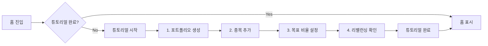

# 화면 기획서: 앱 튜토리얼

> **Screen ID**: `screen-tutorial`
> **Phase**: 2
> **우선순위**: P2
> **마지막 수정**: 2026-01-07

---

## 📋 화면 개요

| 항목               | 내용                                        |
| ------------------ | ------------------------------------------- |
| **화면명**         | 앱 사용방법 튜토리얼                       |
| **목적**           | 신규 사용자에게 앱 조작법을 실습으로 안내  |
| **진입 경로**      | 프로필 설정 완료 후 홈 화면 최초 진입      |
| **이동 가능 화면** | → 홈 (튜토리얼 완료 후)                    |

### 사용자 스토리

> "신규 사용자로서 나는 **직접 따라하면서** 앱 사용법을 배우고 싶다."

---

## 🎯 핵심 사용자 니즈

| 니즈                      | 중요도 | 현재 충족 여부 |
| ------------------------- | ------ | -------------- |
| 첫 포트폴리오 생성 가이드 | ⭐⭐⭐ | ❌ (미구현)    |
| 종목 추가 방법 학습       | ⭐⭐⭐ | ❌ (미구현)    |
| 리밸런싱 기능 이해        | ⭐⭐   | ❌ (미구현)    |
| 건너뛰기 옵션             | ⭐⭐   | ❌ (미구현)    |

---

## 💡 설계 가이드라인

### 1. 튜토리얼 흐름



### 2. 강제 진행 방식

- **건너뛰기 불가**: 주요 단계는 반드시 완료해야 함
- **실제 데이터 생성**: 튜토리얼 중 생성한 포트폴리오/종목은 실제 데이터로 저장

### 3. 단계별 상세

#### Step 1: 포트폴리오 생성

```
┌─────────────────────────────────────┐
│ ✨ 첫 포트폴리오를 만들어볼까요?    │
│                                     │
│ 아래 + 버튼을 눌러주세요            │
│                                     │
│                              [+]    │ ← 하이라이트
└─────────────────────────────────────┘
```

#### Step 2: 종목 추가

```
┌─────────────────────────────────────┐
│ 👍 잘하셨어요!                       │
│                                     │
│ 이제 종목을 추가해볼게요.           │
│ "종목 추가" 버튼을 눌러주세요       │
│                                     │
│    [+ 종목 추가] ← 하이라이트       │
└─────────────────────────────────────┘
```

#### Step 3: 목표 비율 설정

```
┌─────────────────────────────────────┐
│ 📊 목표 비율을 설정해보세요         │
│                                     │
│ 슬라이더를 움직여 원하는 비율을     │
│ 설정해주세요.                       │
│                                     │
│ [━━━━●━━━━━━] 30%                  │
└─────────────────────────────────────┘
```

#### Step 4: 완료

```
┌─────────────────────────────────────┐
│ 🎉 축하합니다!                      │
│                                     │
│ 이제 Stock-Keeper를                 │
│ 자유롭게 사용할 수 있어요!          │
│                                     │
│         [시작하기]                  │
└─────────────────────────────────────┘
```

---

## 📦 DB 저장 사항

| 필드               | 타입    | 설명                     |
| ------------------ | ------- | ------------------------ |
| `tutorial_completed` | Boolean | 튜토리얼 완료 여부       |
| `tutorial_step`    | Integer | 현재 진행 단계 (중단 시) |
| `tutorial_date`    | DateTime | 완료 일시                |

---

## ⚠️ 엣지 케이스

| 상황                 | 권장 처리                        |
| -------------------- | -------------------------------- |
| 튜토리얼 중 앱 종료  | 다음 실행 시 마지막 step부터 재개 |
| 튜토리얼 데이터 삭제 | 튜토리얼 다시 진행하지 않음      |
| 재설치               | 서버에서 완료 여부 확인          |

---

## ✅ 체크리스트

### Phase 2

- [ ] 튜토리얼 UI 프레임워크
- [ ] Step 1~4 가이드 UI
- [ ] 하이라이트 / 오버레이 효과
- [ ] DB 저장 (완료 여부)
- [ ] 실제 데이터 생성 로직

---

## 🔗 관련 문서

- [02_profile.md](./02_profile.md) - 이전 화면 (프로필 설정)
- [03_home.md](./03_home.md) - 튜토리얼 완료 후 이동
