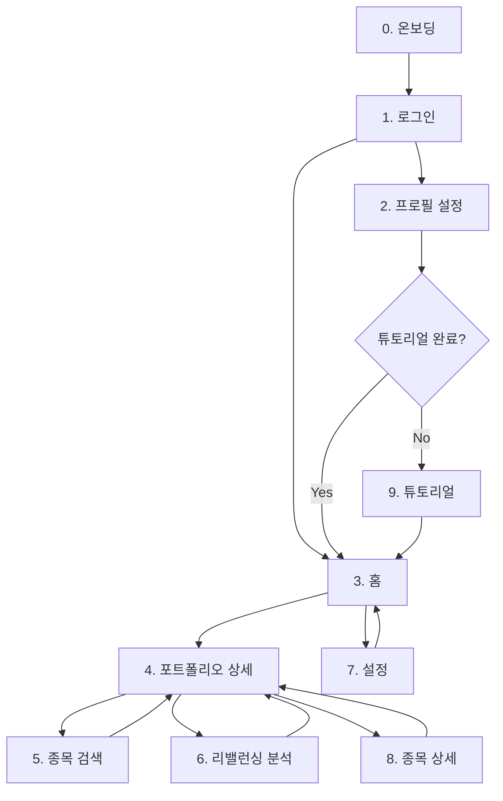

# 화면 기획서 인덱스

> **작성일**: 2026-01-04  
> **프로젝트**: Stock-Keeper  
> **버전**: v1.0 (Phase 1 기준)

---

## 📑 화면 목록

| # | 화면명 | 파일 | 우선순위 | 상태 |
|---|-------|------|---------|------|
| 0 | [앱 소개 온보딩](./00_onboarding.md) | `00_onboarding.md` | P1 | 🆕 작성완료 |
| 1 | [로그인/회원가입](./01_login.md) | `01_login.md` | P1 | ✅ 분석완료 |
| 2 | [프로필 설정](./02_profile.md) | `02_profile.md` | P1 | ✅ 분석완료 |
| 3 | [홈 (포트폴리오 목록)](./03_home.md) | `03_home.md` | P1 | ✅ 분석완료 |
| 4 | [포트폴리오 상세](./04_portfolio_detail.md) | `04_portfolio_detail.md` | P1 | ✅ 분석완료 |
| 5 | [종목 검색/추가](./05_stock_search.md) | `05_stock_search.md` | P1 | ✅ 분석완료 |
| 6 | [리밸런싱 분석](./06_rebalancing.md) | `06_rebalancing.md` | P1 ⭐ | ✅ 분석완료 |
| 7 | [설정](./07_settings.md) | `07_settings.md` | P2 | ✅ 분석완료 |
| 8 | [종목 상세](./08_stock_detail.md) | `08_stock_detail.md` | P1 | 🆕 작성완료 |
| 9 | [앱 튜토리얼](./09_tutorial.md) | `09_tutorial.md` | P2 | 🆕 작성완료 |

---

## 🔗 화면 플로우

---

## 📋 각 문서에 포함된 내용

- **화면 개요**: 목적, 진입 경로, 이동 가능 화면
- **사용자 스토리**: 핵심 니즈 정의
- **현재 구현 요소**: ASCII 와이어프레임으로 시각화
- **개선 아이디어**: 상세 제안 및 옵션 비교
- **엣지 케이스**: 에러 상태, Empty State 등
- **화면 상태**: Loading, Error, Success 등
- **체크리스트**: MVP vs Phase 2 구분

---

## 📚 관련 문서

- [prototype_page_analysis.md](../prototype_page_analysis.md) - 전체 요약
- [ux_design_recommendations.md](../ux_design_recommendations.md) - UX 디자인 가이드
- [screen_flow.md](../screen_flow.md) - 화면 플로우

---

## 📝 용어 정리

| 용어 | 영문 | 설명 |
|-----|------|------|
| **화면 기획서** | Screen Specification | 개별 화면의 상세 설계 문서 |
| **와이어프레임** | Wireframe | 레이아웃 스케치 |
| **유저 플로우** | User Flow | 사용자 이동 경로 |
| **인터랙션 명세** | Interaction Spec | 동작/애니메이션 정의 |

---

> **다음 단계**:
>
> 1. 각 화면 기획서의 개선 아이디어 검토
> 2. 우선순위 결정
> 3. Figma 와이어프레임 작업
