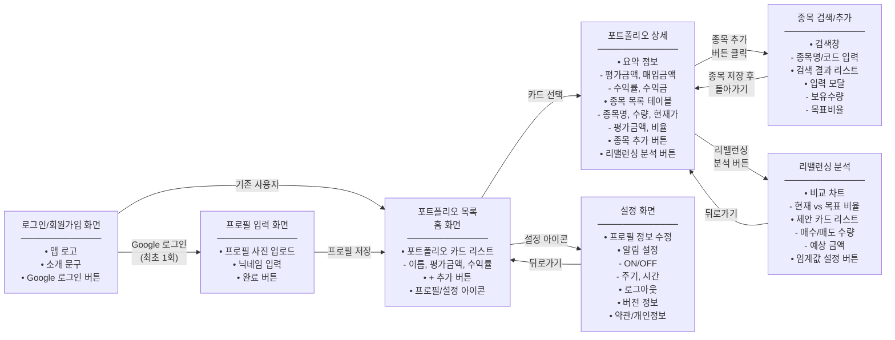

```mermaid
graph LR
    A["로그인/회원가입 화면<br/>─────────────<br/>• 앱 로고<br/>• 소개 문구<br/>• Google 로그인 버튼"]

    B["프로필 입력 화면<br/>─────────────<br/>• 프로필 사진 업로드<br/>• 닉네임 입력<br/>• 완료 버튼"]
    
    C["포트폴리오 목록<br/>홈 화면<br/>─────────────<br/>• 포트폴리오 카드 리스트<br/>  - 이름, 평가금액, 수익률<br/>• + 추가 버튼<br/>• 프로필/설정 아이콘"]
    
    D["포트폴리오 상세<br/>─────────────<br/>• 요약 정보<br/>  - 평가금액, 매입금액<br/>  - 수익률, 수익금<br/>• 종목 목록 테이블<br/>  - 종목명, 수량, 현재가<br/>  - 평가금액, 비율<br/>• 종목 추가 버튼<br/>• 리밸런싱 분석 버튼"]
    
    E["종목 검색/추가<br/>─────────────<br/>• 검색창<br/>  - 종목명/코드 입력<br/>• 검색 결과 리스트<br/>• 입력 모달<br/>  - 보유수량<br/>  - 목표비율"]
    
    F["리밸런싱 분석<br/>─────────────<br/>• 비교 차트<br/>  - 현재 vs 목표 비율<br/>• 제안 카드 리스트<br/>  - 매수/매도 수량<br/>  - 예상 금액<br/>• 임계값 설정 버튼"]
    
    G["설정 화면<br/>─────────────<br/>• 프로필 정보 수정<br/>• 알림 설정<br/>  - ON/OFF<br/>  - 주기, 시간<br/>• 로그아웃<br/>• 버전 정보<br/>• 약관/개인정보"]
    
    A -->|"Google 로그인<br/>(최초 1회)"| B
    A -->|"기존 사용자"| C
    B -->|"프로필 저장"| C
    C -->|"카드 선택"| D
    C -->|"설정 아이콘"| G
    D -->|"종목 추가<br/>버튼 클릭"| E
    D -->|"리밸런싱<br/>분석 버튼"| F
    E -->|"종목 저장 후<br/>돌아가기"| D
    F -->|"뒤로가기"| D
    G -->|"뒤로가기"| C
    
    style A fill:#E
    style B fill:#E
    style C fill:#E
    style D fill:#E
    style E fill:#E
    style F fill:#E
    style G fill:#E
```
