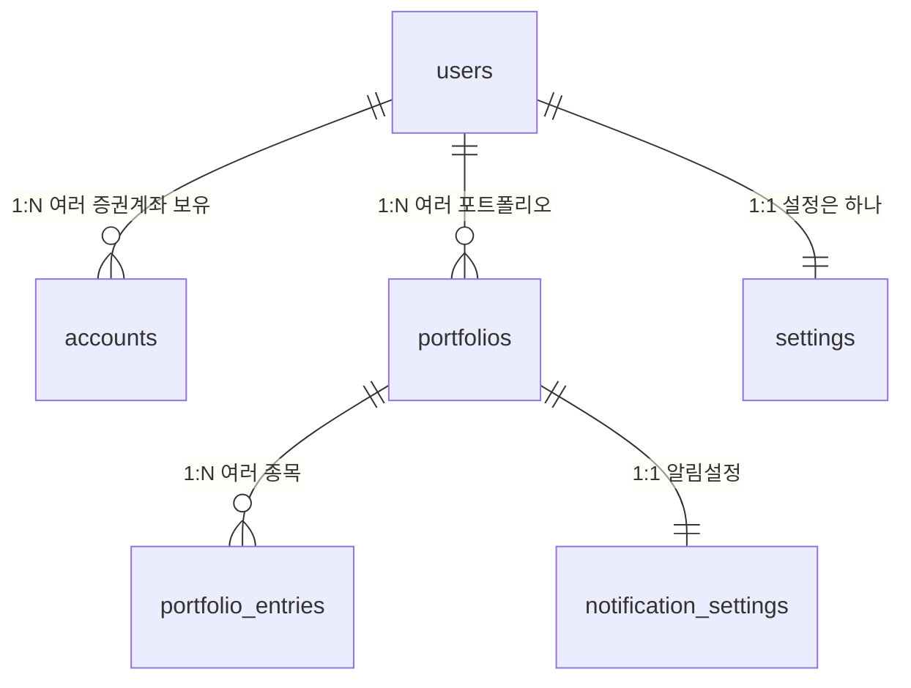

# 주식 포트폴리오 & DB 스키마 완벽 이해 가이드

> 프론트엔드 개발자가 UX를 설계하기 위해 알아야 할 **주식 도메인 개념**, **DB 테이블 관계**, **각 컬럼의 의미**를 한 번에 정리한 문서입니다.

---

## 1. 먼저, 실생활 비유로 이해하기

### 1.1 은행 vs 증권사

| 은행 | 증권사 |
|------|--------|
| 예금 통장 | **증권 계좌** |
| 현금 잔고 | 주식 + 예수금(현금) |
| 이체 | 매수/매도 |

> 증권 계좌 = "주식을 사고팔 수 있는 통장"

### 1.2 포트폴리오란?

**포트폴리오 = 내가 보유한 주식들의 조합**

비유: **도시락 구성**

- 🍚 밥 40%, 🥩 고기 30%, 🥗 야채 30%
- 이 비율이 "포트폴리오"

주식에서는:

- 삼성전자 40%, 애플 30%, 테슬라 30%
- 이 비율을 내가 정한다 = **목표 비중**

### 1.3 리밸런싱이란?

**리밸런싱 = 비율이 틀어졌을 때 다시 맞추는 것**

```
처음 (목표):  삼성 40%, 애플 30%, 테슬라 30%
     ↓
(삼성 주가 상승)
     ↓
현재:         삼성 50%, 애플 25%, 테슬라 25%
     ↓
리밸런싱:     삼성 일부 매도 → 애플/테슬라 매수
     ↓
결과:         삼성 40%, 애플 30%, 테슬라 30% ✅
```

> **왜?** 한 종목에 쏠리면 위험하니까, 균형을 유지하려고

---

## 2. 테이블 관계 한눈에 보기



### 관계 해석

| 관계 | 의미 | 실생활 예시 |
|------|------|-------------|
| `users → accounts` | 한 사람이 여러 증권사 계좌 가능 | "나는 삼성증권, 키움증권 둘 다 써" |
| `users → portfolios` | 한 사람이 여러 포트폴리오 관리 가능 | "은퇴용, 단기투자용 따로 관리" |
| `portfolios → portfolio_entries` | 한 포트폴리오에 여러 종목 | "은퇴용에 삼성, 애플, 국채 담음" |
| `portfolios → notification_settings` | 포트폴리오마다 알림 설정 | "은퇴용만 알림 받을래" |

---

## 3. 테이블별 상세 해설

### 3.1 `users` - 사용자 정보

```sql
Table users {
  id integer [primary key]       -- 고유 번호 (1, 2, 3...)
  email varchar [unique]         -- 로그인 이메일 (중복 불가)
  nickname varchar               -- 화면에 보여줄 이름
  provider enum('GOOGLE')        -- 어디로 로그인했나
  role varchar                   -- USER or ADMIN
  profile_image_url varchar      -- 프로필 사진 URL
  refresh_token text             -- 로그인 유지용 토큰
  is_membership enum             -- 무료/프로/전문가 등급
  created_at / updated_at        -- 가입일, 수정일
}
```

**🎨 프론트 UX 관점:**

- `nickname`: 헤더에 "안녕하세요, OOO님"
- `profile_image_url`: 프로필 아이콘 이미지
- `is_membership`: 프로 기능은 잠금 표시, 업그레이드 유도

---

### 3.2 `accounts` - 증권 계좌

```sql
Table accounts {
  id integer [primary key]
  user_id integer [ref: > users.id]  -- 누구 계좌?
  brokerage_name varchar             -- "삼성증권", "키움증권"
  account_number varchar             -- 계좌번호 (암호화 저장)
  access_token text                  -- 증권사 API 인증
  is_connected boolean               -- 현재 연결 상태
}
```

**왜 따로 테이블인가?**
> 한 사람이 여러 증권사 계좌를 가질 수 있으니까!

**🎨 프론트 UX 관점:**

- 계좌 목록 화면: 카드로 증권사별 표시
- `is_connected`: 연결됨 🟢 / 연결 끊김 🔴  배지
- 계좌 추가 버튼 → OAuth 인증 플로우

---

### 3.3 `portfolios` - 포트폴리오

```sql
Table portfolios {
  id integer [primary key]
  user_id integer [ref: > users.id]  -- 누구 포트폴리오?
  name varchar                       -- "은퇴 준비용", "용돈 굴리기"
  description text                   -- 상세 설명
  is_main boolean                    -- ⭐ 메인으로 표시할 건가
}
```

**⚠️ 중요한 설계 의도:**

- **포트폴리오 ≠ 계좌**: 계좌는 증권사 실제 계좌, 포트폴리오는 "내가 만든 가상 분류"
- 같은 계좌의 종목을 여러 포트폴리오에 나눠 관리할 수도 있음

**🎨 프론트 UX 관점:**

- `is_main = true`인 포트폴리오는 홈 화면에 크게 표시
- 포트폴리오 리스트: 탭 또는 카드 형태

---

### 3.4 `portfolio_entries` - 포트폴리오 내 종목

```sql
Table portfolio_entries {
  id integer [primary key]
  portfolio_id integer [ref: > portfolios.id]
  group enum                -- "국내주식", "해외주식", "ETF" 등
  stock_name varchar        -- "삼성전자", "AAPL"
  bought_price float        -- 내가 산 평균 가격
  current_quantity float    -- 현재 보유 수량 (소수점: 해외주식)
  current_weight float      -- 현재 비중 (%)
  target_weight float       -- 목표 비중 (%)
}
```

**💡 핵심 컬럼 설명:**

| 컬럼 | 왜 float? | 예시 |
|------|----------|------|
| `current_quantity` | 해외주식은 소수점 거래 가능 | 테슬라 0.5주 |
| `current_weight` | 백분율이므로 소수점 필요 | 33.33% |
| `target_weight` | 목표 비율도 소수점 | 30.00% |
| `bought_price` | 소수점 단위 가격 | $193.45 |

**🎨 프론트 UX 관점:**

- 테이블/리스트로 종목 표시
- `current_weight` vs `target_weight` 비교 → 막대 그래프
- 차이가 크면 🔴 빨간색으로 경고

---

### 3.5 `notification_settings` - 알림 설정

```sql
Table notification_settings {
  portfolio_id integer [ref: - portfolios.id]  -- 1:1 관계
  is_enabled boolean
  alert_cycle enum('WEEKLY')      -- 매주, 매월 등
  alert_time time                 -- 09:00, 18:00 등
  threshold_percentage float      -- ±20% 넘으면 알림
}
```

**`ref: -` 의미:**
> `-`는 1:1 관계를 뜻함 (포트폴리오당 알림설정 하나)

**🎨 프론트 UX 관점:**

- 포트폴리오 상세 화면 → 알림 설정 토글
- 임계값 슬라이더: 5% ~ 50%
- "매주 월요일 오전 9시에 알림" 형태로 표시

---

### 3.6 `settings` - 전역 설정

```sql
Table settings {
  user_id integer [ref: > users.id]  -- 1:1
  is_nofitication boolean            -- 전체 알림 ON/OFF
  is_privacy boolean                 -- 개인정보 동의
}
```

**포트폴리오 알림 vs 전역 알림:**

- `notification_settings`: 특정 포트폴리오 알림
- `settings.is_notification`: 앱 전체 알림 ON/OFF (마스터 스위치)

---

## 4. 리밸런싱 계산 로직

### 4.1 핵심 공식

```
리밸런싱_금액 = (총자산 × 목표비중) - 현재평가액
리밸런싱_수량 = 리밸런싱_금액 ÷ 현재가
```

### 4.2 예시

| 종목 | 현재가 | 보유 | 현재비중 | 목표비중 | 조정 |
|------|--------|------|---------|---------|------|
| 삼성 | 7만원 | 10주 | 50% | 40% | -2주 매도 |
| 카카오 | 5만원 | 10주 | 35% | 40% | +1주 매수 |
| 현금 | - | - | 15% | 20% | +5% 확보 |

```
총자산 = 70만 + 50만 + 20만 = 140만원

삼성 목표금액 = 140만 × 40% = 56만원
삼성 현재금액 = 70만원
→ 14만원 팔아야 함 = 2주 매도
```

---

## 5. 프론트엔드 UX 설계 체크리스트

### 5.1 화면별 필요 데이터

| 화면 | 필요 테이블 | 주요 표시 정보 |
|------|------------|--------------|
| 홈 | portfolios, portfolio_entries | 메인 포트폴리오 요약, 총 자산 |
| 포트폴리오 상세 | portfolio_entries | 종목별 비중, 리밸런싱 제안 |
| 계좌 관리 | accounts | 증권사별 계좌 목록, 연결 상태 |
| 설정 | settings, notification_settings | 알림 토글, 주기 설정 |
| 프로필 | users | 닉네임, 이메일, 등급 |

### 5.2 UX 고려사항

1. **실시간 vs 캐시**: 현재가는 API 호출 필요, 비중 계산은 프론트에서
2. **소수점 표시**: 비중은 소수점 둘째자리 (33.33%)
3. **색상 코드**:
   - 현재비중 > 목표비중: 🔴 매도 필요
   - 현재비중 < 목표비중: 🟢 매수 필요
   - 차이 적음: ⚪ 유지

---

## 6. 스키마 개선 제안

현재 스키마를 검토한 결과 몇 가지 개선점이 있어요:

### 6.1 `portfolio_entries` 보완

```diff
Table portfolio_entries {
  ...
+ stock_code varchar     // 종목코드 (005930, AAPL)
+ currency enum          // KRW, USD
+ current_price float    // 현재가 (캐시용)
+ price_updated_at timestamp  // 현재가 갱신 시각
}
```

**이유**: 현재가를 저장해야 비중 계산이 가능하고, 종목코드가 있어야 API로 시세 조회

### 6.2 `accounts`와 `portfolios` 연결?

현재 스키마에서는 포트폴리오와 계좌가 **직접 연결되어 있지 않음**.

- 의도적이라면: "가상 포트폴리오"로 실제 계좌와 무관하게 관리
- 연결이 필요하면: `portfolios`에 `account_id` 추가

---

## 마무리

### 핵심 요약 📌

1. **계좌** = 실제 증권사 계좌 (돈이 있는 곳)
2. **포트폴리오** = 가상의 종목 묶음 (관리 단위)
3. **리밸런싱** = 비중이 틀어지면 다시 맞추는 것
4. **1:N 관계** = users→accounts, users→portfolios, portfolios→entries
5. **1:1 관계** = portfolios→notification_settings, users→settings

### 다음 단계 🚀

이제 이 스키마를 바탕으로:

- 화면 설계(와이어프레임) 작성
- API 엔드포인트 정의
- 상태관리 구조 설계

질문 있으면 언제든 물어봐요! 😊
