# UI/UX 디자인 가이드

> 이 문서는 UI/UX 디자인의 핵심 원리와 왜 그렇게 해야 하는지를 학습하기 위한 교재입니다.

---

## 목차

1. [좋은 UI/UX란 무엇인가](#1-좋은-uiux란-무엇인가)
2. [애니메이션의 역할과 원리](#2-애니메이션의-역할과-원리)
3. [화면 전환의 심리학](#3-화면-전환의-심리학)
4. [마이크로 인터랙션](#4-마이크로-인터랙션)
5. [다크 모드와 라이트 모드](#5-다크-모드와-라이트-모드)
6. [색상과 대비](#6-색상과-대비)
7. [프로젝트 구조와 개발 순서](#7-프로젝트-구조와-개발-순서)

---

## 1. 좋은 UI/UX란 무엇인가

### 1.1 UI와 UX의 차이

많이 혼동되는 두 개념을 명확히 합시다:

| 구분 | UI (User Interface) | UX (User Experience) |
|------|---------------------|---------------------|
| **정의** | 사용자가 보고 만지는 것 | 사용자가 느끼는 것 |
| **예시** | 버튼 색상, 글꼴, 레이아웃 | 앱이 편리했는지, 목표를 달성했는지 |
| **비유** | 레스토랑의 인테리어, 메뉴판 | 음식 맛, 서비스, 전체 경험 |
| **담당자** | UI 디자이너 | UX 디자이너 |

**중요한 관계**:
> 좋은 UI 없이 좋은 UX를 만들기 어렵고,
> 좋은 UI만으로 좋은 UX가 보장되지 않습니다.

### 1.2 사용자는 무엇을 원하는가?

사용자가 앱을 사용할 때 기대하는 것:

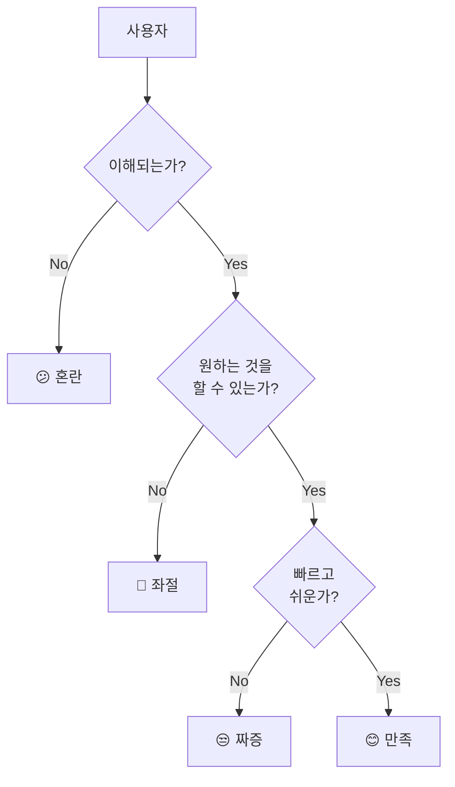

좋은 UI/UX의 핵심:

1. **이해 가능성**: 버튼이 버튼처럼 보이는가?
2. **효율성**: 원하는 것을 빨리 할 수 있는가?
3. **피드백**: 내 행동에 반응하는가?

### 1.3 "왜?"를 아는 것이 중요하다

**나쁜 학습**: "버튼은 파란색으로 해야 해"
**좋은 학습**: "왜 파란색인가? → 행동을 유도하는 색이고, 배경과 대비되기 때문"

이 문서는 **"이렇게 해라"**가 아니라 **"이래서 이렇게 한다"**를 알려줍니다.

---

## 2. 애니메이션의 역할과 원리

### 2.1 애니메이션은 장식이 아니다

많은 사람들이 애니메이션을 "예쁘게 보이려고" 넣는다고 생각합니다.
하지만 애니메이션의 진짜 목적은 **의사소통**입니다.

| 목적 | 설명 | 예시 |
|------|------|------|
| **피드백** | "네 행동을 인식했어" | 버튼 누르면 색 변함 |
| **안내** | "지금 이런 일이 일어나고 있어" | 로딩 스피너 |
| **관계** | "A와 B는 연결되어 있어" | 클릭하면 상세가 펼쳐짐 |
| **주목** | "이것 좀 봐" | 알림 배지 깜빡임 |

### 2.2 인간의 인지 방식 이해하기

사람의 뇌는 **움직임에 민감**합니다.

진화적 이유:
> 원시 시대에 풀숲에서 움직이는 것 = 위험(포식자) 또는 기회(먹이)
> 따라서 뇌는 움직임을 최우선으로 감지하도록 설계됨

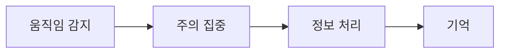

**활용 방법**:

- 중요한 것에 움직임을 주면 → 자연스럽게 주목
- 모든 것이 움직이면 → 혼란 (어디를 봐야 할지 모름)

### 2.3 적절한 속도

애니메이션 속도의 심리학:

| 속도 | 사용자 느낌 | 용도 |
|------|-----------|------|
| 100-150ms | 즉각적, 빠름 | 버튼 반응, 색상 변화 |
| 200-300ms | 자연스러움 | 일반 전환 |
| 300-400ms | 여유로움 | 화면 이동 |
| 500ms 이상 | 느림 | 특별한 강조, 온보딩 |

> **황금률**: 애니메이션이 "느리다"고 느껴지면 너무 긴 것입니다.
> 사용자는 기다리고 싶어하지 않습니다.

### 2.4 이징(Easing)의 원리

이징은 "움직임의 성격"입니다.

**현실 세계에서**:

- 공을 던지면 처음엔 빠르다가 점점 느려짐
- 물체를 밀면 처음엔 느리다가 점점 빨라짐

이것을 애니메이션에 적용:

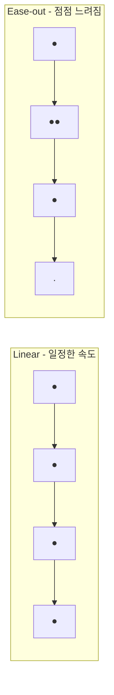

| 이징 | 느낌 | 언제 사용하나 |
|------|------|-------------|
| **linear** | 기계적, 부자연스러움 | 로딩 스피너(무한 회전) |
| **ease-out** | 부드럽게 멈춤 | 화면 진입, 등장 |
| **ease-in** | 가속됨 | 화면 퇴장, 사라짐 |
| **ease-in-out** | 자연스러움 | 대부분의 전환 |
| **bounce** | 재미있음, 주목 | 토글, 특별한 효과 |

---

## 3. 화면 전환의 심리학

### 3.1 공간 기억 (Spatial Memory)

사람의 뇌는 **공간을 기억**합니다.

일상적인 예:
> 책상 왼쪽에 펜을 두면, 다음에 펜이 필요할 때 왼쪽을 봅니다.
> 앱도 마찬가지입니다.

### 3.2 방향의 의미

화면 전환 방향에는 **의미**가 있습니다:

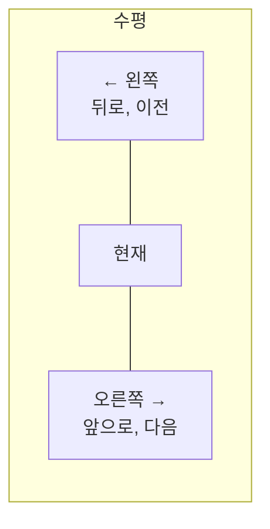

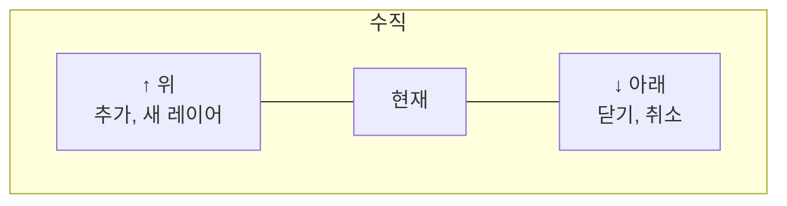

| 방향 | 의미 | 예시 |
|------|------|------|
| **오른쪽 →** | 앞으로, 깊이 들어감 | 목록 → 상세 |
| **← 왼쪽** | 뒤로, 돌아감 | 상세 → 목록 |
| **↑ 아래에서 위** | 추가, 새로운 것 | 모달 열기 |
| **↓ 위에서 아래** | 닫기, 취소 | 모달 닫기 |

**왜 이렇게 사용하는가?**

책을 읽을 때:

- 다음 페이지 → 오른쪽으로 넘김
- 이전 페이지 → 왼쪽으로 넘김

이 익숙함을 앱에 적용합니다.

### 3.3 전환 유형 선택하기

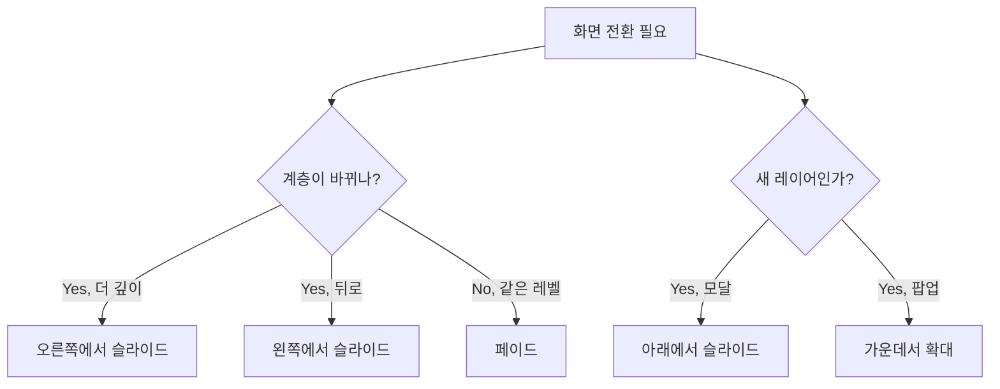

| 상황 | 전환 방식 | 이유 |
|------|----------|------|
| 목록 → 상세 | 오른쪽에서 슬라이드 | "더 깊이 들어감" |
| 상세 → 목록 | 왼쪽으로 슬라이드 | "돌아감" |
| 탭 전환 | 페이드 | 계층 변화 없음 |
| 모달 열기 | 아래에서 슬라이드 | "새 레이어" |
| 경고창 | 가운데서 확대 | "주목 필요" |

---

## 4. 마이크로 인터랙션

### 4.1 마이크로 인터랙션이란?

작은 순간에 일어나는 **피드백**입니다.

예시:

- 버튼을 누르면 살짝 눌리는 효과
- 좋아요 누르면 하트가 커졌다 작아짐
- 잘못 입력하면 입력창이 흔들림

**왜 중요한가?**
> 사용자는 "내가 뭔가를 했다"는 확인을 원합니다.
> 아무 반응이 없으면 "눌린 건가?" 불안해집니다.

### 4.2 버튼 상태

버튼에는 여러 **상태**가 있습니다:

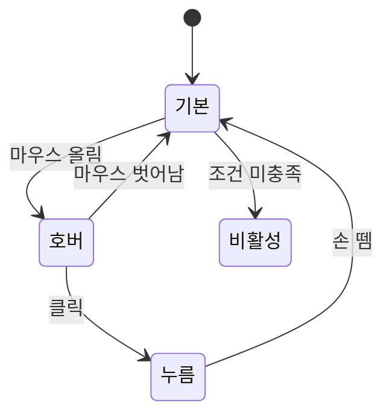

| 상태 | 시각적 변화 | 전달하는 메시지 |
|------|-----------|---------------|
| **기본** | 원래 모습 | "눌러도 돼요" |
| **호버** | 밝아짐, 살짝 떠오름 | "여기 커서 있어요" |
| **누름** | 눌림, 어두워짐 | "누르고 있어요" |
| **비활성** | 흐릿함 (50% 투명도) | "지금은 못 눌러요" |
| **로딩** | 스피너 표시 | "처리 중이에요" |

### 4.3 입력 필드 피드백

입력창도 상태에 따라 다르게 보여야 합니다:

| 상태 | 시각적 변화 | 이유 |
|------|-----------|------|
| 기본 | 회색 테두리 | 입력 가능 |
| 포커스 | 브랜드 색 테두리, 글로우 | "지금 여기 입력 중" |
| 에러 | 빨간 테두리 + 흔들림 | "뭔가 잘못됐어요" |
| 성공 | 초록 체크 아이콘 | "올바른 입력이에요" |

**왜 "흔들림" 효과를 쓰는가?**

사람이 고개를 젓는 것 = "아니오"
입력창이 좌우로 흔들림 = "이건 아니에요"

자연스럽게 "잘못됐다"는 것을 인지합니다.

### 4.4 로딩 표시 선택

로딩 시간에 따라 다른 표시가 필요합니다:

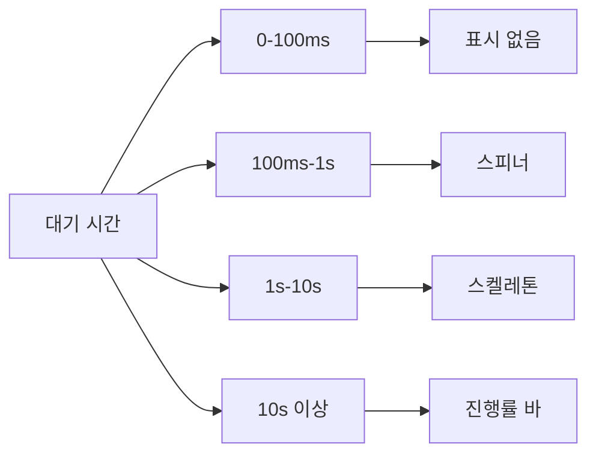

| 대기 시간 | 무엇을 보여줄까 | 이유 |
|----------|---------------|------|
| 0-100ms | 아무것도 | 너무 빨라서 인지 못함 |
| 100ms-1s | 스피너 | "처리 중" 표시 |
| 1s 이상 | 스켈레톤 | 레이아웃 유지, 덜 지루함 |
| 10s 이상 | 진행률 | "얼마나 남았나" 알려줌 |

**스켈레톤 UI란?**

콘텐츠가 들어올 자리를 회색 박스로 미리 보여주는 것.

장점:

- 화면이 갑자기 출렁이지 않음 (레이아웃 시프트 방지)
- 뭔가 로딩 중임을 알 수 있음
- 스피너보다 덜 지루함

### 4.5 성공 피드백

작업이 완료되면 **축하해주세요**.

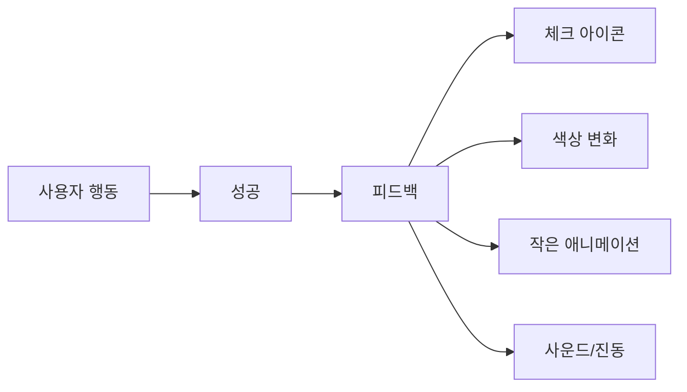

**왜 중요한가?**

심리학적 "보상" 효과:

- 작은 축하가 **도파민**을 분비시킴
- 사용자가 "잘했다"고 느낌
- 다시 하고 싶어짐 (습관 형성)

예시:

- 체크 표시가 그려지는 애니메이션
- 좋아요 누르면 하트가 터지는 효과
- 완료 시 살짝 진동

---

## 5. 다크 모드와 라이트 모드

### 5.1 왜 다크 모드가 필요한가

다크 모드의 장점:

| 장점 | 설명 |
|------|------|
| **눈 보호** | 어두운 환경에서 밝은 화면은 눈 피로 |
| **배터리 절약** | OLED 화면에서 검은색 = 전력 소모 없음 |
| **개인 취향** | 일부 사용자는 다크 모드 선호 |
| **집중** | 콘텐츠가 더 돋보임 |

### 5.2 단순히 반전하면 안 되는 이유

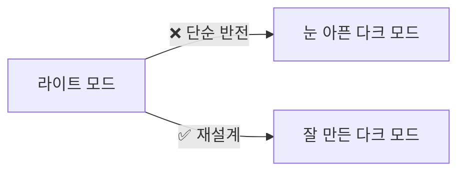

**단순 반전의 문제**:

- 흰 배경 → 검은 배경: OK
- 검은 텍스트 → 흰 텍스트: OK
- 이미지, 로고, 아이콘: **망함**

### 5.3 다크 모드 설계 원칙

**원칙 1: 깊이 표현 방식이 다르다**

| 라이트 모드 | 다크 모드 |
|------------|----------|
| 배경: 흰색 | 배경: 매우 어두운 색 |
| 카드: 흰색 + **그림자** | 카드: 배경보다 **밝은 색** |
| 깊이 = 그림자로 표현 | 깊이 = 밝기로 표현 |

**왜?**
> 다크 모드에서 그림자는 잘 안 보입니다.
> 대신 밝기 차이로 "위에 떠있는 느낌"을 줍니다.

**원칙 2: 채도를 낮춘다**

| 라이트 모드 | 다크 모드 |
|------------|----------|
| 선명한 빨강 #FF0000 | 부드러운 빨강 #EF5350 |
| 선명한 초록 #00FF00 | 부드러운 초록 #66BB6A |

**왜?**
> 어두운 배경에서 선명한 색상 = 눈 아픔
> 채도를 낮추면 눈이 편함

**원칙 3: 순수 검정은 피한다**

```
❌ #000000 (순수 검정)
✅ #0a0a0f, #1a1a2e (어두운 남색/보라)
```

**왜?**

- 순수 검정과 순수 흰색의 대비 = **너무 강함** → 눈 피로
- 약간의 색감 = 더 부드럽고 고급스러움

### 5.4 CSS 변수로 테마 관리하기

테마를 쉽게 바꾸려면 **색상을 변수로** 관리합니다.

**변수 없이 (나쁜 예)**:
모든 파일에서 `#1a1a2e`를 찾아서 바꿔야 함

**변수 사용 (좋은 예)**:
한 곳에서 `--bg-primary: #1a1a2e`만 바꾸면 전체 적용

변수 이름 규칙:

| 나쁜 예 | 좋은 예 | 이유 |
|---------|--------|------|
| `--blue` | `--color-primary` | 파란색이 아닐 수도 있음 |
| `--dark-bg` | `--bg-primary` | 라이트/다크 둘 다 써야 함 |

### 5.5 시스템 설정 연동

사용자가 설정하지 않아도 **시스템 설정**을 따르게 할 수 있습니다.

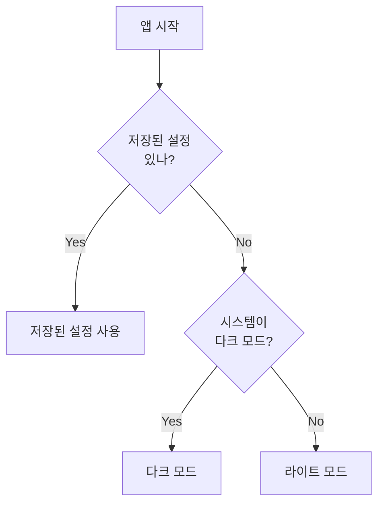

**우선순위**:

1. 사용자가 직접 선택한 설정
2. 시스템 설정
3. 기본값 (라이트 모드)

---

## 6. 색상과 대비

### 6.1 색상의 심리

색상에는 **감정**이 있습니다:

| 색상 | 느낌 | 용도 |
|------|------|------|
| **파랑** | 신뢰, 안정 | 로그인, 저장 버튼 |
| **초록** | 성공, 긍정 | 완료, 승인, 수익 |
| **빨강** | 경고, 위험 | 삭제, 에러, 손실 |
| **노랑/주황** | 주의, 경고 | 주의 메시지 |
| **보라** | 고급, 창의 | 프리미엄 기능 |

### 6.2 대비의 중요성

**대비**란 두 색상이 얼마나 구분되는가입니다.

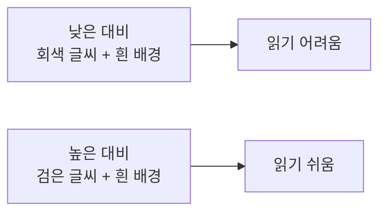

**WCAG 기준**(웹 접근성 가이드라인):

- 일반 텍스트: 최소 **4.5:1** 대비
- 큰 텍스트: 최소 **3:1** 대비

### 6.3 텍스트 계층 만들기

모든 텍스트가 같은 색이면 **중요도**를 알 수 없습니다.

투명도로 계층 만들기:

| 중요도 | 투명도 | 용도 |
|--------|-------|------|
| 최고 | 100% | 제목, 핵심 정보 |
| 높음 | 87% | 본문 제목 |
| 보통 | 70% | 일반 본문 |
| 낮음 | 50% | 설명, 힌트 |
| 비활성 | 40% | 비활성 텍스트 |

### 6.4 브랜드 색상과 기능 색상

**브랜드 색상**: 앱의 정체성

- 로고 색, 메인 버튼 색
- 일관되게 사용

**기능 색상**: 의미가 있는 색

- 성공 (초록), 에러 (빨강), 경고 (노랑)
- **절대 다른 의미로 쓰지 않기**

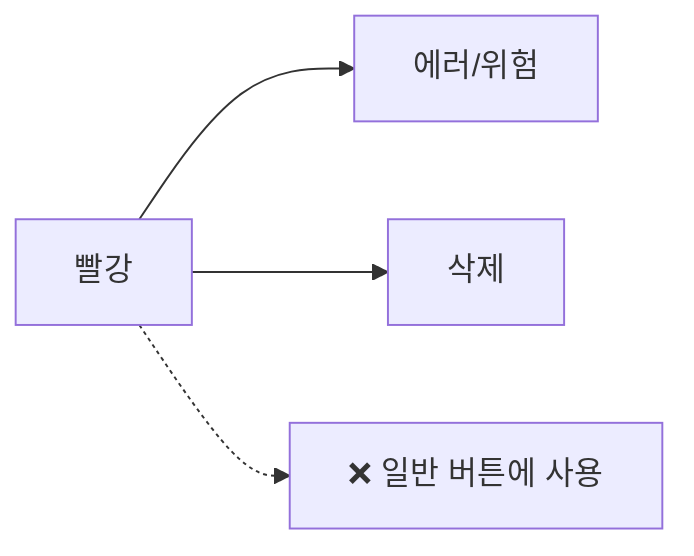

> 빨강 버튼을 보면 사용자는 "위험하구나"라고 느낍니다.
> 일반 기능에 빨강을 쓰면 혼란스럽습니다.

---

## 7. 프로젝트 구조와 개발 순서

### 7.1 왜 구조가 중요한가

코드가 많아지면:

- "이 코드 어디있지?" → 찾는 시간 낭비
- "이미 만들어놨나?" → 중복 코드 발생
- "수정하면 다른 데 영향 있나?" → 버그 발생

좋은 구조 = **예측 가능한** 구조

### 7.2 스타일 관련 폴더

```
📁 src/
├── 📁 styles/              # 전역 스타일
│   ├── theme.ts            # 색상, 간격, 반경 등
│   ├── typography.ts       # 폰트 스타일
│   └── animations.ts       # 공통 애니메이션
│
└── 📁 components/
    └── Button/
        ├── Button.tsx      # 컴포넌트
        └── Button.styles.ts # 이 컴포넌트만의 스타일
```

**왜 분리하는가?**

| 전역 스타일 | 컴포넌트 스타일 |
|------------|---------------|
| 앱 전체에서 사용 | 이 컴포넌트에서만 사용 |
| 한 곳에서 관리 | 컴포넌트와 함께 관리 |
| 예: 브랜드 색상 | 예: 버튼 패딩 |

### 7.3 개발 순서

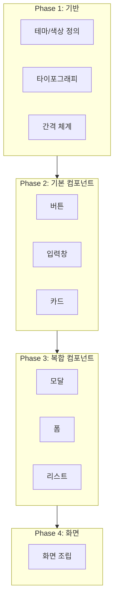

**왜 이 순서인가?**

1. **테마가 먼저**: 없으면 컴포넌트마다 색상 하드코딩
2. **기본 컴포넌트가 먼저**: 복합 컴포넌트가 사용함
3. **복합 컴포넌트가 먼저**: 화면에서 조립함

### 7.4 "처음부터" vs "나중에"

| 처음부터 해야 함 | 나중에 해도 됨 |
|----------------|--------------|
| 색상 변수 시스템 | 세밀한 애니메이션 튜닝 |
| 기본 컴포넌트 | 다크 모드 (있으면 좋음) |
| 반응형 레이아웃 기초 | 고급 마이크로 인터랙션 |
| 접근성 기본 | 성능 최적화 |

### 7.5 네이밍 규칙

일관된 이름이 중요합니다:

| 대상 | 규칙 | 예시 |
|------|------|------|
| 컴포넌트 파일 | PascalCase | `ProfileCard.tsx` |
| 스타일 파일 | 컴포넌트명.styles | `ProfileCard.styles.ts` |
| CSS 클래스 | kebab-case | `.profile-card` |
| 색상 변수 | --용도-상세 | `--bg-primary` |
| 간격 변수 | --spacing-크기 | `--spacing-md` |

---

## 마무리

### 핵심 요약

1. **UI/UX는 다르다**: UI는 보이는 것, UX는 느끼는 것
2. **애니메이션은 의사소통**: 장식이 아님
3. **방향에 의미가 있다**: 오른쪽=앞으로, 왼쪽=뒤로
4. **피드백을 줘라**: 사용자 행동에 반응
5. **다크 모드는 단순 반전이 아님**: 재설계 필요
6. **대비를 신경 써라**: 읽기 쉬워야 함
7. **순서대로 개발하라**: 기반 → 기본 → 복합 → 화면

### 더 공부할 자료

| 주제 | 리소스 |
|------|--------|
| 애니메이션 | [Material Design Motion](https://m2.material.io/design/motion) |
| 접근성 | [WCAG 가이드라인](https://www.w3.org/WAI/WCAG21/quickref/) |
| iOS 가이드 | [Apple HIG](https://developer.apple.com/design/human-interface-guidelines) |
| Android 가이드 | [Material Design 3](https://m3.material.io/) |
| 색상 대비 확인 | [WebAIM Contrast Checker](https://webaim.org/resources/contrastchecker/) |

---

> 📌 이 문서는 학습 목적으로 작성되었습니다.
>
> 마지막 업데이트: 2025-12-31
