# 개발 환경 & 테스트 가이드

> 이 문서는 개발 과정에서 겪는 번거로움을 줄이고, 효율적으로 테스트하는 방법을 학습하기 위한 교재입니다.

---

## 목차

1. [개발할 때 왜 이렇게 불편한가](#1-개발할-때-왜-이렇게-불편한가)
2. [환경 분리의 필요성](#2-환경-분리의-필요성)
3. [Mock 데이터란](#3-mock-데이터란)
4. [테스트 계정 자동화](#4-테스트-계정-자동화)
5. [테스트의 종류와 전략](#5-테스트의-종류와-전략)
6. [개발자 경험(DX) 향상](#6-개발자-경험dx-향상)
7. [실무 적용 가이드](#7-실무-적용-가이드)

---

## 1. 개발할 때 왜 이렇게 불편한가

### 1.1 개발자가 겪는 대표적인 고통

개발 중에 이런 상황을 겪어본 적 있나요?

**상황 1: 테스트 계정 지옥**
> "새 기능을 테스트하려면 매번 회원가입해야 해요."  
> "테스트 끝나면 DB에서 직접 삭제해야 해요."  
> "PGAdmin 열고, 테이블 찾고, 삭제하고... 너무 번거로워요."

**상황 2: 백엔드 의존성**
> "백엔드가 아직 안 만들어져서 프론트 개발을 못 해요."  
> "API가 바뀌어서 갑자기 화면이 안 돼요."

**상황 3: 환경 혼란**
> "제 컴퓨터에서는 되는데요?"  
> "실서버에 배포했더니 안 돼요."

이 문서에서는 이 모든 문제를 **해결하는 방법**을 배웁니다.

### 1.2 비효율적인 개발 흐름 (AS-IS)

현재 많은 개발자가 겪는 플로우:

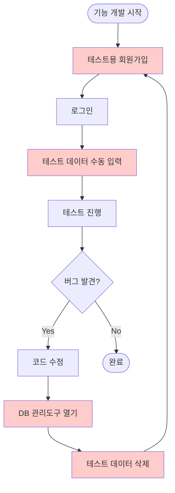

빨간색으로 표시된 단계가 **반복적이고 수동적인 작업**입니다.

### 1.3 효율적인 개발 흐름 (TO-BE)

자동화를 적용한 플로우:

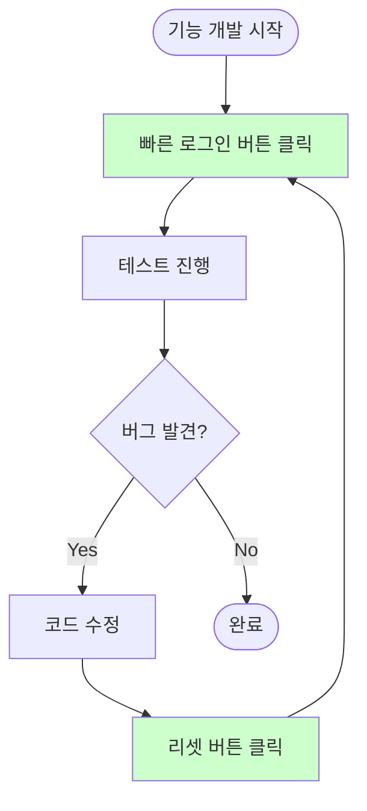

초록색 단계는 **버튼 한 번**으로 끝나는 작업입니다.

---

## 2. 환경 분리의 필요성

### 2.1 환경이란?

**환경(Environment)**은 "코드가 실행되는 곳"을 의미합니다.

| 환경 | 설명 | 사용자 |
|------|------|--------|
| **Local** | 개발자 컴퓨터 | 나 혼자 |
| **Development** | 팀 공용 개발 서버 | 개발팀 |
| **Staging** | 배포 전 테스트 서버 | QA팀, 기획자 |
| **Production** | 실제 서비스 서버 | 실제 사용자 |

### 2.2 왜 환경을 나누는가?

**하나의 환경만 있다면?**

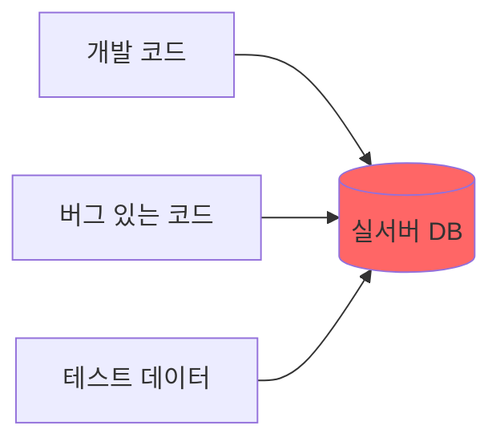

- 개발 중인 불안정한 코드가 실서버에 영향
- 테스트 데이터가 실제 데이터와 섞임
- **대참사** 🔥

**환경을 분리하면?**

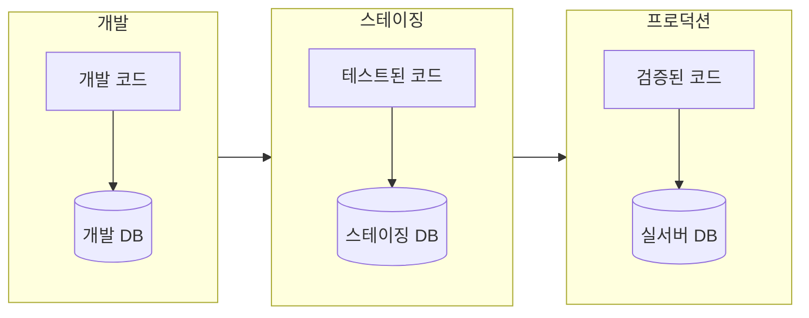

- 각 환경이 독립적
- 실수해도 실서버에 영향 없음
- 단계별로 검증 가능

### 2.3 환경 변수란?

**환경 변수(Environment Variable)**는 "환경마다 다른 설정값"입니다.

예를 들어 API 주소:

- 로컬: `http://localhost:3000`
- 개발: `https://dev-api.myapp.com`
- 프로덕션: `https://api.myapp.com`

코드에 직접 쓰면 환경 바꿀 때마다 코드를 수정해야 합니다:

```javascript
// ❌ 안 좋은 예: 하드코딩
const API_URL = 'https://api.myapp.com';
```

환경 변수를 사용하면:

```javascript
// ✅ 좋은 예: 환경 변수
const API_URL = process.env.API_URL;
```

환경에 따라 다른 파일에서 값을 읽어옵니다:

- `.env.local` → 로컬 설정
- `.env.development` → 개발 설정
- `.env.production` → 프로덕션 설정

### 2.4 환경 변수 관리 원칙

| 원칙 | 설명 | 예시 |
|------|------|------|
| **비밀번호는 Git에 올리지 않는다** | `.gitignore`에 추가 | `.env.local`, `.env.production` |
| **예시 파일은 공유한다** | 어떤 변수가 필요한지 알 수 있도록 | `.env.example` |
| **환경마다 다른 값만 변수로** | 모든 곳에서 같은 값은 코드에 써도 됨 | 앱 이름 등 |

---

## 3. Mock 데이터란

### 3.1 Mock의 개념

**Mock(모의)**은 "진짜처럼 행동하는 가짜"입니다.

일상적인 예:
> 자동차 충돌 테스트에서 사람 대신 **더미 인형**을 사용합니다.  
> 진짜 사람을 태울 순 없으니까요.

개발에서:
> 실제 서버 대신 **Mock 서버**를 사용합니다.  
> 서버가 아직 없거나, 안정적인 테스트가 필요하니까요.

### 3.2 왜 Mock을 사용하는가?

**Mock 없이 개발하면:**

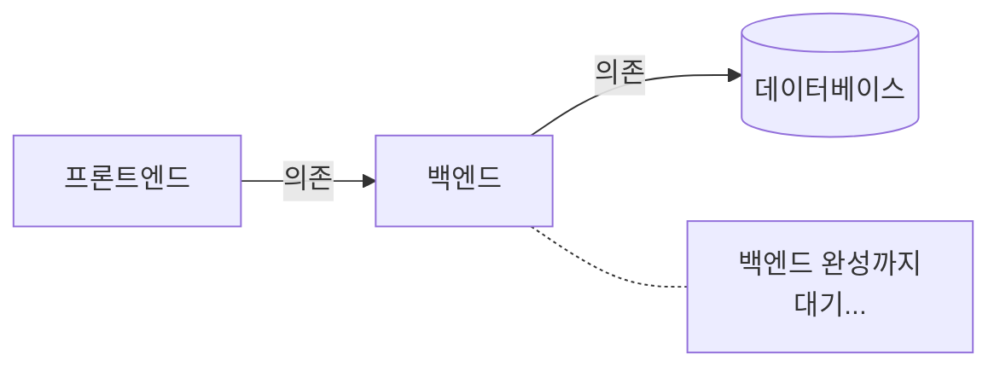

- 백엔드가 완성될 때까지 프론트 개발 불가
- 서버가 불안정하면 내 코드도 테스트 불가
- 인터넷이 안 되면 개발 불가

**Mock을 사용하면:**

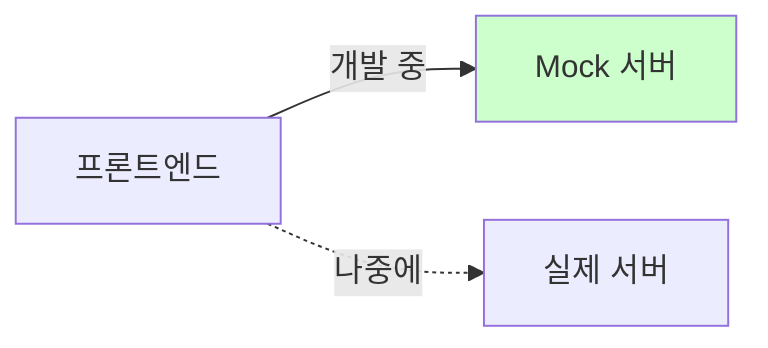

- 백엔드 없이도 프론트 개발 가능
- 항상 일관된 응답으로 안정적 테스트
- 에러 상황도 쉽게 재현 가능

### 3.3 Mock 데이터의 종류

| 종류 | 설명 | 예시 |
|------|------|------|
| **Fixture** | 미리 정의된 고정 데이터 | 테스트용 사용자 3명, 게시글 10개 |
| **Factory** | 필요할 때 데이터를 생성하는 함수 | `createUser()` → 매번 다른 사용자 생성 |
| **Mock API** | 가짜 API 서버 | 진짜 서버처럼 응답하는 가짜 서버 |

### 3.4 Fixture 예시

**정적 데이터**: 테스트할 때 항상 같은 값이 필요할 때

```javascript
// 테스트용 사용자 목록
const mockUsers = [
  { id: 1, name: '홍길동', email: 'hong@test.com' },
  { id: 2, name: '김철수', email: 'kim@test.com' },
  { id: 3, name: '이영희', email: 'lee@test.com' },
];

// 빈 상태 테스트용
const emptyUser = null;

// 에러 상태 테스트용
const invalidUser = { id: -1, name: '', email: 'invalid' };
```

**왜 여러 종류를 준비하는가?**

- `mockUsers`: 정상 동작 테스트
- `emptyUser`: 빈 화면 테스트
- `invalidUser`: 에러 처리 테스트

### 3.5 Mock API 동작 원리

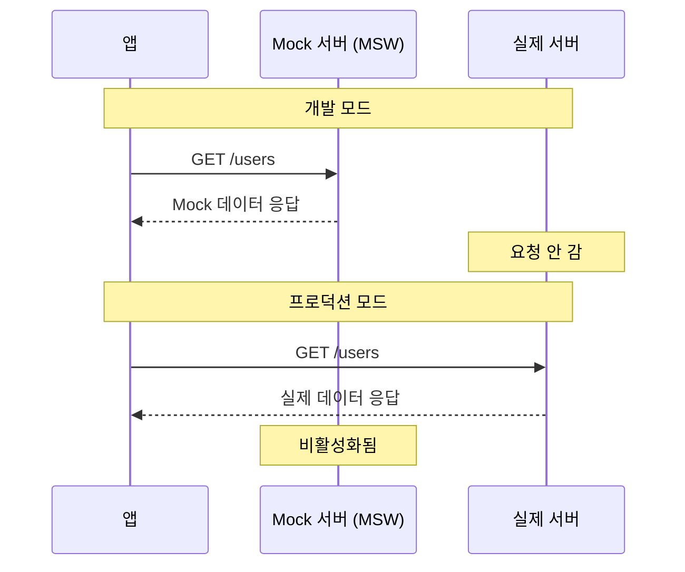

개발할 때는 Mock이 가로채서 응답하고, 프로덕션에서는 진짜 서버로 갑니다.

---

## 4. 테스트 계정 자동화

### 4.1 문제: 수동 테스트의 고통

매번 테스트할 때마다:

1. 회원가입 화면 → 정보 입력 → 가입
2. 로그인 화면 → 비밀번호 입력 → 로그인
3. 테스트 데이터 수동 생성
4. 실제 테스트
5. DB 관리 도구 열기 → 데이터 삭제

**이 과정을 하루에 수십 번 반복**합니다.

### 4.2 해결책 1: Quick Login (빠른 로그인)

개발 환경에서만 사용할 수 있는 **"비밀번호 없이 바로 로그인"** 기능

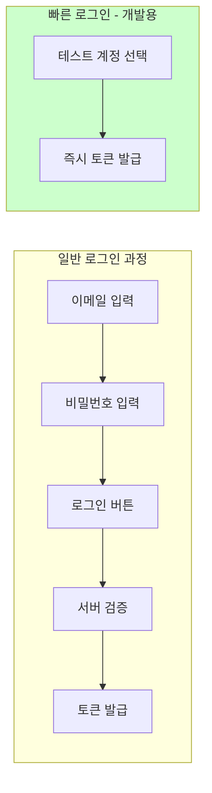

화면에 개발용 패널 추가:

```
┌─────────────────────────────┐
│  🔧 Dev Quick Login         │
│ ┌─────────────────────────┐ │
│ │ 👤 일반 사용자          │ │
│ │    test@dev.com         │ │
│ └─────────────────────────┘ │
│ ┌─────────────────────────┐ │
│ │ 👑 프리미엄 사용자       │ │
│ │    premium@dev.com      │ │
│ └─────────────────────────┘ │
│ ┌─────────────────────────┐ │
│ │ 🆕 신규 가입자          │ │
│ │    new@dev.com          │ │
│ └─────────────────────────┘ │
└─────────────────────────────┘
```

클릭 한 번으로 해당 계정으로 로그인됩니다.

### 4.3 해결책 2: Seed 스크립트

**Seed(씨앗 뿌리기)**는 DB에 테스트 데이터를 자동으로 넣는 것입니다.

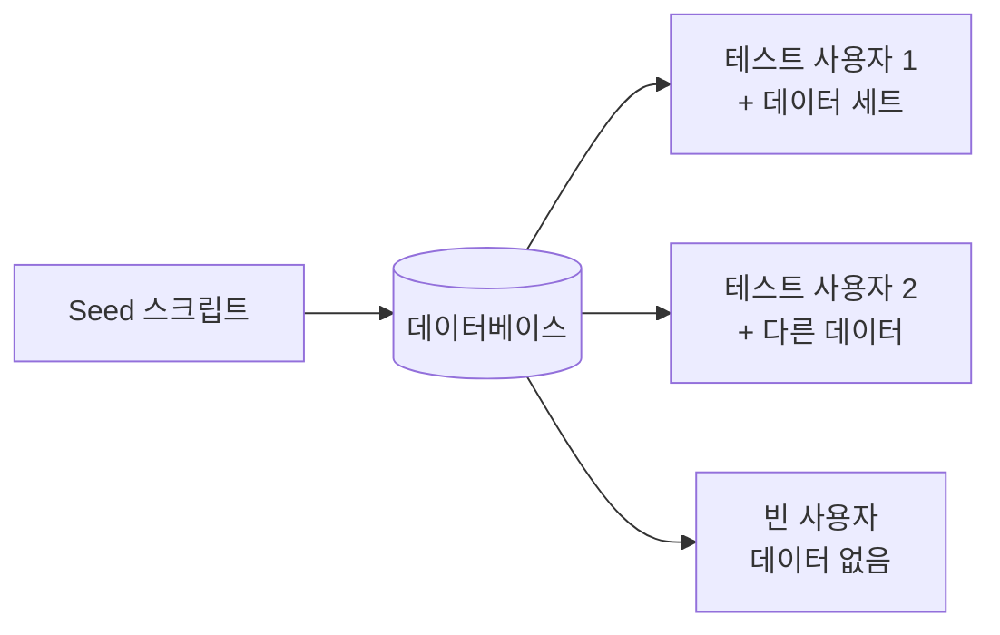

명령어 한 줄로 실행:

```bash
npm run db:seed
```

이 명령어가 자동으로:

1. 기존 테스트 데이터 삭제
2. 테스트 사용자 3명 생성
3. 각 사용자에게 샘플 데이터 추가

### 4.4 해결책 3: 리셋 버튼

개발 환경에서 데이터를 처음 상태로 되돌리는 버튼


PGAdmin 열 필요 없이 버튼 한 번으로 초기화!

### 4.5 시나리오별 테스트 계정

다양한 상황을 테스트하기 위해 여러 계정 준비:

| 계정 | 용도 | 데이터 상태 |
|------|------|-----------|
| `test@dev.com` | 일반 테스트 | 기본 데이터 있음 |
| `new@dev.com` | 신규 가입 플로우 | 데이터 없음 (빈 화면 테스트) |
| `premium@dev.com` | 유료 기능 테스트 | 프리미엄 구독 상태 |
| `heavy@dev.com` | 성능 테스트 | 대량 데이터 (1000개 이상) |
| `error@dev.com` | 에러 상황 테스트 | 의도적으로 에러 유발 |

### 4.6 주의사항: 프로덕션 보호

이 기능들은 **개발 환경에서만** 동작해야 합니다!

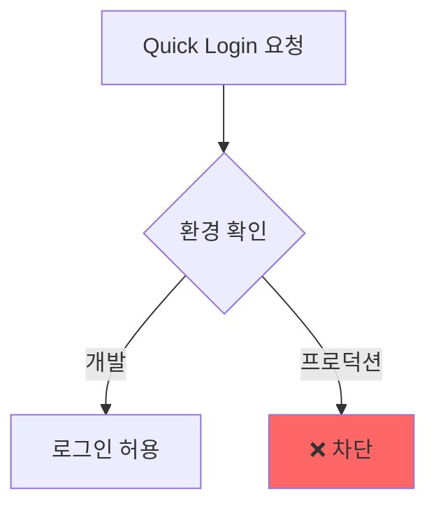

**체크리스트**:

- [ ] 환경 변수로 기능 ON/OFF 제어
- [ ] 프로덕션 배포 전 기능 비활성화 확인
- [ ] `/dev/*` 엔드포인트는 프로덕션에서 404 반환

---

## 5. 테스트의 종류와 전략

### 5.1 왜 테스트를 하는가?

테스트 없이 개발하면:

- "이 버튼 눌러도 되나?" 매번 수동 확인
- 코드 수정 후 "다른 곳 안 망가졌겠지?" 불안
- 버그가 실서버에서 발견됨 → 사용자 피해

테스트가 있으면:

- 코드 수정 → 테스트 실행 → 통과하면 안심
- 버그가 배포 전에 발견됨
- 자신감 있게 리팩토링 가능

### 5.2 테스트 피라미드

테스트는 **피라미드 모양**으로 구성하는 것이 좋습니다:

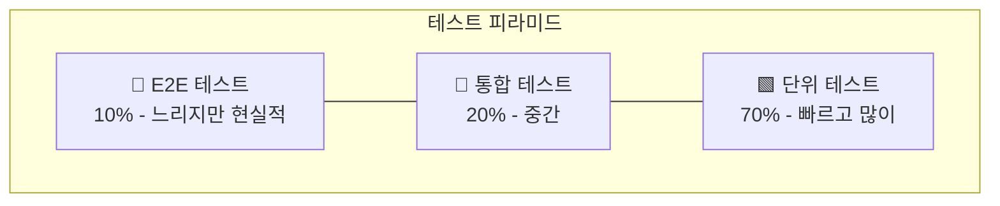

| 종류 | 테스트 대상 | 속도 | 비율 |
|------|-----------|------|------|
| **단위 테스트** | 함수 하나, 컴포넌트 하나 | 빠름 | 70% |
| **통합 테스트** | 여러 부분이 함께 동작 | 보통 | 20% |
| **E2E 테스트** | 사용자가 실제로 하는 행동 | 느림 | 10% |

### 5.3 단위 테스트 (Unit Test)

> "이 함수가 올바르게 동작하는가?"

**예시: 금액 포맷 함수**

```javascript
function formatCurrency(amount) {
  return `₩${amount.toLocaleString()}`;
}

// 테스트
test('금액을 올바르게 포맷한다', () => {
  expect(formatCurrency(1000)).toBe('₩1,000');
  expect(formatCurrency(1234567)).toBe('₩1,234,567');
});

test('0원을 처리한다', () => {
  expect(formatCurrency(0)).toBe('₩0');
});
```

**특징**:

- 하나의 함수만 테스트
- 외부 의존성 없음 (DB, API 안 씀)
- 매우 빠름 (수천 개도 몇 초)

### 5.4 통합 테스트 (Integration Test)

> "여러 부분이 함께 잘 동작하는가?"

**예시: 로그인 화면**

```javascript
test('로그인 버튼을 누르면 API가 호출된다', async () => {
  // 화면 렌더링
  render(<LoginScreen />);
  
  // 입력
  fireEvent.changeText(screen.getByPlaceholder('이메일'), 'test@test.com');
  fireEvent.changeText(screen.getByPlaceholder('비밀번호'), 'password123');
  
  // 버튼 클릭
  fireEvent.press(screen.getByText('로그인'));
  
  // API 호출 확인
  await waitFor(() => {
    expect(mockApi.login).toHaveBeenCalledWith('test@test.com', 'password123');
  });
});
```

**특징**:

- 컴포넌트 + 상태 + API 호출 함께 테스트
- Mock API 사용
- 단위 테스트보다 느리지만 현실적

### 5.5 E2E 테스트 (End-to-End)

> "사용자 입장에서 전체 흐름이 잘 되는가?"

**예시: 회원가입 → 로그인 → 메인 화면**

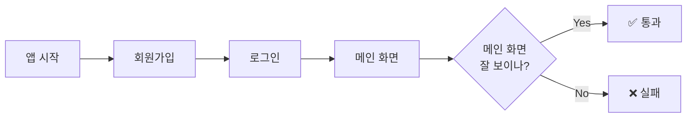

**특징**:

- 실제 앱을 실행하고 클릭/입력
- 실제 서버 또는 Staging 서버 사용
- 가장 느리지만 가장 확실함

### 5.6 무엇을 테스트해야 하는가?

모든 것을 테스트할 수는 없습니다. **우선순위**:

| 우선순위 | 대상 | 이유 |
|---------|------|------|
| 🔴 높음 | 핵심 비즈니스 로직 | 돈/데이터가 오가는 곳 |
| 🔴 높음 | 인증/보안 | 보안 사고 방지 |
| 🟡 중간 | 자주 바뀌는 코드 | 변경 시 버그 발생 가능 |
| 🟡 중간 | 복잡한 조건문 | 실수하기 쉬움 |
| 🟢 낮음 | 단순 UI | 눈으로 확인 가능 |

---

## 6. 개발자 경험(DX) 향상

### 6.1 DX란?

**DX (Developer Experience)**는 "개발하는 경험이 얼마나 좋은가"입니다.

UX가 사용자 경험이라면, DX는 **개발자 경험**입니다.

**좋은 DX 예시**:

- 저장하면 자동으로 화면 새로고침 (Hot Reload)
- 에러 메시지가 어디가 잘못됐는지 정확히 알려줌
- 코드 작성 중 자동완성 지원

**나쁜 DX 예시**:

- 코드 바꿀 때마다 수동으로 서버 재시작
- 에러 메시지: "Error occurred" (뭐가 잘못된 건지 모름)
- 타이핑할 때마다 전체 화면 깜빡임

### 6.2 개발 도구 패널 (DevPanel)

개발 환경에서만 보이는 **헬퍼 도구**:

```
┌────────────────────────────────┐
│  🔧 Developer Tools            │
├────────────────────────────────┤
│ Quick Login                    │
│ ├── 👤 일반 사용자 [로그인]     │
│ └── 👑 프리미엄 [로그인]        │
├────────────────────────────────┤
│ Actions                        │
│ ├── 🔄 데이터 리셋              │
│ ├── 🗑️ 캐시 클리어             │
│ └── 🚪 로그아웃                 │
├────────────────────────────────┤
│ Current State                  │
│ └── { user: {...}, ... }       │
└────────────────────────────────┘
```

### 6.3 자동화할 수 있는 것들

| 수동 작업 | 자동화 방법 |
|----------|-----------|
| 코드 정렬 | 저장 시 자동 포맷 (Prettier) |
| 린트 검사 | 저장 시 자동 검사 (ESLint) |
| 테스트 실행 | 커밋 전 자동 실행 (Husky) |
| 타입 체크 | 실시간 검사 (TypeScript) |
| 컴포넌트 생성 | 템플릿 스크립트 |

### 6.4 템플릿화의 이점

새 컴포넌트를 만들 때마다:

```
📁 Button/
├── Button.tsx        # 컴포넌트 파일
├── Button.styles.ts  # 스타일 파일
├── Button.types.ts   # 타입 파일
└── index.ts          # export 파일
```

매번 직접 만들면:

- 시간 낭비
- 파일 빠뜨림
- 네이밍 불일치

**템플릿 스크립트**를 만들어두면:

```bash
npm run generate:component Button
```

→ 4개 파일이 자동 생성!

---

## 7. 실무 적용 가이드

### 7.1 새 프로젝트 시작 시 체크리스트

**환경 설정**

- [ ] `.env.example` 파일 생성 (필요한 변수 목록)
- [ ] `.env.local`을 `.gitignore`에 추가
- [ ] 환경별 설정 파일 준비

**Mock 설정**

- [ ] Mock 데이터 폴더 구조 생성
- [ ] 기본 Fixture 데이터 작성
- [ ] Mock API 서버 설정 (MSW 등)

**테스트 계정**

- [ ] Seed 스크립트 작성
- [ ] Quick Login 컴포넌트 추가
- [ ] DevPanel 컴포넌트 추가

**자동화**

- [ ] ESLint + Prettier 설정
- [ ] 저장 시 자동 포맷 설정
- [ ] Git Hook 설정 (커밋 전 린트/테스트)

### 7.2 배포 전 체크리스트

**개발 기능 비활성화 확인**

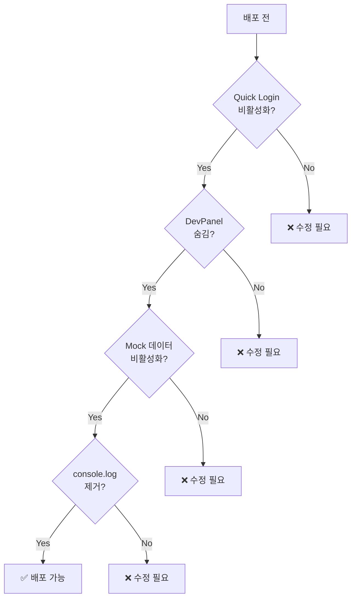

**환경 변수 확인**

- [ ] `ENABLE_DEV_TOOLS=false`
- [ ] `ENABLE_MOCK_DATA=false`
- [ ] API URL이 프로덕션 주소인지 확인

### 7.3 팀 협업 시 공유할 것

| 항목 | 공유 방법 |
|------|----------|
| 환경 변수 목록 | `.env.example` 파일 |
| 테스트 계정 정보 | README.md 또는 팀 Wiki |
| 개발 환경 설정 방법 | README.md 또는 CONTRIBUTING.md |
| Mock 데이터 구조 | 코드 주석 또는 문서 |

---

## 마무리

### 핵심 요약

1. **환경을 분리하라**: 개발/스테이징/프로덕션을 구분
2. **Mock을 활용하라**: 백엔드 없이도 개발 가능
3. **테스트 계정을 자동화하라**: 버튼 하나로 로그인, 버튼 하나로 리셋
4. **테스트를 작성하라**: 피라미드 형태로 (단위 > 통합 > E2E)
5. **DX를 개선하라**: 자동화할 수 있는 것은 자동화

### 투자 대비 효과

| 투자 (한 번) | 효과 (매일) |
|-------------|-----------|
| Mock 설정 2시간 | 백엔드 기다리는 시간 0 |
| Quick Login 1시간 | 테스트 시작 시간 10초 |
| Seed 스크립트 2시간 | DB 수동 작업 0 |
| 자동 포맷 설정 30분 | 코드 정렬 시간 0 |

**처음에 조금 투자하면, 이후 매일 시간을 아낍니다.**

---

> 📌 이 문서는 학습 목적으로 작성되었습니다.
>
> 마지막 업데이트: 2025-12-31
