# 프론트엔드 데이터 관리 가이드

> 이 문서는 프론트엔드 개발에서 데이터를 어떻게 관리하고, 왜 그렇게 해야 하는지를 학습하기 위한 교재입니다.

---

## 목차

1. [데이터 관리가 어려운 이유](#1-데이터-관리가-어려운-이유)
2. [상태(State)란 무엇인가](#2-상태state란-무엇인가)
3. [폴더 구조와 책임 분리](#3-폴더-구조와-책임-분리)
4. [CRUD 작업의 처리 전략](#4-crud-작업의-처리-전략)
5. [동기 vs 비동기 언제 무엇을 선택하나](#5-동기-vs-비동기-언제-무엇을-선택하나)
6. [인증과 토큰 관리](#6-인증과-토큰-관리)
7. [캐싱이란](#7-캐싱이란)
8. [에러 처리 전략](#8-에러-처리-전략)
9. [구현 순서와 타이밍](#9-구현-순서와-타이밍)

---

## 1. 데이터 관리가 어려운 이유

### 1.1 프론트엔드 개발자가 겪는 대표적인 문제들

프론트엔드 개발을 하다 보면 이런 상황을 자주 만납니다:

- **"화면 A에서 데이터를 수정했는데, 화면 B에서는 옛날 데이터가 보여요"**
- **"새로고침하면 로그인이 풀려요"**
- **"저장 버튼을 눌렀는데 성공했는지 실패했는지 모르겠어요"**
- **"같은 API를 여러 곳에서 호출하니까 어디서 관리해야 할지 모르겠어요"**

이 모든 문제는 **"데이터를 어디에 저장하고, 어떻게 동기화할 것인가"**에 대한 답이 없어서 발생합니다.

### 1.2 데이터는 어디에나 존재한다

프론트엔드 앱에서 다루는 데이터는 여러 곳에 흩어져 있습니다:

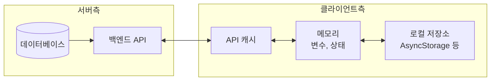

**문제는 이 데이터들이 서로 다른 시점에, 다른 값을 가질 수 있다는 것입니다.**

예를 들어:

1. DB에는 사용자 이름이 "김철수"
2. 하지만 앱 메모리에는 아직 "김철호" (수정 전 값)
3. 로컬 저장소에는 아예 저장된 적 없음

이런 **"불일치 상태"**가 바로 버그의 원인입니다.

### 1.3 이 문서에서 배울 것

이 문서를 통해 다음 질문에 답할 수 있게 됩니다:

> - 어떤 데이터를 어디에 저장해야 하는가?
> - 서버 데이터와 화면 데이터를 어떻게 분리할 것인가?
> - 언제 서버에 저장하고, 언제 로컬에만 유지할 것인가?
> - 저장/수정/삭제 후 화면을 어떻게 갱신할 것인가?

---

## 2. 상태(State)란 무엇인가

### 2.1 상태의 정의

**상태(State)**란 "현재 앱이 기억하고 있는 데이터"입니다.

일상적인 예로 비유하면:

- 쇼핑몰 앱의 **장바구니에 담긴 상품 목록** → 상태
- 음악 앱에서 **현재 재생 중인 곡** → 상태
- SNS 앱에서 **읽지 않은 알림 개수** → 상태

상태가 바뀌면 화면이 바뀝니다. 이것이 React 같은 프레임워크의 핵심 원리입니다.

### 2.2 상태의 두 가지 종류

모든 상태는 크게 **두 가지**로 나눌 수 있습니다:

| 구분             | 서버 상태 (Server State)              | 클라이언트 상태 (Client State)            |
| ---------------- | ------------------------------------- | ----------------------------------------- |
| **정의**   | 서버(DB)에 저장된 데이터              | 현재 세션에서만 유효한 데이터             |
| **예시**   | 사용자 프로필, 게시글 목록, 상품 정보 | 모달 열림 여부, 입력 중인 텍스트, 현재 탭 |
| **특징**   | 여러 사용자/기기가 공유               | 이 화면, 이 순간만 필요                   |
| **영속성** | 새로고침해도 유지                     | 새로고침하면 사라져도 됨                  |
| **동기화** | 서버와 맞춰야 함                      | 서버와 무관                               |

### 2.3 왜 분리해야 하는가?

**잘못된 예**: 모든 것을 하나의 전역 상태에 담기

```javascript
// ❌ 이렇게 하면 안 됩니다
const globalState = {
  user: { name: '김철수', email: '...' },      // 서버 상태
  posts: [...],                                // 서버 상태
  isModalOpen: false,                          // 클라이언트 상태
  searchKeyword: '',                           // 클라이언트 상태
  isLoading: false,                            // 클라이언트 상태
};
```

**문제점**:

1. 서버 데이터가 바뀌면 전체를 다시 가져와야 함
2. 모달을 열었다 닫았다 할 때마다 불필요한 리렌더링
3. 캐싱, 자동 갱신, 에러 처리를 직접 구현해야 함

**분리했을 때의 장점**:

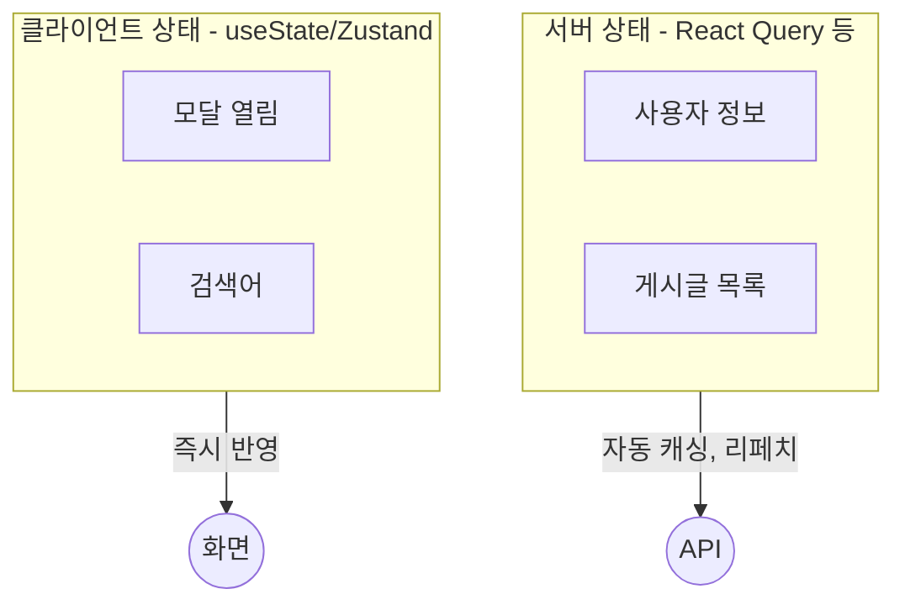

- **서버 상태**: 라이브러리가 캐싱, 동기화, 에러 처리를 자동으로 해줌
- **클라이언트 상태**: 가볍고 빠르게 변경 가능

### 2.4 어떤 데이터가 어디에 속하는가?

실제로 분류해보면 명확해집니다:

| 데이터 예시       | 종류              | 이유                                                |
| ----------------- | ----------------- | --------------------------------------------------- |
| 사용자 프로필     | 서버              | DB에 저장되어 있고, 여러 기기에서 같은 값을 봐야 함 |
| 게시글 목록       | 서버              | 다른 사람이 작성한 글도 보여야 함                   |
| 상품 재고         | 서버              | 실시간으로 변할 수 있고, 정확해야 함                |
| 모달 열림 여부    | 클라이언트        | 현재 화면에서만 의미 있음, 저장할 필요 없음         |
| 폼에 입력 중인 값 | 클라이언트        | 아직 저장 전이므로 서버와 무관                      |
| 다크모드 설정     | 클라이언트 (로컬) | 이 기기에서만 적용, 서버에 안 보내도 됨             |
| 로그인 토큰       | 인증 (특수)       | 보안 저장소에 별도 관리                             |

---

## 3. 폴더 구조와 책임 분리

### 3.1 왜 폴더를 나누는가?

코드가 많아지면 "이 코드를 어디에 넣어야 하지?"라는 고민이 생깁니다.
폴더 구조는 **"각 파일이 어떤 역할을 하는가"**를 명확히 합니다.

좋은 폴더 구조의 원칙:

- **한 폴더 = 한 가지 역할** (단일 책임)
- **이름만 보고 무슨 일을 하는지 알 수 있어야 함**
- **의존 방향이 명확해야 함** (A가 B를 쓴다면, B는 A를 몰라야 함)

### 3.2 권장 폴더 구조

```
📁 src/
├── 📁 api/               # 서버와 통신하는 코드
│   ├── client.ts         # axios 설정, 공통 처리
│   └── 📁 services/      # 기능별 API 함수
│       ├── userService.ts
│       └── postService.ts
│
├── 📁 hooks/             # 재사용 가능한 로직
│   ├── 📁 queries/       # 데이터 조회 훅
│   └── 📁 mutations/     # 데이터 변경 훅
│
├── 📁 stores/            # 클라이언트 상태
│
├── 📁 screens/           # 화면 컴포넌트
│
├── 📁 components/        # 재사용 UI 컴포넌트
│
└── 📁 utils/             # 유틸리티 함수
```

### 3.3 데이터가 흐르는 방향

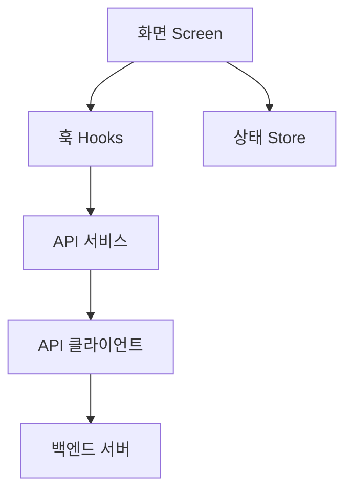

**핵심 규칙**: 화살표 방향을 거슬러 올라가면 안 됩니다.

- ✅ 화면 → 훅 → 서비스 (OK)
- ❌ 서비스 → 화면 (NG, 서비스가 화면을 알면 안 됨)

### 3.4 각 레이어의 역할

| 레이어             | 역할                              | 예시                                  |
| ------------------ | --------------------------------- | ------------------------------------- |
| **Screen**   | 화면을 그리고, 사용자 입력을 받음 | "로그인 버튼을 눌렀을 때"             |
| **Hooks**    | 비즈니스 로직을 캡슐화            | "사용자 목록을 가져오는 훅"           |
| **Services** | API 호출 함수 정의                | "GET /users 엔드포인트 호출"          |
| **Client**   | 공통 설정 (토큰 주입, 에러 처리)  | "모든 요청에 Authorization 헤더 추가" |
| **Store**    | 클라이언트 상태 보관              | "현재 선택된 탭"                      |

---

## 4. CRUD 작업의 처리 전략

### 4.1 CRUD란?

데이터를 다루는 4가지 기본 작업:

- **C**reate: 새로 만들기 (회원가입, 글 작성)
- **R**ead: 읽어오기 (목록 조회, 상세 보기)
- **U**pdate: 수정하기 (프로필 변경, 글 수정)
- **D**elete: 삭제하기 (게시글 삭제, 회원 탈퇴)

### 4.2 Optimistic vs Pessimistic Update

데이터를 수정할 때 두 가지 접근법이 있습니다:

**Pessimistic Update (비관적 업데이트)**

> "서버 응답을 기다린 후에 화면을 바꾼다"

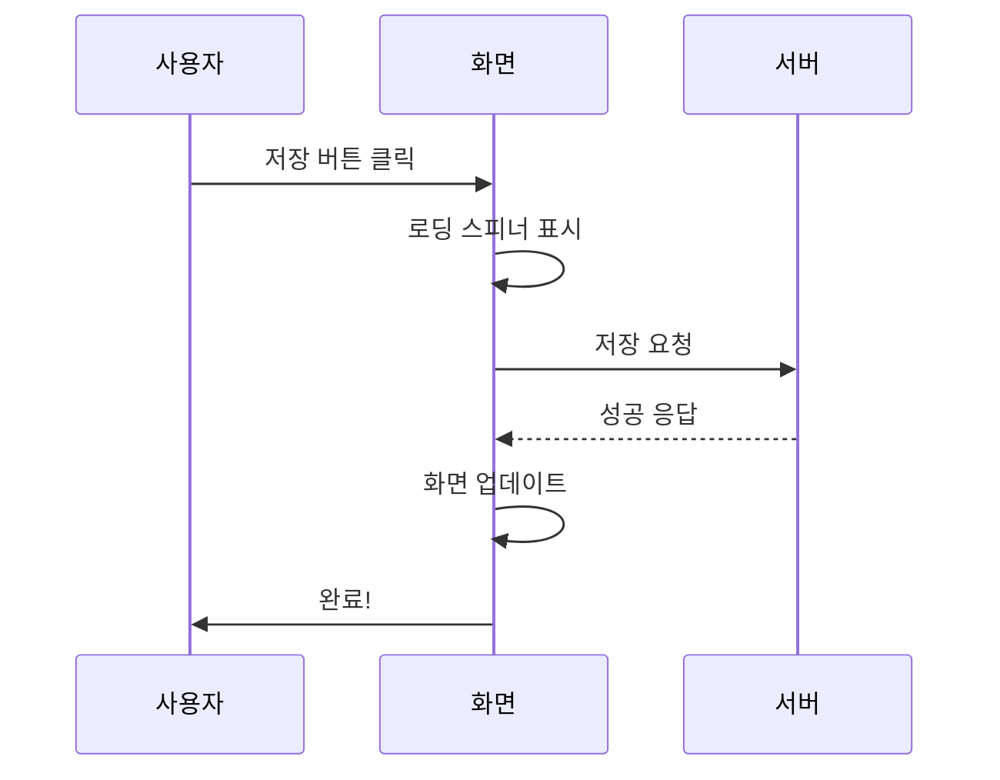

- **장점**: 확실함, 실패해도 화면이 꼬이지 않음
- **단점**: 로딩 대기 필요, 느리게 느껴짐
- **사용 예**: 결제, 회원가입, 중요한 삭제

**Optimistic Update (낙관적 업데이트)**

> "일단 성공했다고 가정하고 화면을 먼저 바꾸고, 실패하면 되돌린다"

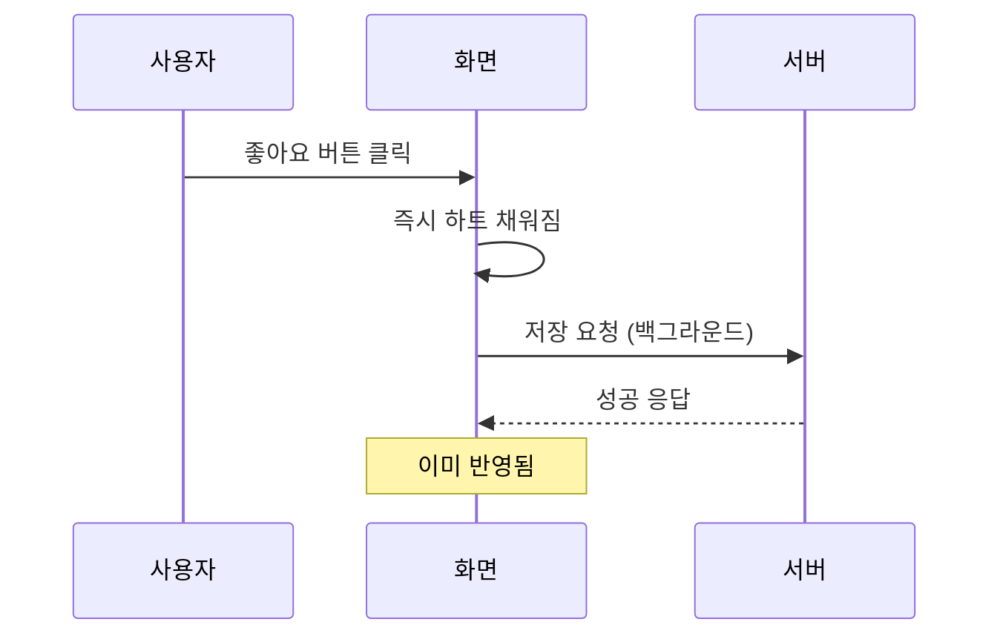

- **장점**: 즉각적인 피드백, 빠르게 느껴짐
- **단점**: 실패 시 롤백 로직 필요
- **사용 예**: 좋아요, 북마크, 읽음 처리

### 4.3 어떤 것을 선택해야 할까?

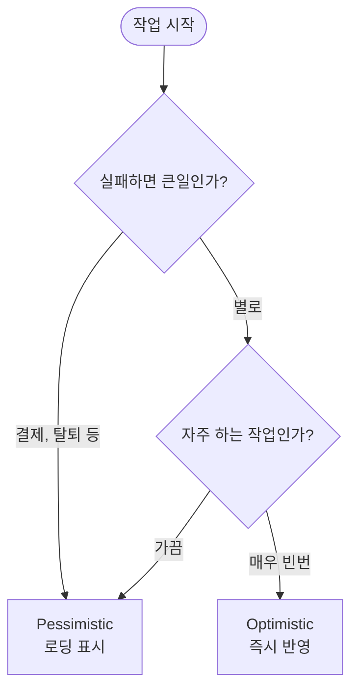

| 작업          | 추천 방식                  | 이유                                   |
| ------------- | -------------------------- | -------------------------------------- |
| 글 작성       | Pessimistic                | 내용이 많고, 실패하면 다시 쓰기 어려움 |
| 글 삭제       | Pessimistic + 확인창       | 복구 불가능한 작업                     |
| 좋아요/북마크 | Optimistic                 | 빈번하고, 실패해도 큰 문제 없음        |
| 댓글 작성     | Pessimistic                | 내용이 있어서 실패 시 불편             |
| 읽음 처리     | Optimistic (Fire & Forget) | 사용자가 모르게 처리해도 됨            |

---

## 5. 동기 vs 비동기: 언제 무엇을 선택하나

### 5.1 동기와 비동기의 차이

**동기 (Synchronous)**: 한 작업이 끝날 때까지 기다림

> 커피숍에서 주문하고 **줄 서서 기다렸다가** 받아감

**비동기 (Asynchronous)**: 기다리지 않고 다른 일을 함

> 커피숍에서 주문하고 **진동벨 받고 자리에 앉아 있다가** 벨 울리면 받아감

### 5.2 프론트엔드에서의 의미

**동기적 처리**: 사용자가 결과를 기다려야 함

```javascript
// 로딩 화면을 보여주고 → 완료되면 다음 화면으로
const handleSubmit = async () => {
  setLoading(true);          // 로딩 시작
  await saveData();          // 기다림
  setLoading(false);         // 로딩 끝
  goToNextScreen();          // 다음으로
};
```

**비동기적 처리**: 사용자는 기다리지 않음

```javascript
// 화면은 바로 바뀌고, 서버 저장은 뒤에서 진행
const handleLike = () => {
  setLiked(true);            // 화면 즉시 반영
  saveLikeToServer();        // 기다리지 않음 (백그라운드)
};
```

### 5.3 판단 기준

| 질문                               | Yes → 동기              | No → 비동기   |
| ---------------------------------- | ------------------------ | -------------- |
| 결과를 보고 다음 동작을 해야 하나? | 폼 제출 후 상세 페이지로 | 읽음 처리      |
| 실패하면 사용자에게 알려야 하나?   | 결제 실패                | 분석 로그 전송 |
| 로딩 표시가 자연스러운 상황인가?   | 파일 업로드              | 하트 버튼      |

### 5.4 실제 적용 예시

| 상황               | 처리 방식              | 이유                              |
| ------------------ | ---------------------- | --------------------------------- |
| 로그인             | 동기 + 로딩            | 성공해야 다음 화면으로 갈 수 있음 |
| 글 저장            | 동기 + 로딩            | 저장 완료 확인 필요               |
| 좋아요             | 비동기 (Optimistic)    | 빠른 피드백이 중요                |
| 자동 저장          | 비동기 (Debounce)      | 사용자 모르게 백그라운드 처리     |
| 페이지 조회수 증가 | 비동기 (Fire & Forget) | 사용자와 무관                     |

---

## 6. 인증과 토큰 관리

### 6.1 왜 토큰이 필요한가?

웹/앱은 기본적으로 **"상태가 없습니다 (Stateless)"**.
서버는 "방금 그 요청과 지금 이 요청이 같은 사람인지" 모릅니다.

**토큰(Token)**은 "나는 로그인한 사용자야"라는 **신분증** 역할을 합니다.

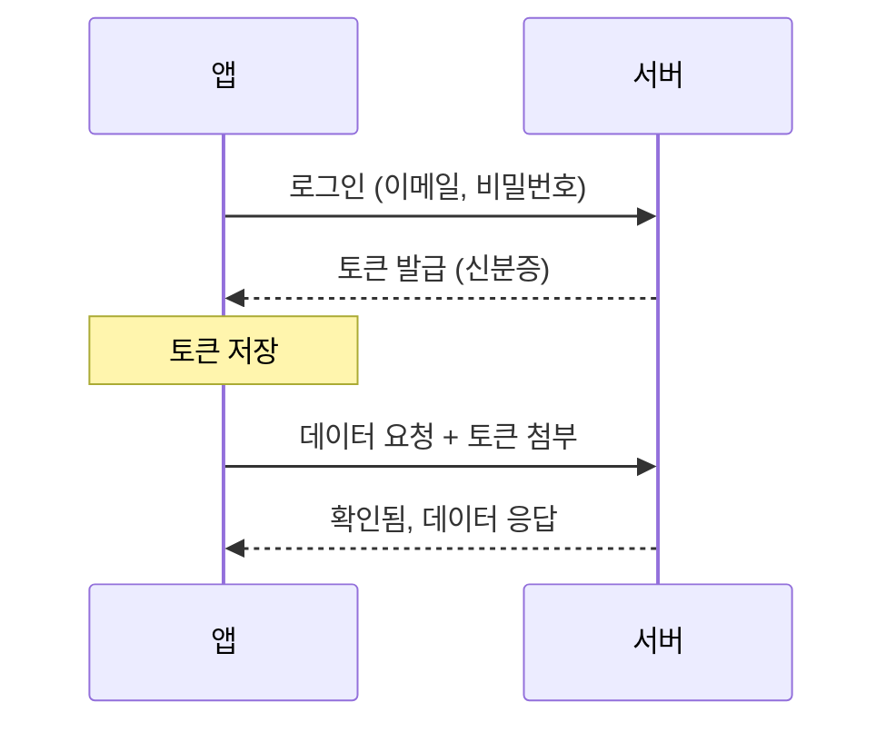

### 6.2 Access Token과 Refresh Token

보안을 위해 토큰을 두 개로 나눕니다:

| 토큰          | 용도                  | 유효 기간    | 저장 위치               |
| ------------- | --------------------- | ------------ | ----------------------- |
| Access Token  | API 호출 시 사용      | 짧음 (1시간) | 메모리 또는 보안 저장소 |
| Refresh Token | Access Token 재발급용 | 김 (2주)     | 보안 저장소만           |

**왜 두 개인가?**

- Access Token이 탈취되어도 1시간만 유효
- Refresh Token은 아주 안전한 곳에만 저장
- 매번 로그인하지 않아도 됨 (Refresh로 자동 갱신)

### 6.3 토큰 흐름

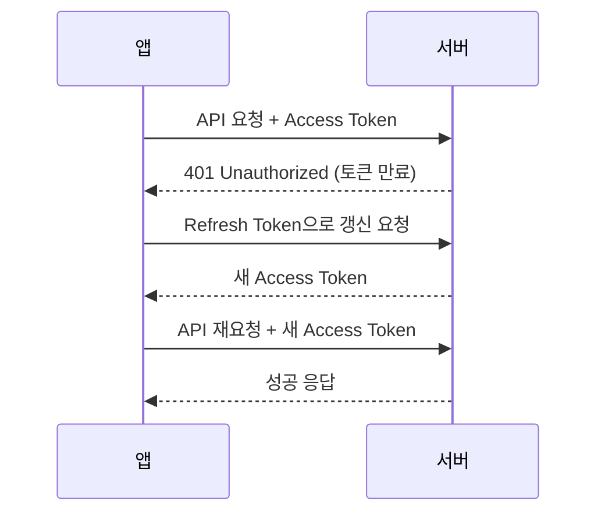

### 6.4 보안 저장소

토큰은 **일반 저장소**에 넣으면 위험합니다.

| 저장소                    | 보안 수준 | 용도                          |
| ------------------------- | --------- | ----------------------------- |
| 일반 변수                 | 매우 높음 | 임시 저장 (앱 종료 시 사라짐) |
| Secure Storage            | 높음      | 토큰 저장 (암호화됨)          |
| AsyncStorage/LocalStorage | 보통      | 설정, 캐시 (토큰 저장 비권장) |
| 쿠키                      | 보통      | 웹 전용                       |

---

## 7. 캐싱이란

### 7.1 캐싱의 개념

**캐싱(Caching)**은 "한 번 가져온 데이터를 저장해두고 재사용"하는 것입니다.

일상적인 예:

> 도서관에서 책을 빌려왔는데, 매번 읽을 때마다 도서관에 다시 가진 않죠.
> **집에 두고 필요할 때 꺼내봅니다** → 이게 캐싱입니다.

### 7.2 왜 캐싱이 필요한가?

캐싱을 하지 않으면:

- 화면 이동할 때마다 같은 API를 다시 호출 → **느림**
- 서버 부하 증가 → **비용 증가**
- 오프라인에서 아무것도 못 함 → **UX 저하**

### 7.3 캐시의 "신선도" 개념

캐시된 데이터는 시간이 지나면 **"오래된 것(Stale)"**이 됩니다.

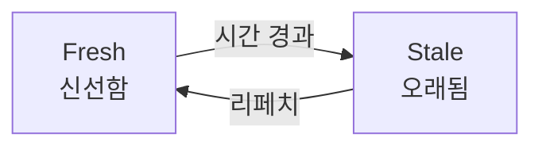

| 용어                | 의미                                                 |
| ------------------- | ---------------------------------------------------- |
| **Fresh**     | 방금 가져온 거라 서버와 같음, 다시 안 가져와도 됨    |
| **Stale**     | 오래되어서 서버와 다를 수 있음, 필요하면 다시 가져옴 |
| **staleTime** | 얼마나 오래되면 Stale로 볼 것인가                    |

### 7.4 데이터별 캐시 전략

데이터 특성에 따라 다르게 설정합니다:

| 데이터    | staleTime | 이유                     |
| --------- | --------- | ------------------------ |
| 주식 시세 | 30초      | 실시간으로 변함          |
| 상품 목록 | 5분       | 자주 바뀌지 않음         |
| 내 프로필 | 10분      | 내가 바꾸기 전엔 안 변함 |
| 이용약관  | 24시간    | 거의 안 바뀜             |

### 7.5 캐시 무효화

데이터를 **수정/삭제했을 때** 캐시를 지워야 합니다.

예: 글을 작성한 후

1. 글 작성 성공
2. 글 목록 캐시 삭제 (무효화)
3. 다음에 목록 화면 가면 새로 가져옴 → 내 글이 보임

무효화를 안 하면? → **방금 작성한 글이 목록에 안 보임** (캐시에는 옛날 목록)

---

## 8. 에러 처리 전략

### 8.1 에러의 종류

앱에서 발생할 수 있는 에러:

| 에러 유형          | 원인        | 사용자에게 보여줄 메시지                         |
| ------------------ | ----------- | ------------------------------------------------ |
| 네트워크 에러      | 인터넷 끊김 | "인터넷 연결을 확인해주세요"                     |
| 인증 에러 (401)    | 로그인 만료 | 자동으로 재로그인 시도 또는 로그인 화면으로      |
| 권한 에러 (403)    | 접근 불가   | "이 페이지에 접근 권한이 없습니다"               |
| 찾을 수 없음 (404) | 삭제됨      | "요청하신 정보를 찾을 수 없습니다"               |
| 서버 에러 (500)    | 서버 문제   | "일시적인 오류입니다. 잠시 후 다시 시도해주세요" |
| 입력 에러 (400)    | 잘못된 입력 | "이메일 형식이 올바르지 않습니다"                |

### 8.2 에러 처리의 원칙

**1. 사용자에게 무슨 일이 일어났는지 알려주어야 함**

```
❌ "Error: NETWORK_ERR"
✅ "인터넷 연결이 끊어졌습니다"
```

**2. 가능하면 해결책을 제시해야 함**

```
❌ "오류가 발생했습니다"
✅ "저장에 실패했습니다. [다시 시도] 버튼을 눌러주세요"
```

**3. 복구 가능하면 자동으로 복구해야 함**

- 토큰 만료 → 자동 갱신 시도
- 일시적 에러 → 자동 재시도

### 8.3 에러 처리 흐름

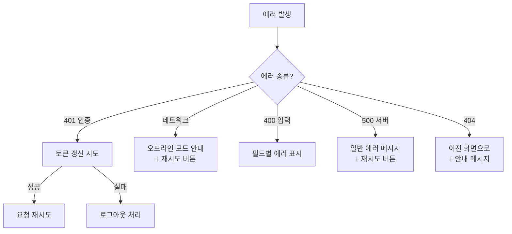

---

## 9. 구현 순서와 타이밍

### 9.1 왜 순서가 중요한가?

데이터 관리 코드는 서로 **의존 관계**가 있습니다.

예를 들어:

- API 호출 함수 → 훅에서 사용
- 에러 핸들러 → API 클라이언트에서 사용
- 타입 정의 → 모든 곳에서 사용

**잘못된 순서**로 개발하면:

- 나중에 구조 변경 필요 → 많은 파일 수정
- 임시 코드 작성 → 나중에 제거 안 하고 버그 됨

### 9.2 권장 구현 순서

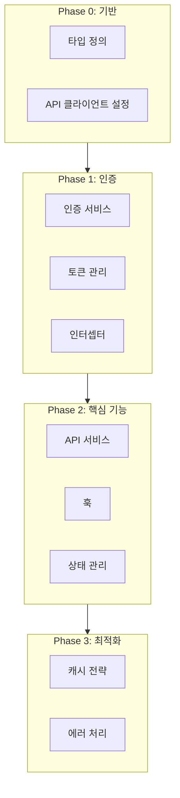

### 9.3 각 Phase에서 해야 할 일

| Phase               | 기간  | 할 일                                |
| ------------------- | ----- | ------------------------------------ |
| **0: 기반**   | 1-2일 | 폴더 구조, 타입 정의, API 클라이언트 |
| **1: 인증**   | 2-3일 | 로그인, 토큰 관리, 자동 갱신         |
| **2: 핵심**   | 3-5일 | 주요 API 서비스, 훅, 화면 연결       |
| **3: 최적화** | 1-2일 | 캐시 튜닝, 에러 처리, 로딩 UI        |

### 9.4 "이건 나중에 해도 됨" vs "이건 처음부터 해야 함"

| 처음부터 해야 함            | 나중에 해도 됨    |
| --------------------------- | ----------------- |
| 폴더 구조                   | Optimistic Update |
| 타입 정의                   | 세밀한 캐시 전략  |
| 인증/토큰 관리              | 오프라인 모드     |
| 기본 에러 처리              | 성능 최적화       |
| 상태 분리 (서버/클라이언트) | 분석/로깅         |

---

## 마무리

### 핵심 요약

1. **상태를 분리하라**: 서버 상태와 클라이언트 상태는 다르게 관리
2. **책임을 분리하라**: 폴더 구조로 각 코드의 역할을 명확히
3. **상황에 맞는 전략을 선택하라**: Optimistic vs Pessimistic, 동기 vs 비동기
4. **보안을 신경 써라**: 토큰은 안전한 곳에 저장
5. **캐시를 활용하라**: 불필요한 요청 줄이기
6. **에러를 친절하게 처리하라**: 사용자에게 이해 가능한 메시지

### 더 공부할 자료

| 주제        | 추천 자료                                           |
| ----------- | --------------------------------------------------- |
| React Query | [TanStack Query 공식 문서](https://tanstack.com/query) |
| 상태 관리   | [Zustand GitHub](https://github.com/pmndrs/zustand)    |
| 인증        | [JWT.io](https://jwt.io/) - JWT 구조 이해              |

---

> 📌 이 문서는 학습 목적으로 작성되었습니다.
>
> 마지막 업데이트: 2025-12-31
