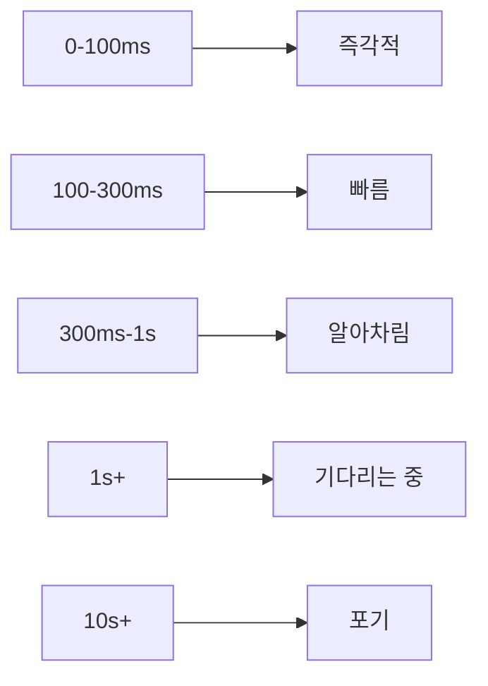
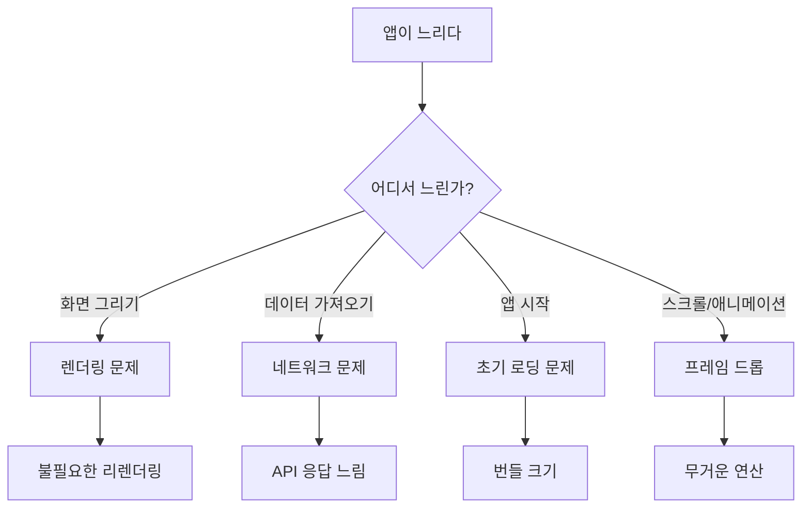
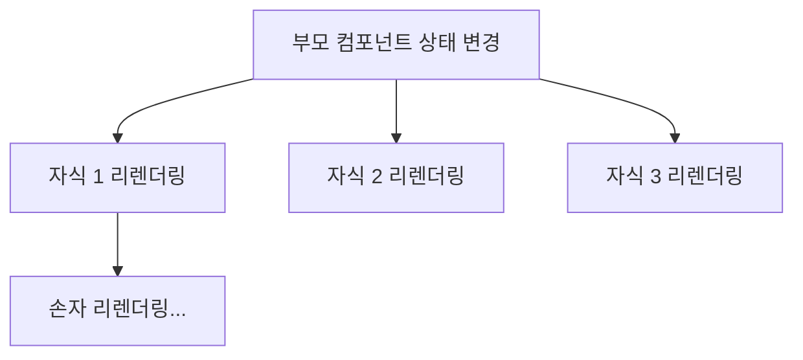
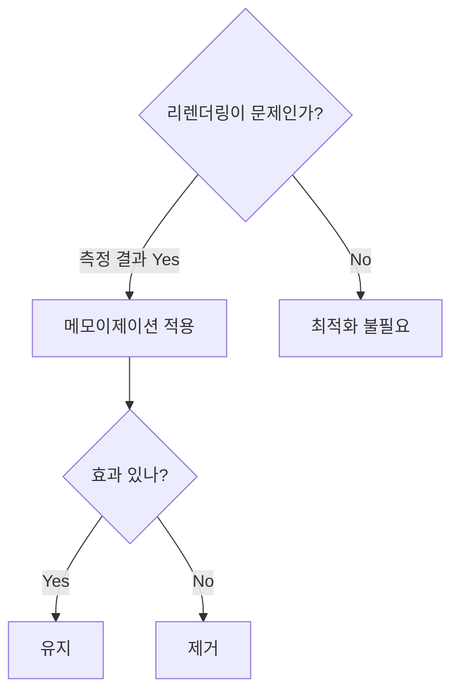
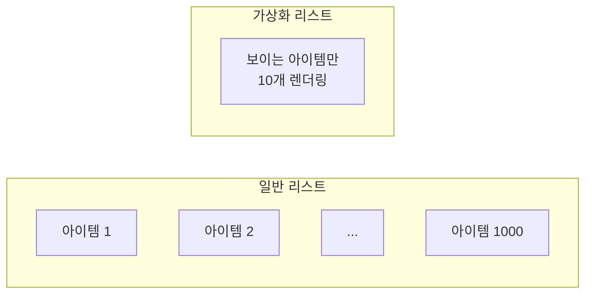
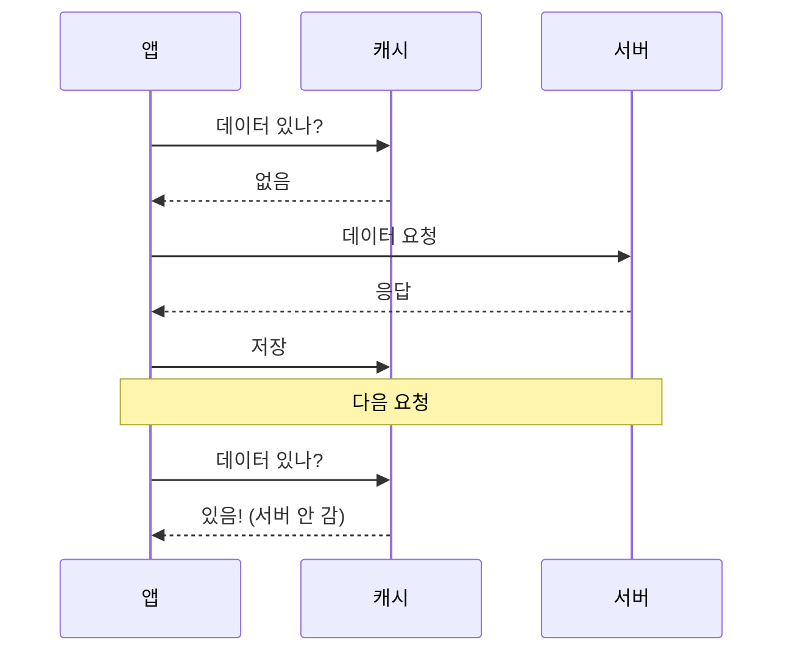
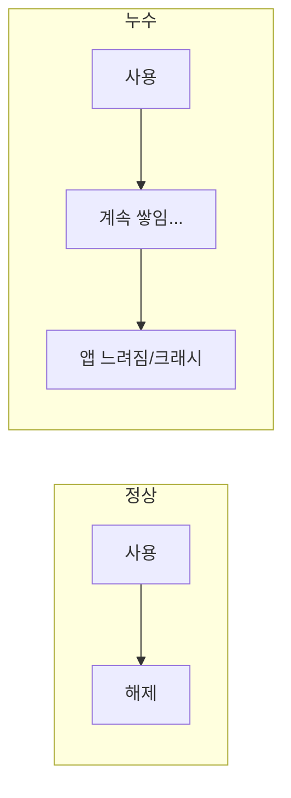
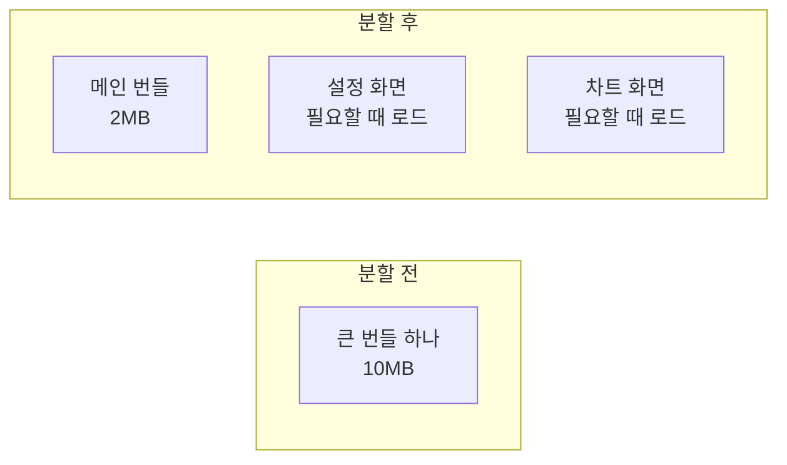
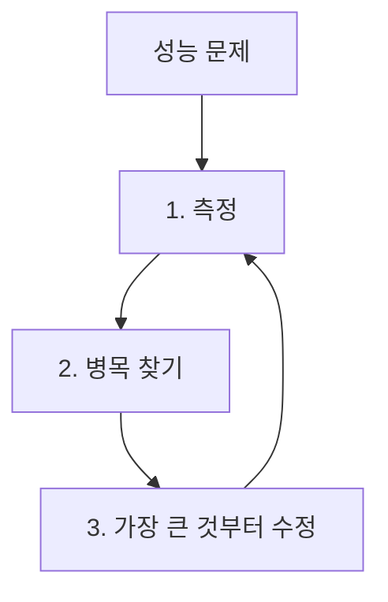

# 성능 최적화 가이드

> 이 문서는 앱이 빠르고 부드럽게 동작하도록 최적화하는 방법을 학습하기 위한 교재입니다.

---

## 목차

1. [성능이 왜 중요한가](#1-성능이-왜-중요한가)
2. [성능 측정하기](#2-성능-측정하기)
3. [렌더링 최적화](#3-렌더링-최적화)
4. [네트워크 최적화](#4-네트워크-최적화)
5. [메모리 최적화](#5-메모리-최적화)
6. [번들 크기 최적화](#6-번들-크기-최적화)

---

## 1. 성능이 왜 중요한가

### 1.1 느린 앱의 대가

연구에 따르면:

| 상황 | 결과 |
|------|------|
| 로딩 3초 초과 | 53%가 이탈 |
| 1초 지연 | 전환율 7% 감소 |
| 느린 앱 경험 | 79%가 다시 사용 안 함 |

### 1.2 사용자가 느끼는 속도



| 시간 | 사용자 인식 |
|------|-----------|
| 0-100ms | "바로 됐다" |
| 100-300ms | "조금 걸렸지만 빠르다" |
| 300ms-1s | "로딩 중이구나" |
| 1s 이상 | "느리다" |
| 10s 이상 | "안 되나?" → 이탈 |

### 1.3 성능 최적화의 원칙

> "측정 없이 최적화하지 말라"

**잘못된 접근**:

1. "여기가 느릴 것 같아" → 추측으로 최적화
2. 실제로는 다른 곳이 병목
3. 시간 낭비

**올바른 접근**:

1. 측정 → 어디가 느린지 확인
2. 가장 느린 곳 최적화
3. 다시 측정 → 효과 확인

---

## 2. 성능 측정하기

### 2.1 무엇을 측정하나?

| 지표 | 설명 | 목표 |
|------|------|------|
| **First Paint** | 첫 화면 표시 | < 1초 |
| **Time to Interactive** | 상호작용 가능 | < 3초 |
| **Frame Rate** | 초당 프레임 | 60 FPS |
| **Memory** | 메모리 사용량 | 증가하지 않음 |
| **API 응답** | 서버 응답 시간 | < 300ms |

### 2.2 측정 도구

| 플랫폼 | 도구 |
|--------|------|
| React Native | React DevTools, Flipper |
| 웹 | Chrome DevTools, Lighthouse |
| 공통 | 직접 console.time() |

### 2.3 병목 찾기



---

## 3. 렌더링 최적화

### 3.1 리렌더링이란?

React에서 **상태가 바뀌면** 화면을 다시 그립니다 (리렌더링).

문제:
> 바뀌지 않은 부분까지 다시 그리면 느려집니다.

### 3.2 불필요한 리렌더링 원인



**부모가 바뀌면 모든 자식이 리렌더링**됩니다.
자식의 props가 안 바뀌어도!

### 3.3 해결: 메모이제이션

**메모이제이션(Memoization)**: "이전과 같으면 다시 계산하지 말자"

| 상황 | 사용 |
|------|------|
| 컴포넌트 리렌더링 방지 | `React.memo()` |
| 값 재계산 방지 | `useMemo()` |
| 함수 재생성 방지 | `useCallback()` |

**언제 사용하나?**



**주의**:
> 무조건 메모이제이션 ≠ 빨라짐
> 오버헤드가 있으므로 측정 후 적용

### 3.4 리스트 최적화

긴 목록을 렌더링할 때:

**문제**:

- 1000개 아이템 = 1000개 컴포넌트 생성
- 화면에 보이는 건 10개인데...

**해결: 가상화 (Virtualization)**



화면에 보이는 아이템만 렌더링하고, 스크롤하면 재활용합니다.

**도구**:

- React Native: `FlatList` (내장)
- 웹: `react-window`, `react-virtualized`

---

## 4. 네트워크 최적화

### 4.1 API 호출 줄이기

| 문제 | 해결 |
|------|------|
| 같은 데이터 반복 요청 | 캐싱 |
| 한 화면에서 API 10개 호출 | 배치 요청 |
| 불필요한 데이터 요청 | 필요한 것만 요청 |
| 매 글자 입력마다 검색 | 디바운싱 |

### 4.2 캐싱

**캐싱**: 한 번 가져온 데이터를 저장해두고 재사용



**효과**:

- API 호출 감소
- 로딩 시간 단축
- 오프라인에서도 데이터 표시 가능

### 4.3 디바운싱과 쓰로틀링

**디바운싱 (Debouncing)**:
> 연속 호출 중 마지막 것만 실행

예: 검색창 자동완성

```
입력: "r" → "re" → "rea" → "reac" → "react"
API 호출: ────────────────────────────────→ "react"만 호출
```

**쓰로틀링 (Throttling)**:
> 일정 간격으로만 실행

예: 스크롤 이벤트

```
스크롤: ▓▓▓▓▓▓▓▓▓▓▓▓▓▓▓▓▓▓▓▓
실행:   ▓───▓───▓───▓───▓ (200ms 간격)
```

| 기법 | 용도 |
|------|------|
| 디바운싱 | 검색, 자동저장, 리사이즈 |
| 쓰로틀링 | 스크롤, 마우스 이동 |

### 4.4 이미지 최적화

이미지는 **가장 큰 리소스**입니다.

| 최적화 | 방법 |
|--------|------|
| 크기 줄이기 | 화면 크기에 맞게 리사이즈 |
| 포맷 변경 | WebP 사용 (30% 더 작음) |
| 지연 로딩 | 화면에 보일 때만 로드 |
| 캐싱 | 한 번 받은 이미지 재사용 |
| 플레이스홀더 | 로딩 중 저해상도 이미지 표시 |

---

## 5. 메모리 최적화

### 5.1 메모리 누수란?

**메모리 누수 (Memory Leak)**: 더 이상 필요 없는 메모리가 해제되지 않음



### 5.2 흔한 메모리 누수 원인

| 원인 | 설명 |
|------|------|
| 이벤트 리스너 미해제 | 화면 떠나도 계속 동작 |
| 타이머 미해제 | setInterval이 계속 실행 |
| 구독 미해제 | 웹소켓, 옵저버 등 |
| 클로저 | 참조가 계속 유지됨 |

### 5.3 해결: 정리(Cleanup)

컴포넌트가 사라질 때 **정리**해야 합니다.

React에서:

```javascript
useEffect(() => {
  // 설정
  const timer = setInterval(doSomething, 1000);
  
  // 정리 (컴포넌트 언마운트 시 실행)
  return () => {
    clearInterval(timer);
  };
}, []);
```

**체크리스트**:

- [ ] setInterval → clearInterval
- [ ] addEventListener → removeEventListener
- [ ] subscribe → unsubscribe
- [ ] WebSocket → close

---

## 6. 번들 크기 최적화

### 6.1 번들이란?

**번들(Bundle)**: 앱 실행에 필요한 모든 코드를 하나로 묶은 파일

번들이 크면:

- 다운로드 오래 걸림
- 앱 시작 느림
- 메모리 많이 사용

### 6.2 번들 크기 줄이기

| 방법 | 설명 |
|------|------|
| 미사용 코드 제거 | Tree Shaking |
| 코드 분할 | 필요할 때만 로드 |
| 라이브러리 점검 | 가벼운 대안 찾기 |
| 이미지 최적화 | 번들에 포함된 이미지 압축 |

### 6.3 코드 분할 (Code Splitting)

모든 코드를 한 번에 로드하지 않고, **필요할 때 로드**합니다.



**효과**:

- 초기 로딩 빨라짐
- 필요한 것만 로드

### 6.4 라이브러리 선택

같은 기능이라도 라이브러리마다 크기가 다릅니다.

| 용도 | 큰 라이브러리 | 가벼운 대안 |
|------|-------------|-----------|
| 날짜 | Moment.js (300KB) | Day.js (2KB) |
| 유틸리티 | Lodash (전체) | 개별 함수만 import |
| 아이콘 | 전체 아이콘 팩 | 필요한 것만 |

---

## 마무리

### 최적화 우선순위



### 핵심 요약

1. **측정 먼저**: 추측하지 말고 데이터로
2. **리렌더링 줄이기**: 필요할 때만 메모이제이션
3. **리스트 가상화**: 보이는 것만 렌더링
4. **네트워크 최적화**: 캐싱, 디바운싱
5. **메모리 정리**: 언마운트 시 cleanup
6. **번들 줄이기**: 코드 분할, 가벼운 라이브러리

### 성능 체크리스트

```markdown
## 출시 전 성능 체크리스트
- [ ] 긴 리스트에 FlatList/가상화 사용
- [ ] 이미지 최적화 (크기, 포맷)
- [ ] 불필요한 리렌더링 확인
- [ ] 메모리 누수 검사
- [ ] API 응답 시간 확인
- [ ] 번들 크기 확인
```

---

> 📌 이 문서는 학습 목적으로 작성되었습니다.
>
> 마지막 업데이트: 2025-12-31
