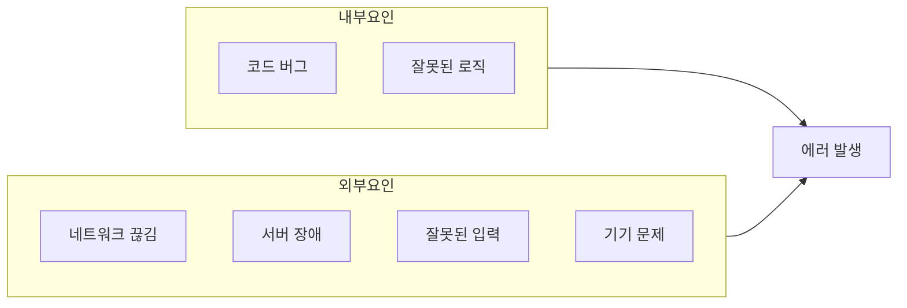
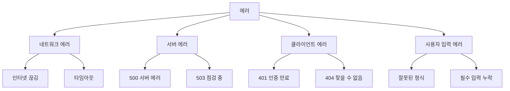
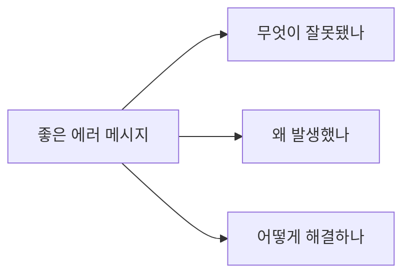
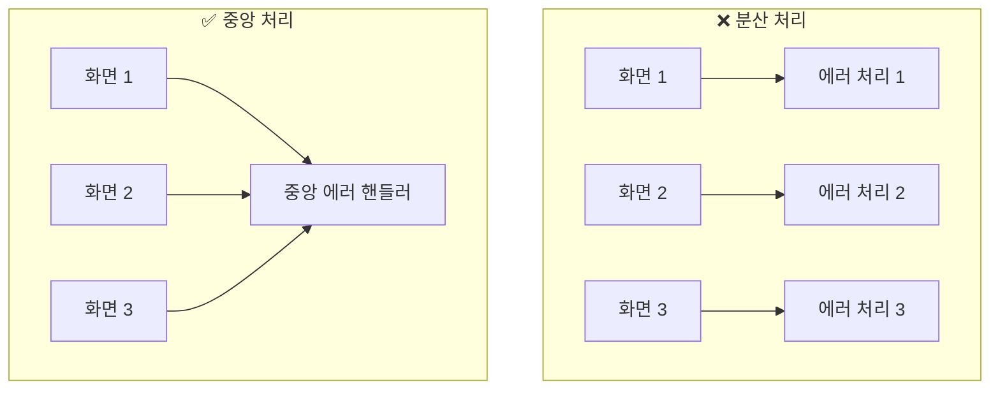
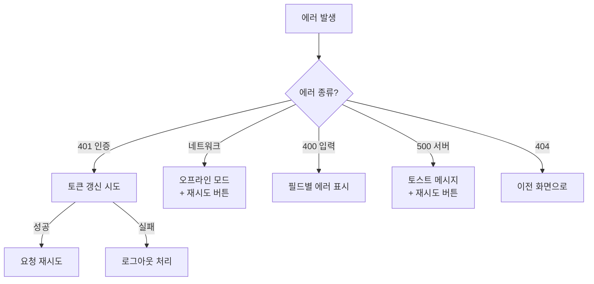
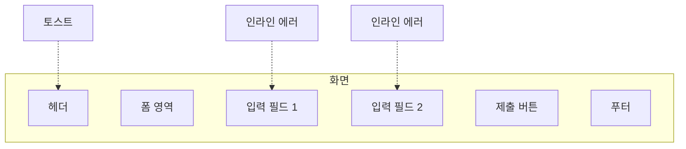

# 에러 핸들링 & 복구 가이드

> 이 문서는 앱에서 발생하는 다양한 에러를 어떻게 처리하고, 사용자에게 어떻게 안내해야 하는지를 학습하기 위한 교재입니다.

---

## 목차

1. [에러는 왜 발생하는가](#1-에러는-왜-발생하는가)
2. [에러의 종류](#2-에러의-종류)
3. [좋은 에러 메시지란](#3-좋은-에러-메시지란)
4. [에러 처리 전략](#4-에러-처리-전략)
5. [복구 가능한 에러 vs 치명적 에러](#5-복구-가능한-에러-vs-치명적-에러)
6. [사용자 경험을 해치지 않는 에러 처리](#6-사용자-경험을-해치지-않는-에러-처리)

---

## 1. 에러는 왜 발생하는가

### 1.1 에러는 피할 수 없다

아무리 완벽한 코드를 작성해도 에러는 발생합니다.



**중요한 관점 전환**:
> "에러가 발생하지 않게 하자" ❌
> "에러가 발생해도 잘 처리하자" ✅

### 1.2 에러 처리가 중요한 이유

에러 처리를 안 하면:

- 앱이 갑자기 죽음 (크래시)
- 사용자가 무슨 일인지 모름
- 데이터가 손실될 수 있음
- 사용자가 앱을 떠남

에러 처리를 잘 하면:

- 앱이 안정적으로 유지됨
- 사용자가 상황을 이해함
- 복구 방법을 안내할 수 있음
- 사용자 신뢰 유지

---

## 2. 에러의 종류

### 2.1 발생 원인별 분류



### 2.2 HTTP 상태 코드 이해하기

HTTP 응답 코드는 **숫자로 된 에러 분류**입니다.

| 범위 | 의미 | 누구 책임? |
|------|------|-----------|
| 2xx | 성공 | - |
| 4xx | 클라이언트 에러 | 사용자 또는 앱 |
| 5xx | 서버 에러 | 서버 |

**자주 보는 코드**:

| 코드 | 이름 | 의미 | 대응 |
|------|------|------|------|
| 200 | OK | 성공 | 정상 처리 |
| 400 | Bad Request | 잘못된 요청 | 입력값 확인 |
| 401 | Unauthorized | 인증 필요/만료 | 재로그인 |
| 403 | Forbidden | 권한 없음 | 접근 불가 안내 |
| 404 | Not Found | 없는 리소스 | 이전 화면으로 |
| 500 | Server Error | 서버 문제 | 잠시 후 재시도 |
| 503 | Service Unavailable | 점검 중 | 나중에 다시 |

### 2.3 에러 vs 예외

| 구분 | 에러 (Error) | 예외 (Exception) |
|------|-------------|-----------------|
| 심각도 | 심각, 복구 어려움 | 예상 가능, 처리 가능 |
| 예시 | 메모리 부족, 시스템 에러 | 네트워크 실패, 잘못된 입력 |
| 대응 | 앱 재시작 필요할 수 있음 | try-catch로 처리 가능 |

---

## 3. 좋은 에러 메시지란

### 3.1 나쁜 에러 메시지의 특징

```
❌ "Error"
❌ "오류가 발생했습니다"
❌ "NETWORK_ERR: Connection refused"
❌ "null pointer exception at line 342"
```

**문제점**:

- 무슨 일인지 모름
- 왜 발생했는지 모름
- 어떻게 해야 하는지 모름

### 3.2 좋은 에러 메시지의 3요소



| 요소 | 나쁜 예 | 좋은 예 |
|------|--------|--------|
| **무엇** | "에러" | "저장에 실패했습니다" |
| **왜** | (없음) | "인터넷 연결이 끊어졌습니다" |
| **해결** | (없음) | "[다시 시도] 버튼을 눌러주세요" |

### 3.3 상황별 에러 메시지 예시

| 상황 | 메시지 |
|------|--------|
| 네트워크 끊김 | "인터넷 연결을 확인해주세요" |
| 서버 에러 | "일시적인 오류입니다. 잠시 후 다시 시도해주세요" |
| 로그인 만료 | "다시 로그인이 필요합니다" |
| 없는 페이지 | "요청하신 정보를 찾을 수 없습니다" |
| 잘못된 입력 | "이메일 형식이 올바르지 않습니다" |
| 권한 없음 | "이 기능을 사용할 권한이 없습니다" |

### 3.4 기술 용어 피하기

개발자에게는 익숙하지만 사용자는 모르는 용어:

| 기술 용어 | 사용자 친화적 표현 |
|----------|------------------|
| 401 Unauthorized | "다시 로그인해주세요" |
| Timeout | "응답 시간이 초과되었습니다" |
| Network Error | "인터넷 연결을 확인해주세요" |
| Internal Server Error | "서버에 일시적 문제가 있습니다" |
| Invalid JSON | "데이터를 불러오지 못했습니다" |

---

## 4. 에러 처리 전략

### 4.1 중앙 집중식 처리

에러 처리 코드가 여기저기 흩어지면 관리가 어렵습니다.



**장점**:

- 일관된 에러 메시지
- 한 곳만 수정하면 전체 적용
- 로깅/모니터링 용이

### 4.2 에러 분류 및 처리 흐름



### 4.3 단계별 대응

| 단계 | 설명 | 예시 |
|------|------|------|
| **1. 감지** | 에러 발생 인식 | try-catch, API 응답 확인 |
| **2. 분류** | 어떤 종류인지 판단 | HTTP 코드, 에러 타입 |
| **3. 처리** | 적절한 대응 | 재시도, 안내, 복구 |
| **4. 알림** | 사용자에게 전달 | 토스트, 모달, 인라인 |
| **5. 기록** | 로그 저장 | 디버깅, 모니터링 |

---

## 5. 복구 가능한 에러 vs 치명적 에러

### 5.1 복구 가능한 에러

사용자 개입 없이 또는 간단한 조치로 해결 가능:

| 에러 | 자동 복구 방법 |
|------|--------------|
| 토큰 만료 | Refresh Token으로 자동 갱신 |
| 일시적 네트워크 끊김 | 자동 재시도 (3회) |
| 캐시 만료 | 백그라운드에서 새 데이터 fetch |

### 5.2 사용자 조치 필요 에러

사용자가 무언가 해야 해결됨:

| 에러 | 사용자 조치 |
|------|-----------|
| 인터넷 끊김 | Wi-Fi/데이터 연결 확인 |
| 잘못된 입력 | 올바른 값 다시 입력 |
| 권한 거부 | 설정에서 권한 허용 |
| 세션 만료 | 다시 로그인 |

### 5.3 치명적 에러

앱을 더 이상 사용할 수 없는 상황:

| 에러 | 대응 |
|------|------|
| 앱 크래시 | 크래시 리포트 전송 후 재시작 유도 |
| 데이터 손상 | 고객센터 안내 |
| 지원 종료 버전 | 업데이트 강제 |

### 5.4 재시도 전략

자동 재시도할 때의 규칙:


**Exponential Backoff** (지수 백오프):

- 1차: 1초 후 재시도
- 2차: 2초 후 재시도
- 3차: 4초 후 재시도
- 이후: 포기

**왜 이렇게 하는가?**
> 서버가 과부하 상태일 때 모든 클라이언트가 동시에 재시도하면 더 악화됩니다.
> 간격을 늘려가며 재시도하면 서버가 회복할 시간을 줍니다.

---

## 6. 사용자 경험을 해치지 않는 에러 처리

### 6.1 에러 표시 방식

| 방식 | 용도 | 예시 |
|------|------|------|
| **토스트** | 짧은 알림, 자동 사라짐 | "저장되었습니다" |
| **인라인** | 필드별 에러 | 입력창 아래 빨간 글씨 |
| **모달** | 중요한 결정 필요 | "정말 삭제하시겠습니까?" |
| **전체 화면** | 치명적 에러 | "인터넷 연결 필요" |

### 6.2 에러 표시 위치



**원칙**:

- 에러는 **발생한 곳 가까이** 표시
- 입력 에러 → 해당 입력 필드 아래
- 전체 폼 에러 → 제출 버튼 위
- 시스템 에러 → 토스트 또는 상단 배너

### 6.3 에러 상태에서도 할 수 있는 것

에러가 발생해도 **모든 것을 막지 않습니다**:

| 에러 상황 | 막을 것 | 허용할 것 |
|----------|--------|----------|
| 저장 실패 | 다음 화면 이동 | 입력 수정, 다른 기능 |
| 목록 로딩 실패 | 목록 표시 | 새로고침, 다른 메뉴 |
| 네트워크 끊김 | 서버 동기화 | 캐시된 데이터 보기, 드래프트 저장 |

### 6.4 에러 예방

에러 처리보다 **예방**이 더 좋습니다:

| 예방 방법 | 설명 |
|----------|------|
| 실시간 유효성 검사 | 제출 전에 잘못된 입력 알려줌 |
| 자동 저장 | 데이터 손실 방지 |
| 오프라인 모드 | 네트워크 없어도 기본 기능 가능 |
| 입력 형식 마스크 | 전화번호 자동 하이픈 등 |

---

## 마무리

### 핵심 요약

1. **에러는 피할 수 없다**: 잘 처리하는 것이 목표
2. **좋은 메시지 = 무엇 + 왜 + 해결책**
3. **중앙에서 처리**: 일관성 유지
4. **복구 가능하면 자동으로**: 사용자 수고 최소화
5. **기술 용어 피하기**: 사용자가 이해하는 말로
6. **예방이 최선**: 에러가 발생하지 않게

### 체크리스트

```markdown
## 새 기능 개발 시 에러 처리 체크리스트
- [ ] 네트워크 끊김 상황 처리했나?
- [ ] 서버 에러 (5xx) 대응했나?
- [ ] 입력 유효성 검사했나?
- [ ] 에러 메시지가 사용자 친화적인가?
- [ ] 재시도 방법을 안내했나?
- [ ] 에러 로깅을 추가했나?
```

---

> 📌 이 문서는 학습 목적으로 작성되었습니다.
>
> 마지막 업데이트: 2025-12-31
