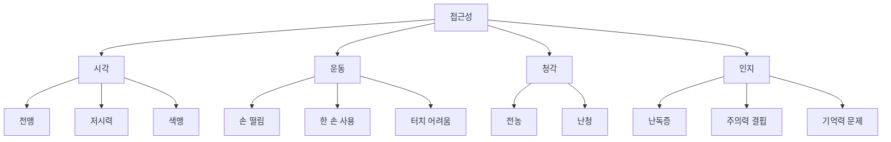
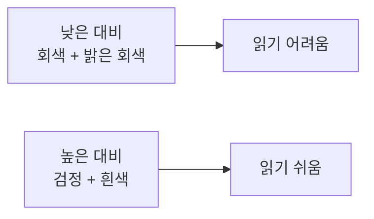
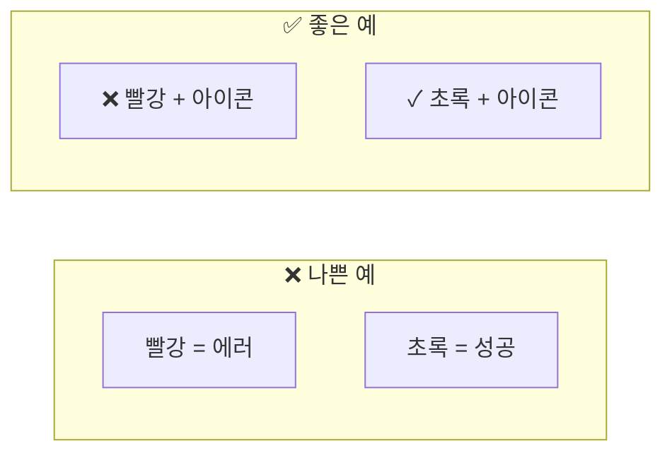
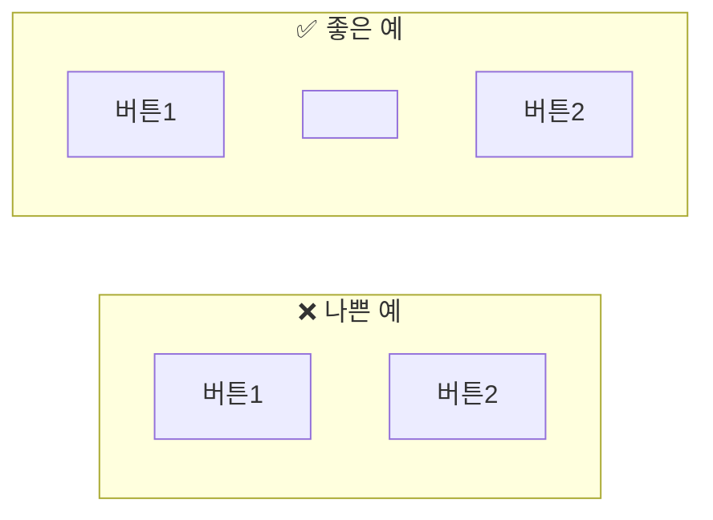
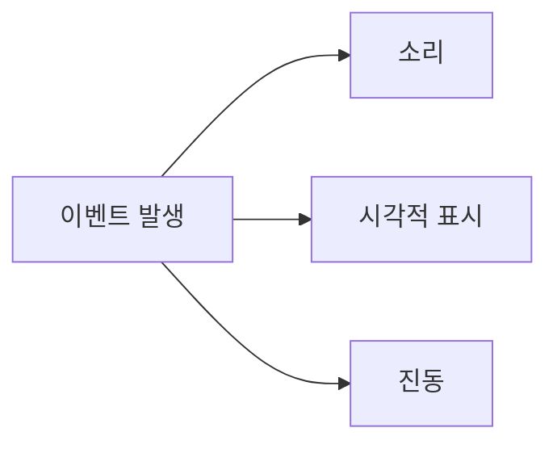
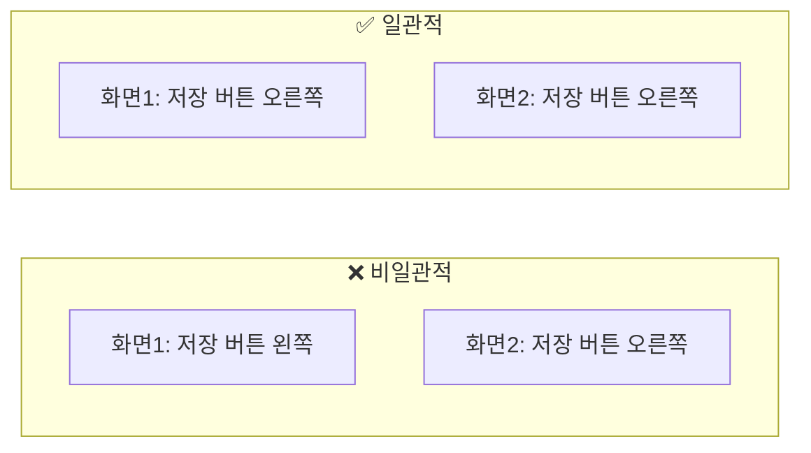
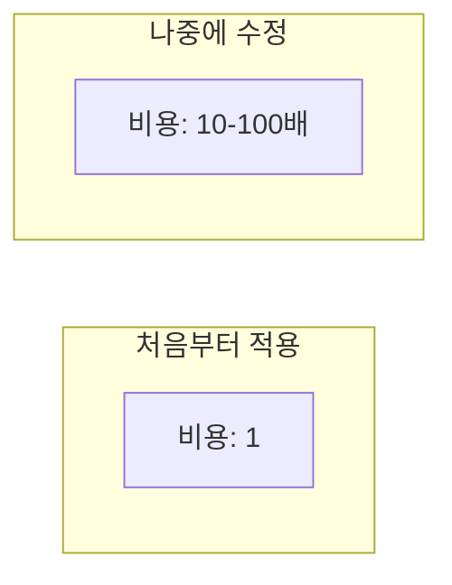

# 접근성 (Accessibility) 가이드

> 이 문서는 모든 사용자가 앱을 사용할 수 있도록 접근성을 구현하는 방법을 학습하기 위한 교재입니다.

---

## 목차

1. [접근성이란 무엇인가](#1-접근성이란-무엇인가)
2. [왜 접근성이 중요한가](#2-왜-접근성이-중요한가)
3. [시각 접근성](#3-시각-접근성)
4. [운동 접근성](#4-운동-접근성)
5. [청각 접근성](#5-청각-접근성)
6. [인지 접근성](#6-인지-접근성)
7. [테스트와 체크리스트](#7-테스트와-체크리스트)

---

## 1. 접근성이란 무엇인가

### 1.1 정의

**접근성 (Accessibility, A11y)**:
> 장애가 있거나 특수한 상황에 있는 사람도 앱을 사용할 수 있게 하는 것

**A11y**는 "Accessibility"의 약자입니다:
> **A** + [ccessibilit 11글자] + **y** = A11y

### 1.2 누구를 위한 것인가?

접근성은 **특정 그룹만** 위한 것이 아닙니다:

| 영구적 장애 | 일시적 상황 | 상황적 제약 |
|------------|-----------|-----------|
| 시각 장애 | 눈 수술 후 | 밝은 햇빛 아래 |
| 청각 장애 | 귀 염증 | 시끄러운 지하철 |
| 손 사용 불가 | 팔 깁스 | 아기를 안고 있음 |
| 인지 장애 | 수면 부족 | 운전 중 |

> 접근성 좋은 앱 = **모든 상황**에서 사용하기 좋은 앱

### 1.3 장애의 유형



---

## 2. 왜 접근성이 중요한가

### 2.1 도덕적 이유

> 모든 사람은 정보에 접근할 권리가 있습니다.

인터넷과 앱은 현대 생활의 필수입니다:

- 은행, 쇼핑, 교육, 소통
- 접근이 안 되면 **사회에서 배제**됨

### 2.2 법적 이유

많은 나라에서 접근성은 **법적 의무**입니다:

| 국가/지역 | 법률 |
|----------|------|
| 한국 | 장애인차별금지법 |
| 미국 | ADA, Section 508 |
| 유럽 | EAA (European Accessibility Act) |

### 2.3 비즈니스 이유

| 이유 | 설명 |
|------|------|
| 시장 확대 | 전 세계 15%가 장애인 |
| SEO 향상 | 스크린리더 친화 = 검색엔진 친화 |
| 사용성 향상 | 접근성 좋으면 모두에게 좋음 |
| 법적 위험 감소 | 소송 방지 |

---

## 3. 시각 접근성

### 3.1 스크린리더 지원

**스크린리더**는 화면을 읽어주는 소프트웨어입니다.

| 플랫폼 | 스크린리더 |
|--------|----------|
| iOS | VoiceOver |
| Android | TalkBack |
| Windows | NVDA, JAWS |
| macOS | VoiceOver |

### 3.2 대체 텍스트 (Alt Text)

이미지를 볼 수 없는 사용자를 위해 **설명**을 제공합니다:

| 이미지 유형 | 대체 텍스트 |
|------------|-----------|
| 정보 전달 이미지 | "매출 그래프: 1월 100만원, 2월 150만원" |
| 버튼/아이콘 | "메뉴 열기", "검색" |
| 장식용 이미지 | 비워두거나 무시 처리 |

**나쁜 예**:

```
❌ "이미지"
❌ "img_001.jpg"
❌ "사진"
```

**좋은 예**:

```
✅ "삼성전자 주가 차트: 지난 1개월 동안 10% 상승"
✅ "뒤로 가기"
✅ "사용자 프로필 사진"
```

### 3.3 색상 대비

**대비**가 낮으면 읽기 어렵습니다.



**WCAG 기준**:

| 요소 | 최소 대비 |
|------|----------|
| 일반 텍스트 | 4.5:1 |
| 큰 텍스트 (18pt+) | 3:1 |
| UI 요소 (버튼 등) | 3:1 |

**확인 도구**: [WebAIM Contrast Checker](https://webaim.org/resources/contrastchecker/)

### 3.4 색상만으로 정보 전달 금지

**문제**: 색맹 사용자는 색상 차이를 인식 못 함



**해결**:

- 색상 + 아이콘
- 색상 + 텍스트
- 색상 + 패턴

### 3.5 텍스트 크기 조절

사용자가 시스템 설정에서 글꼴 크기를 키울 수 있습니다.

**해야 할 것**:

- 시스템 폰트 크기 설정 존중
- 텍스트 크기 커져도 레이아웃 안 깨지게
- 고정 높이 대신 유동적 높이

---

## 4. 운동 접근성

### 4.1 터치 영역 크기

손가락이 정확히 누르기 어려운 사용자를 위해:

| 기준 | 최소 크기 |
|------|----------|
| iOS HIG | 44×44 pt |
| Material Design | 48×48 dp |
| WCAG | 44×44 CSS pixels |

**예시**:

```
❌ 작은 버튼 [x] ← 누르기 어려움
✅ 충분한 버튼 [  x  ] ← 누르기 쉬움
```

### 4.2 터치 영역 간격

인접한 요소 사이에 **충분한 간격**이 필요합니다.



잘못 눌러서 의도치 않은 동작 방지

### 4.3 제스처 대안

모든 사용자가 복잡한 제스처를 할 수 있는 것은 아닙니다.

| 제스처 | 대안 |
|--------|------|
| 스와이프로 삭제 | 삭제 버튼도 제공 |
| 핀치로 확대 | 확대/축소 버튼 제공 |
| 흔들어서 취소 | 취소 버튼 제공 |

### 4.4 시간 제한

| 나쁜 예 | 좋은 예 |
|---------|--------|
| 10초 안에 입력 안 하면 초기화 | 시간 연장 옵션 제공 |
| 빠르게 사라지는 토스트 | 사용자가 닫을 때까지 유지 옵션 |

손이 불편한 사용자는 더 오래 걸릴 수 있습니다.

---

## 5. 청각 접근성

### 5.1 자막 제공

영상에는 **자막**이 필요합니다:

| 유형 | 설명 |
|------|------|
| 자막 (Subtitles) | 대사만 표시 |
| 캡션 (Captions) | 대사 + 소리 설명 "[문 닫히는 소리]" |

### 5.2 소리에만 의존하지 않기

| 나쁜 예 | 좋은 예 |
|---------|--------|
| 에러 시 경고음만 | 경고음 + 화면 표시 |
| 알림 소리만 | 소리 + 진동 + 배지 |

### 5.3 시각적 피드백

소리 대신 **시각적 피드백**도 함께:



---

## 6. 인지 접근성

### 6.1 명확한 언어

| 나쁜 예 | 좋은 예 |
|---------|--------|
| "엔터티 유효성 검증 실패" | "이메일 형식이 올바르지 않습니다" |
| "세션이 만료되었습니다" | "다시 로그인해주세요" |
| "Fatal Error 0x80004005" | "문제가 발생했습니다. 앱을 다시 시작해주세요" |

### 6.2 일관된 디자인



**일관성이 필요한 것**:

- 버튼 위치
- 네비게이션 구조
- 색상 의미
- 아이콘

### 6.3 오류 방지와 복구

| 원칙 | 예시 |
|------|------|
| 실수 방지 | 삭제 전 확인 대화상자 |
| 쉬운 수정 | 실행 취소 기능 |
| 명확한 안내 | 입력 형식 미리 표시 |
| 저장 보호 | 자동 저장, 임시 저장 |

### 6.4 집중 방해 최소화

| 피해야 할 것 | 이유 |
|-------------|------|
| 자동 재생 영상 | 주의 분산 |
| 깜빡이는 요소 | 집중 방해, 발작 위험 |
| 갑작스러운 팝업 | 현재 작업 중단 |
| 너무 많은 정보 | 인지 과부하 |

---

## 7. 테스트와 체크리스트

### 7.1 접근성 테스트 방법

| 방법 | 설명 |
|------|------|
| 자동 검사 도구 | axe, Lighthouse |
| 스크린리더 테스트 | VoiceOver, TalkBack 직접 사용 |
| 키보드만 사용 | 마우스/터치 없이 조작 |
| 색상 시뮬레이션 | 색맹 시뮬레이터 |
| 실제 사용자 테스트 | 장애인 사용자 참여 |

### 7.2 스크린리더 테스트 방법

**iOS VoiceOver 켜기**:
설정 → 손쉬운 사용 → VoiceOver

**Android TalkBack 켜기**:
설정 → 접근성 → TalkBack

**확인할 것**:

- 모든 버튼/이미지에 레이블이 있는가?
- 순서대로 읽히는가?
- 현재 상태가 전달되는가? (선택됨, 확장됨 등)

### 7.3 접근성 체크리스트

```markdown
## 시각
- [ ] 모든 이미지에 대체 텍스트
- [ ] 색상 대비 4.5:1 이상
- [ ] 색상만으로 정보 전달 안 함
- [ ] 텍스트 크기 조절 가능

## 운동
- [ ] 터치 영역 44×44 이상
- [ ] 충분한 터치 영역 간격
- [ ] 복잡한 제스처에 대안 제공
- [ ] 시간 제한에 연장 옵션

## 청각
- [ ] 영상에 자막 제공
- [ ] 소리에만 의존하지 않음
- [ ] 시각적 피드백 함께 제공

## 인지
- [ ] 명확하고 쉬운 언어
- [ ] 일관된 디자인
- [ ] 오류 방지 및 복구 가능
- [ ] 집중 방해 요소 최소화

## 기술
- [ ] 스크린리더로 테스트
- [ ] 키보드만으로 조작 가능
- [ ] 자동 검사 도구 통과
```

### 7.4 처음부터 vs 나중에



**접근성은 처음부터 고려해야 합니다.**

나중에 추가하면:

- 구조 변경 필요
- 디자인 재작업
- 테스트 재수행
- 비용 급증

---

## 마무리

### 핵심 요약

1. **접근성 = 모두를 위한 것**: 장애인만이 아님
2. **스크린리더 지원**: 대체 텍스트 필수
3. **색상 대비 확보**: 4.5:1 이상
4. **터치 영역 크게**: 44×44 이상
5. **대안 제공**: 제스처, 소리에 대한 대안
6. **처음부터 적용**: 나중에 하면 비용 급증

### 접근성은 품질이다

> "접근성은 선택이 아닌 필수입니다.
> 모든 사용자가 제품을 사용할 수 있어야 합니다."

접근성이 좋은 앱은:

- 더 많은 사람이 사용
- 더 좋은 사용자 경험
- 더 높은 품질

---

> 📌 이 문서는 학습 목적으로 작성되었습니다.
>
> 마지막 업데이트: 2025-12-31
