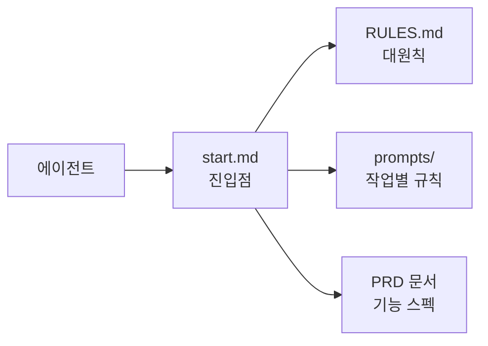
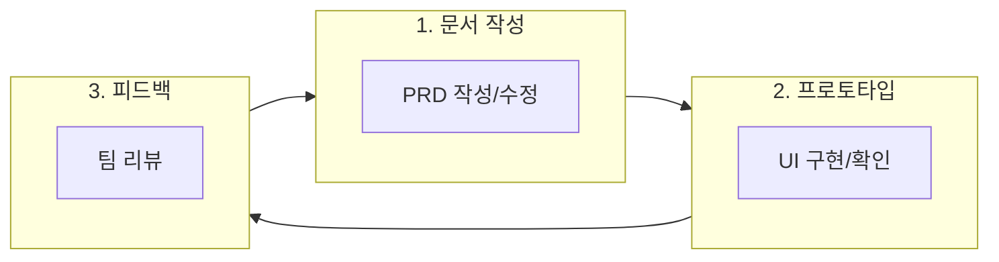

# DOCS&TEST

> 포트폴리오 리밸런싱 앱 개발을 위한 **문서 작성 및 프로토타입 테스트** 레포지토리

---

## 📋 이 레포지토리는

- **PRD(요구사항 정의서)** 및 개발 관련 문서를 작성하고 관리합니다.
- 문서 기반으로 **UI 프로토타입**을 만들어 시각적으로 확인합니다.
- 팀원들과 협업하며 문서를 개선해나갑니다.

---

## 📁 폴더 구조

```
TEST_DOCS/
│
├── 📁 Docs/                       # 문서 작성 폴더
│   │
│   ├── 📁 docs/                   # 에이전트 프로토콜 & 가이드
│   │   ├── RULES.md               # 대원칙 (에이전트 필독)
│   │   ├── start.md               # 작업 시작 시 참조 매핑
│   │   ├── 📁 prompts/            # 작업별 상세 규칙
│   │   └── 📁 decisions/          # 주요 결정 기록
│   │
│   ├── 📁 new_PRD/                # 새 구조 PRD (기능 기반)
│   ├── 📁 old_PRD/                # 기존 PRD (보관용)
│   ├── 📁 인사이트/                # 학습 및 참고 자료
│   └── 📁 프론트 학습용/           # 프론트엔드 학습 가이드
│
└── 📁 TEST/                       # 프로토타입 폴더
    └── 📁 prototype_v1/           # UI 프로토타입 HTML
```

---

## 🤖 에이전트 프로토콜 문서 (Docs/docs/)

AI 에이전트가 **토큰을 최소화**하면서 효율적으로 작업할 수 있도록 설계된 **매핑 방식 문서**입니다.

### 작동 원리



### 문서 구조

| 파일 | 역할 |
|------|------|
| `RULES.md` | 모든 작업에 적용되는 **대원칙** (항상 읽음) |
| `start.md` | 작업 시작 시 **어떤 문서를 참조할지** 매핑 |
| `prompts/` | 작업 유형별 **상세 규칙** (해당 작업 시만 읽음) |
| `decisions/` | 중요한 **결정 사항** 기록 |

### 왜 이 방식인가?

- **매번 긴 프롬프트 불필요**: 규칙이 문서에 정의되어 있음
- **토큰 절약**: 필요한 문서만 선택적으로 참조
- **일관성 유지**: 팀 전체가 동일한 규칙 적용
- **점진적 개선**: 문서를 업데이트하면 에이전트 동작도 개선

> ⚠️ 현재 미완성 상태이며, 문서 작업~개발 초기 단계에서 완성 예정

---

## 🚀 시작하기

### 문서 작성자

1. `Docs/new_PRD/` 폴더에서 PRD 작성
2. 작성 규칙은 `Docs/docs/PRD_Structure_Guide.md` 참고
3. AI 활용 시 `Docs/docs/PRD_AI_Writing_Guide.md` 참고

### 프로토타입 확인

1. `TEST/prototype_v1/` 폴더의 `index.html` 파일을 브라우저에서 열기
2. 또는 Live Server 확장 사용

---

## 📖 주요 문서

| 문서 | 설명 |
|------|------|
| [PRD 구조 가이드](Docs/docs/PRD_Structure_Guide.md) | 새 PRD 구조 및 작성 규칙 |
| [AI 작성 가이드](Docs/docs/PRD_AI_Writing_Guide.md) | AI를 활용한 PRD 작성 요령 |
| [UI/UX 가이드](Docs/프론트%20학습용/UI_UX_Design_Guide.md) | UI/UX 디자인 학습 교재 |
| [데이터 관리 가이드](Docs/프론트%20학습용/Data_Management_Guide.md) | 데이터 관리 학습 교재 |

---

## 🔄 작업 흐름



---

## 👥 팀 협업 규칙

### 브랜치 전략

- `main`: 검토 완료된 문서
- `develop`: 작업 중인 문서
- `feature/[이름]`: 개인 작업 브랜치

### 커밋 메시지

```
docs: PRD 포트폴리오 기능 추가
proto: 홈 화면 프로토타입 수정
fix: 오타 수정
```

> 마지막 업데이트: 2025-12-31
